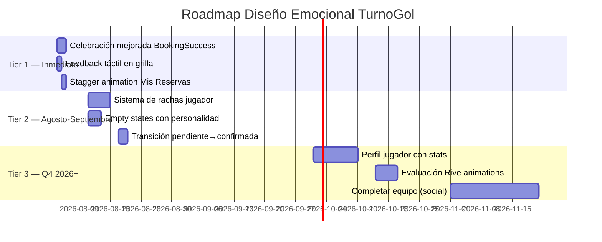

# 🔬 Análisis: Diseño Emocional aplicado a TurnoGol

> **Diagnóstico completo con investigación, validación de claims, errores actuales, e implementaciones posibles.**
> Fecha: 2 de agosto de 2026 · Investigación basada en fuentes verificadas de 2024-2026.

---

## 1. Validación del Documento: ¿Qué dice la evidencia real?

### ✅ Lo que el documento dice BIEN

#### 1.1 Duolingo — Las cifras son verificables pero están desactualizadas

El documento dice que los DAU pasaron de 14.2M a 34M en dos años post-animaciones (2022). **Eso fue verdad en su momento, pero la historia siguió:**

| Métrica | Dato del documento | Dato real verificado (2025) | Fuente |
|:---|:---|:---|:---|
| DAU | 14.2M → 34M | **52.7M DAU** a fines de 2025 | Earnings reports Duolingo Q3/Q4 2025 |
| Crecimiento YoY | "se duplicaron" | 36-40% YoY en 2025, desacelerando | Duolingo investor updates 2025 |
| DAU/MAU ratio | No mencionado | ~37% (mediados 2025) — indicador de hábito fuerte | Industry analysis 2025 |
| Meta 2026 | No mencionado | **100M DAU** como objetivo estratégico | Duolingo public announcements |

> [!IMPORTANT]
> **Veredicto:** Las animaciones NO fueron el único motor. Duolingo combinó gamificación (streaks, leaderboards, XP), animaciones con **state machines** (Rive, no Lottie), y una cultura de A/B testing obsesiva. Atribuir el crecimiento solo a "animaciones bonitas" es una **simplificación peligrosa**. La animación fue el vehículo; la psicología conductual (aversión a la pérdida con las rachas, comparación social con los leaderboards) fue el motor.

#### 1.2 Phantom Wallet — Datos verificados y contexto ampliado

| Claim del documento | Realidad verificada | 
|:---|:---|
| Rediseño integral 2023 | ✅ Correcto: junio 2023, con Bakken & Bæck |
| Animaron al fantasma (mascota) | ✅ Correcto: "bouncy, playful aesthetic" documentado |
| #2 en Utilities en App Store US | ✅ Correcto: Nov 2024, por encima de WhatsApp |
| Se convirtió en "una de las más populares" | ✅ 10-17M MAU a fines de 2024, 28x vs post-FTX |

> [!NOTE]
> **Contexto que el documento omite:** El crecimiento de Phantom coincidió con el bull market cripto 2024-2025 y la explosión de Solana. La animación contribuyó a bajar la barrera de entrada, pero el timing de mercado fue el catalizador principal. Phantom también adquirió **Bitski** (onboarding) y **Blowfish** (seguridad) — el diseño emocional fue UNA de varias palancas, no LA palanca.

#### 1.3 Revolut — Estrategia premium verificada

| Claim del documento | Realidad verificada |
|:---|:---|
| Onboarding con gráficos premium | ✅ Documentado como "storytelling over registration" |
| Tarjetas 3D interactivas | ✅ Implementado con HDRI lightmaps, perspectiva dinámica |
| Gráficos de gastos con soft glow | ✅ Parte de su estrategia "phygital" |

> [!TIP]
> **Lo que sí aplica a TurnoGol:** La idea de Revolut de transformar rutinas financieras en "emotional wins" (celebrar cuando cumplís un presupuesto) es directamente trasladable a reservas de fútbol: celebrar cuando reservás, cuando completás un equipo, cuando tenés una racha de asistencia.

#### 1.4 La cita de Reed Hastings

> [!WARNING]
> **La cita textual tal como aparece en el documento no existe como quote verificable.** Es una paráfrasis de la filosofía de Hastings, documentada en entrevistas y su libro. La cita verificable real es:
> *"I learned the value of focus. I learned it is better to do one product well than two products in a mediocre way."*
> — Reed Hastings (AZQuotes, SucceedFeed)
>
> Esto no invalida la idea, pero si la usás en marketing o presentaciones, no la pongas entre comillas como cita directa.

---

## 2. Estado Actual de TurnoGol: Auditoría de Diseño Emocional

Revisé en profundidad la codebase. Esto es lo que encontré:

### 🟢 Lo que TurnoGol YA hace bien (y no debería tocar)

| Elemento | Dónde vive | Por qué funciona |
|:---|:---|:---|
| **TG Ball Spinner** | [tg-ball-spinner.tsx](file:///c:/Users/Lazar/Documents/github/TurnoGol/src/components/ui/tg-ball-spinner.tsx) | Identidad branded, SVG puro, GPU-composited, respeta `prefers-reduced-motion`. Es exactamente lo que hay que hacer: un spinner que no es genérico, es TurnoGol. |
| **Pulse en reserva nueva** | [BookingCard.tsx](file:///c:/Users/Lazar/Documents/github/TurnoGol/src/components/booking/BookingCard.tsx#L283) (`animate-slot-pulse`) | Microinteracción correcta: el pulso marca "algo cambió" sin distraer. |
| **Card premium system** | [globals.css](file:///c:/Users/Lazar/Documents/github/TurnoGol/src/app/globals.css#L475-L500) (`.card-premium`) | Elevación multi-capa, glass en dark mode, transición suave en hover. Esto es diseño premium bien ejecutado. |
| **Shell con textura de cancha** | `.shell-bg` y `.player-shell-bg` | Identidad visual deportiva sin ser literal/kitsch. Los radial gradients con emerald crean profundidad. |
| **Celebración en reserva exitosa** | [BookingSuccessCard.tsx](file:///c:/Users/Lazar/Documents/github/TurnoGol/src/app/reserva/%5BbookingId%5D/exito/BookingSuccessCard.tsx#L47-L51) | El `animate-slot-pulse` en el CheckCircle2, el gradiente hero accent, los extras (mapa, calendario, WhatsApp). Esto es un "peak-end" moment. |
| **FavoriteButton con estados ricos** | [FavoriteButton.tsx](file:///c:/Users/Lazar/Documents/github/TurnoGol/src/components/public/FavoriteButton.tsx) | Actualización optimista, escala en hover, transición de colores. Bien implementado. |
| **Toast system con accent bar** | [toast.tsx](file:///c:/Users/Lazar/Documents/github/TurnoGol/src/components/ui/toast.tsx) | La barra lateral con gradiente emerald-to-teal es un detalle que eleva la percepción. |
| **Accesibilidad rigurosa** | Múltiples archivos | WCAG AA verificado con axe, contrastes medidos, `motion-reduce` respetado. Esto NO se toca. |

### 🔴 Lo que TurnoGol NO tiene (y el documento sugiere que necesita)

Acá es donde voy a ser **brutalmente honesto**:

#### 2.1 No hay retroalimentación emocional en el flujo de reserva

El flujo actual es: **Elegir horario → Pagar → Éxito.** En los tres pasos, la retroalimentación es funcional pero plana:

- **Al elegir un horario:** El slot se marca, pero no hay feedback de "ganaste algo". Un slot libre es un botón con un `+` opaco al 40%. Funcional, pero frío.
- **Al pagar:** Redirige a MercadoPago (fuera de tu control), vuelve, y si confirmó, muestra el `BookingSuccessCard`. No hay "momento puente" entre el pago y la confirmación.
- **La celebración de éxito:** Un `CheckCircle2` con un pulso de 600ms que se dispara UNA VEZ. Es correcto, pero comparado con Duolingo (que celebra un ejercicio bien respondido con confetti, animación de personaje, y sound design), es muy tímido.

> [!CAUTION]
> **Error conceptual del documento que NO debés copiar:** El documento sugiere "mascotas expresivas" como las de Duolingo. Para TurnoGol, crear una mascota animada sería un error de priorización catastrófico. Duolingo invierte millones en un equipo de animadores. Vos tenés que optimizar para impacto con bajo costo de implementación.

#### 2.2 No hay gamificación para el jugador

La app actualmente tiene un flujo transaccional puro: **buscar → reservar → jugar → repetir**. No hay:
- Rachas de asistencia
- Estadísticas del jugador
- Historial visual con progreso
- Reconocimiento por ser "buen jugador" (no no-show)

Esto es exactamente lo que la investigación de mercado de 2025-2026 señala como la oportunidad más grande en apps de booking deportivo: **convertir la reserva transaccional en un journey deportivo** (fuente: fcurban.com, crustlab.com, ideausher.com — 2025-2026).

#### 2.3 La pantalla de "Mis Reservas" es puramente informativa

[MisReservasView.tsx](file:///c:/Users/Lazar/Documents/github/TurnoGol/src/app/(player)/mis-reservas/MisReservasView.tsx) tiene cards con estados de color (como la grilla admin), pero no hay:
- Visualización emocional del historial ("Jugaste 12 veces en los últimos 2 meses")
- Celebración de rachas
- Sentimiento de "progreso" o "pertenencia"

#### 2.4 No hay microinteracciones en la grilla pública de disponibilidad

[AvailabilityGrid.tsx](file:///c:/Users/Lazar/Documents/github/TurnoGol/src/app/(public)/[slug]/components/AvailabilityGrid.tsx) es funcional pero estática. Cuando el jugador toca un slot disponible:
- No hay bounce
- No hay cambio de estado visual instantáneo
- No hay feedback háptico (ni visual simulado)

#### 2.5 Los estados vacíos son genéricos

[EmptyState](file:///c:/Users/Lazar/Documents/github/TurnoGol/src/components/ui/empty-state.tsx) tiene un glow decorativo y un ícono Lucide, pero para el jugador que no tiene reservas, un empty state con personalidad (un arco vacío, una pelota esperando, copy empático) haría más que un ícono genérico.

---

## 3. Análisis del Mercado Argentino de Fútbol 5 (2025-2026)

Investigué el mercado actual para contextualizar qué tipo de diseño emocional tiene sentido para TurnoGol:

### Realidad del usuario argentino en 2026

| Factor | Implicancia para diseño emocional |
|:---|:---|
| **86% de jóvenes 18-35 esperan booking mobile-first** (trainge.com, 2025) | La experiencia TIENE que ser mobile-optimized. El diseño emocional es para el thumb, no para el mouse. |
| **Hábito consolidado de seña por MercadoPago** (llenalo.ar, reservasimple.com) | El pago ya no es una barrera. La oportunidad está en lo que pasa **después** del pago: la celebración, la anticipación, la organización del equipo. |
| **Coyuntura económica presiona la demanda** (emblemadeportivo.com.ar, 2026) | Con demanda más selectiva, la retención es más valiosa que la adquisición. Cada jugador que se queda vale más. |
| **Competencia creciente** (Turnito, CanchaFija, Llenalo, ReservoCancha, etc.) | La funcionalidad es copiable. **El feel no lo es.** Este es exactamente el argumento del documento, y acá sí aplica. |
| **El jugador quiere "completar equipos" y comunidad** (canchafija.com.ar, reservocancha.com.ar) | Las features sociales y de comunidad son la próxima frontera. El diseño emocional es el pegamento. |

> [!IMPORTANT]
> **La premisa central del documento ES válida para TurnoGol:** En un mercado donde Turnito, ATC, CanchaFija y una docena más ofrecen "reservar una cancha", la diferenciación por funcionalidad tiene techo. El diseño emocional —cómo se siente reservar— puede ser el moat de TurnoGol. **Pero hay que implementarlo con cirugía, no con un bombardeo de animaciones.**

---

## 4. Benchmarks de Retención (2026) — La realidad dura

Antes de proponer implementaciones, necesitás saber contra qué estás compitiendo:

| Métrica | Promedio de industria (2026) | Top quartile |
|:---|:---|:---|
| **Day 1 Retention** | ~26% | 35-45% |
| **Day 7 Retention** | ~8-12% | 20-30% |
| **Day 30 Retention** | ~4% | 12-20% |
| **Impacto de microinteracciones en D7** | — | **Hasta 2x retención vs. apps sin feedback** |

Fuentes: userpilot.com (2026), amraandelma.com (2025), medium.com/ux-psychology.

> [!NOTE]
> TurnoGol tiene una ventaja natural: el uso es **event-driven** (el usuario vuelve porque quiere jugar al fútbol, no porque la app lo enganchó). Pero entre dos apps que reservan canchas, el usuario se queda con la que le gusta usar. Las microinteracciones refinadas pueden **duplicar la retención en la primera semana** (medium.com, 2025).

---

## 5. Errores que estás cometiendo (o por cometer)

### ❌ Error 1: Creer que necesitás una mascota

El documento pone a Duo (el búho de Duolingo) como ejemplo de "mascotas expresivas". Duolingo tiene un equipo de animadores dedicados y usa **Rive con state machines** para generar animaciones reactivas a gran escala.

**Para TurnoGol, una mascota sería:**
- Costosa de diseñar y animar bien
- Incongruente con el tono del producto (dueños de canchas tomando mate, no niños aprendiendo idiomas)
- Un riesgo de parecer infantil para un público que es 18-40 y quiere organizar un partido rápido

**Alternativa correcta:** Usar la **pelota de fútbol** (que ya es el ícono de TurnoGol con el `TgBallSpinner`) como elemento de identidad emocional, pero sin antropomorfizarla.

### ❌ Error 2: Copiar el nivel de animación de Revolut o Phantom

Revolut tiene tarjetas 3D con HDRI lightmaps. Phantom tiene un fantasma con motion behavior. Estos son productos con valuaciones de miles de millones de dólares y equipos de diseño de 50+ personas.

**Para TurnoGol, la estrategia correcta es la de los "90/10 wins":**
- El 10% del esfuerzo que genera el 90% del impacto emocional
- CSS animations + transiciones bien calibradas > Rive/Lottie para tu escala actual
- Un bounce de 200ms en un botón puede hacer más por la percepción de calidad que una animación 3D costosa

### ❌ Error 3: No medir el impacto

El documento habla de métricas de negocio (DAU, suscriptores, conversión), pero tu codebase tiene Sentry para errores, no analytics de engagement. Si implementás microinteracciones sin medir:
- Tasa de rebooking (% de jugadores que reservan 2+ veces)
- Frecuencia de reserva (reservas/jugador/mes)
- Tiempo en la grilla de disponibilidad
- Tasa de "compartir en WhatsApp" post-éxito

...no vas a saber si tu inversión en diseño emocional está funcionando.

### ❌ Error 4: Ignorar que TurnoGol es una web app, no una app nativa

Todo lo que propone el documento (haptic feedback, animaciones fluidas, sensación táctil) tiene limitaciones reales en web:

| Feature | Nativa | Web (tu caso) |
|:---|:---|:---|
| Haptic feedback | ✅ Full control (iOS Taptic Engine, Android) | ⚠️ Solo Android via `navigator.vibrate()`. **iOS Safari NO soporta vibration API** en absoluto (2026). |
| Animaciones 120fps | ✅ Metal/Vulkan | ⚠️ Posible con CSS transforms GPU-composited, pero el budget es más ajustado |
| Push notifications | ✅ Full control | ⚠️ Requiere PWA + service worker, iOS tiene limitaciones |
| Background sync | ✅ Trivial | ⚠️ Limitado |

> [!WARNING]
> **Implicancia directa:** No podés replicar el "feel" de Duolingo 1:1 en web. Pero podés llegar al 80% del impacto emocional con CSS animations, transiciones bien calibradas, y "haptics simulados" (scale-down de 120ms al tocar, micro-bounce al soltar).

---

## 6. Implementaciones recomendadas (priorizadas por impacto/esfuerzo)

### 🏆 Tier 1 — Alto impacto, bajo esfuerzo (hacelo YA)

#### 6.1 Celebración mejorada en BookingSuccessCard

**Estado actual:** Un `CheckCircle2` con `animate-slot-pulse` (600ms, una vez).

**Propuesta:**
- Reemplazar el ícono estático por una **animación CSS de "confetti burst"** con partículas emerald/teal (CSS puro, sin librería).
- El texto "¡Reserva confirmada!" debería entrar con un **stagger animation** (primero el ícono, luego el título, luego los datos).
- Agregar un **counter animado** del monto de la seña (como Revolut hace con los gráficos de gasto).

**Costo:** ~2-4 horas de CSS. Cero dependencias nuevas.
**Impacto esperado:** El "peak-end rule" (Daniel Kahneman) dice que la gente recuerda el pico emocional y el final de una experiencia. La pantalla de éxito ES el pico. Mejorarla puede impactar directamente en la tasa de compartir por WhatsApp.

#### 6.2 Feedback táctil simulado en la grilla de disponibilidad

**Estado actual:** Los slots libres son botones planos con un `+`.

**Propuesta:**
- Al tocar un slot libre: **scale(0.96) en 80ms + vuelta a scale(1) con cubic-bezier bounce** (simula la sensación de "apretar un botón físico").
- Al confirmar la selección: **un flash sutil de emerald** (opacity 0 → 0.15 → 0 en 300ms) que indica "elegiste este".
- En Android: agregar `navigator.vibrate(15)` en el handler de selección (un tick corto, casi imperceptible pero que registra en el subconsciente).

**Costo:** ~1-2 horas.
**Impacto esperado:** Reducción de "incertidumbre de interacción" (veroxstudio.com, 2026) — el usuario sabe que algo pasó.

#### 6.3 Stagger animation en cards de "Mis Reservas"

**Estado actual:** Las cards aparecen todas de golpe.

**Propuesta:** Aplicar `animate-card-fade-in` (que ya existe en globals.css) con un **delay escalonado** (`animation-delay: calc(var(--index) * 80ms)`), cada card entra suavemente de abajo hacia arriba con un delay de 80ms entre ellas.

**Costo:** ~30 minutos. La animación ya existe.
**Impacto:** Percepción de polish y cuidado.

---

### 🥈 Tier 2 — Alto impacto, esfuerzo medio (próximas 2-4 semanas)

#### 6.4 Sistema de rachas para el jugador

**Concepto:** El jugador ve su "racha de asistencia" (partidos jugados consecutivos sin no-show). Esto activa la misma psicología de aversión a la pérdida que las rachas de Duolingo.

**Implementación mínima:**
- Un contador en `/mis-reservas` que muestra: "🔥 Racha: 5 partidos seguidos" con una animación sutil de fuego CSS.
- Cuando la racha sube, un toast de celebración: "¡5 partidos seguidos! Sos de los que nunca fallan."
- Cuando el jugador es el opuesto (tiene no-shows), NO castigar con diseño emocional negativo — el softban ya existe para eso.

**Datos necesarios:** Ya tenés `status: 'completed'` y `status: 'no_show'` en bookings. Es una query.
**Costo:** ~1-2 días (backend query + UI).
**Impacto esperado:** Las rachas son el mecanismo de retención más probado en la industria. DAU/MAU de Duolingo está sostenido en >37% por este mecanismo (fuente: investor reports 2025).

#### 6.5 Empty states con personalidad

**Concepto:** Reemplazar los empty states genéricos con ilustraciones SVG temáticas y copy empático.

| Pantalla | Empty state actual | Empty state propuesto |
|:---|:---|:---|
| Mis Reservas (vacío) | Ícono Lucide + "No tenés reservas" | SVG de arco de fútbol vacío + "La cancha te espera. ¿Armamos un partido?" + CTA "Explorar canchas" |
| Favoritos (vacío) | Ícono Heart + texto genérico | SVG de pelota con corazón + "Todavía no guardaste ningún complejo. Explorá y guardalos para reservar más rápido." |
| Historial completado | N/A | SVG de cancha con confetti + "¡X partidos jugados! Seguí así." |

**Costo:** ~1-2 días (diseño SVG + implementación).
**Impacto:** Los empty states son un momento de verdad: el usuario sin datos es el más frágil. Un empty state con personalidad reduce el abandono.

#### 6.6 Transición de "Pendiente" a "Confirmada" en tiempo real

**Estado actual:** `PaymentStatusWatcher` hace polling y muestra la confirmación.

**Propuesta:** Cuando el estado cambia de `pending_payment` a `confirmed`:
- Animación de **morphing** del ícono `Clock` → `CheckCircle2` (CSS clip-path transition).
- El fondo del card hace una **onda de color** de ámbar a emerald (como una ola de verde que barre la celda).
- En "Mis Reservas", la card hace un **highlight pulse** similar al `animate-slot-pulse` de la grilla admin.

**Costo:** ~4-6 horas.
**Impacto:** Este es un "momento de verdad" en fintech según Revolut (craftinnovations.global, 2025). El momento en que la plata llega y la reserva se confirma es donde se construye la confianza.

---

### 🥉 Tier 3 — Alto impacto, alto esfuerzo (roadmap Q4 2026+)

#### 6.7 Perfil de jugador con estadísticas

**Concepto:** Un mini-perfil en `/perfil` que muestre:
- Partidos jugados (total y mes actual)
- Racha actual
- Complejos favoritos (top 3)
- "Reputación" basada en asistencia (nunca negativa públicamente)
- Canchas en las que más jugaste

**Inspiración:** FC Urban (fcurban.com) ya implementa esto para su plataforma de fútbol pick-up en Europa.

**Costo:** ~1-2 semanas.
**Impacto:** Transforma la relación de "transaccional" a "identitaria". El jugador tiene SU perfil futbolero digital.

#### 6.8 Rive animations para momentos clave (evaluación de ROI necesaria)

**Concepto:** Usar Rive (no Lottie) para 2-3 momentos clave:
1. La pelota TG animada con state machine (reacciona al scroll, al estado de la reserva)
2. Celebración de gol con animación en la pantalla de éxito
3. Animación de "cargando" temática de fútbol para el onboarding

**Realidad técnica en 2026:**
- `@rive-app/react-webgl2` funciona con Next.js App Router pero requiere `use client` + `ssr: false`
- Los archivos `.riv` son 10-15x más chicos que Lottie JSON equivalente
- Requiere aprender Rive Editor (curva de aprendizaje)

**Costo:** ~2-3 semanas + aprendizaje de Rive.
**Impacto:** Alto si se implementa bien, pero el ROI vs CSS puro hay que evaluarlo. Para tu escala actual, CSS puede cubrir el 80% del impacto.

#### 6.9 "Completar equipo" con diseño social

**Concepto:** Permitir que al reservar, el jugador pueda marcar "busco jugadores" y compartir por WhatsApp/link. Otros jugadores de la plataforma ven que hay partidos buscando gente.

**Por qué esto es diseño emocional:** No es solo una feature funcional — es la diferencia entre "reservé una cancha" (transacción) y "estoy armando un partido" (experiencia social). El diseño visual de esta feature (cards de partidos abiertos, contadores de "faltan X", invitaciones) es donde el diseño emocional aplica al 100%.

**Costo:** ~3-4 semanas (backend + UI + sharing).
**Impacto:** Esto es lo que CanchaFija y FC Urban están haciendo. Es el siguiente salto lógico de TurnoGol y donde el diseño emocional realmente se diferencia.

---

## 7. Lo que NO hacer (anti-patterns)

| Anti-pattern | Por qué es malo | Qué hacer en cambio |
|:---|:---|:---|
| **Agregar animaciones en todos lados** | "Animation fatigue" — el usuario deja de notarlas y empiezan a sentirse como lag. Investigación de rsisinternational.org (2026) muestra que la complejidad excesiva AUMENTA la carga cognitiva. | Animar solo los **momentos de verdad**: selección de slot, confirmación de pago, éxito, cambio de estado. |
| **Copiar Duolingo con una mascota** | Tu público objetivo son varones 18-40 que quieren jugar un partido. No es el público de una app educativa gamificada. | Usar la pelota TG como icono de marca, no como personaje. |
| **Sound design / sonidos** | En una web app mobile, los sonidos son intrusivos y generalmente desactivados. No hay API web confiable para "sonido sutil" cross-platform. | Invertir en **visual feedback** y (solo en Android) vibración sutil. |
| **Notificaciones push agresivas** | El mercado argentino tiene baja tolerancia a spam. "Te acordás que el viernes jugás?" está bien. "¡3 canchas disponibles cerca tuyo!" es spam. | Notificaciones SOLO transaccionales (confirmación, recordatorio 2h antes, cambio de estado). |
| **Over-engineering con Rive/Lottie antes de tener métricas** | Invertir semanas en animaciones interactivas sin saber si tu retención D7 actual está por debajo o por encima del benchmark es optimizar a ciegas. | Primero implementar analytics de engagement (Tier 1), luego decidir inversión en animaciones avanzadas con datos reales. |

---

## 8. Stack tecnológico recomendado para diseño emocional en TurnoGol

| Necesidad | Herramienta recomendada | Por qué |
|:---|:---|:---|
| Microinteracciones UI | **CSS Animations + Tailwind** | Ya lo usás. Cero bundle overhead. GPU-composited si usás `transform` y `opacity`. |
| Animaciones de celebración | **CSS @keyframes puro** | Confetti, bursts, stagger — todo posible sin librerías. |
| Ilustraciones empty state | **SVG inline** | Ya lo hacés con el TgBallSpinner. Mismo patrón para ilustraciones temáticas. |
| Haptics simulados | **scale(0.96) + transition 80ms** | Funciona en iOS y Android. Es "fake haptics" pero el cerebro lo procesa como feedback táctil (veroxstudio.com, 2026). |
| Haptics reales (Android) | **`navigator.vibrate(15)`** | Solo Android/Chrome. Feature-detect obligatorio. No depender de esto. |
| Animaciones interactivas futuras | **Rive** (no Lottie) | Si decidís subir de nivel: Rive tiene state machines, es 10-15x más liviano que Lottie, y tiene SDK para React. Evaluar ROI cuando tengas métricas. |
| Analytics de engagement | **Mixpanel o PostHog** (self-hosted) | Necesitás medir antes de optimizar. PostHog es open-source y se puede hostear gratis. |

---

## 9. Priorización final: Hoja de ruta propuesta

---

## 10. Conclusión: ¿El documento tiene razón?

**Sí, pero con matices críticos:**

1. **La premisa es correcta:** El diseño emocional SÍ es un diferenciador competitivo en 2026, especialmente en mercados donde la funcionalidad se comoditizó (como booking de canchas en Argentina).

2. **Los case studies son reales pero simplificados:** Duolingo, Phantom y Revolut no crecieron "por las animaciones". Crecieron por una combinación de timing, producto, distribución Y diseño emocional. Atribuir el éxito solo al diseño es survivorship bias.

3. **La aplicabilidad a TurnoGol requiere cirugía, no copia:** No necesitás una mascota animada ni tarjetas 3D. Necesitás **microinteracciones quirúrgicas** en los 5-6 momentos de verdad del flujo del jugador.

4. **Lo que realmente va a diferenciar a TurnoGol** no es una animación bonita — es convertir la reserva de una transacción en un **ritual deportivo**: rachas, stats, perfil, comunidad. El diseño emocional es el empaque de esa transformación.

5. **Medí antes de invertir más.** Tenés una base técnica sólida (accesibilidad, design tokens, componentes bien hechos). Antes de agregar más capas de polish, asegurate de tener métricas que te digan si el polish actual está moviendo la aguja.

---

## Fuentes principales de esta investigación

| Fuente | Año | Tema |
|:---|:---|:---|
| userpilot.com | 2026 | Benchmarks retención mobile |
| veroxstudio.com | 2025-2026 | Microinteracciones y engagement |
| fcurban.com | 2025 | Gamificación en booking deportivo |
| crustlab.com | 2025 | Reward systems en sports apps |
| medium.com/UX Psychology | 2025-2026 | Emotional feedback loops |
| Duolingo Investor Reports | Q1-Q4 2025 | DAU, DAU/MAU, monetización |
| phantom.com / bakkenbaeck.com | 2023-2024 | Rediseño y growth Phantom |
| craftinnovations.global | 2025 | Revolut onboarding strategy |
| turnito.app, canchafija.com.ar, llenalo.ar | 2025-2026 | Mercado argentino fútbol 5 |
| W3C Web Haptics API proposal | 2026 | Estado de haptics en web |
| rsisinternational.org | 2026 | Cognitive load y over-animation |
| rive.app documentation | 2026 | Rive vs Lottie vs CSS |
