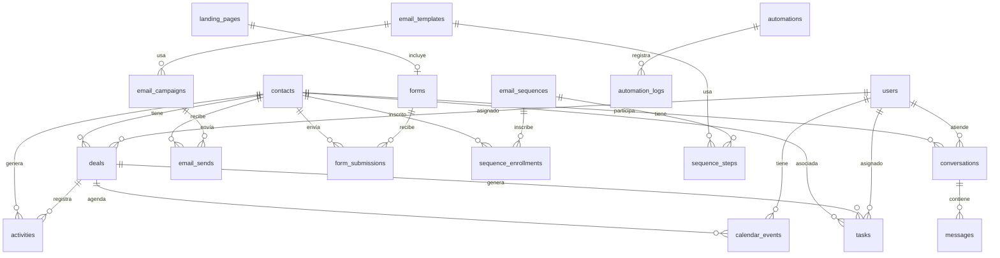

# 🏗️ Blueprint: Agente de Ventas AI + CRM Propio para TurnoGol

> **Propósito**: Documento de especificación completo para que Claude Code (Sonnet 4 / Opus 4) construya, en un repo nuevo, un sistema compuesto por:
> 1. **Agente de Ventas AI** — califica, conversa y agenda leads automáticamente por WhatsApp e Instagram/Facebook DMs.
> 2. **CRM propio** — reemplaza GoHighLevel al 100%: contactos, pipelines, calendario, email marketing, landing pages, formularios, automatizaciones, reportes.
>
> **Contexto de negocio**: TurnoGol es un SaaS B2B de gestión para complejos de fútbol en Argentina. El ICP son dueños de complejos de 3-6 canchas que gestionan con WhatsApp + cuaderno. El wedge de venta es el clavo (no-show) y el teléfono.

---

## Tabla de Contenidos

1. [Mega-Prompt para Claude Code](#1-mega-prompt-para-claude-code)
2. [Arquitectura General](#2-arquitectura-general)
3. [Stack Tecnológico](#3-stack-tecnológico)
4. [Schema de Base de Datos](#4-schema-de-base-de-datos)
5. [Agente de Ventas AI — Spec Completa](#5-agente-de-ventas-ai--spec-completa)
6. [CRM — Spec Completa](#6-crm--spec-completa)
7. [API Contracts](#7-api-contracts)
8. [Automatizaciones y Workflows](#8-automatizaciones-y-workflows)
9. [Roadmap de Fases](#9-roadmap-de-fases)
10. [Prompts de Sistema del Agente](#10-prompts-de-sistema-del-agente)
11. [Verificación y Testing](#11-verificación-y-testing)

---

## 1. Mega-Prompt para Claude Code

> **Instrucciones**: Copiá este prompt completo en una nueva conversación de Claude Code en tu repo nuevo. Es el prompt fundacional — después le vas pasando fase por fase.

````markdown
# CLAUDE.md — TurnoGol Sales Engine

## Qué es este proyecto

Sistema de ventas AI + CRM propio para TurnoGol, un SaaS B2B de gestión para complejos de fútbol en Argentina.

Dos módulos principales:
1. **Agente de Ventas AI**: bot conversacional que califica leads y agenda demos por WhatsApp (API Cloud) e Instagram/Facebook DMs (Meta Graph API). Sigue un playbook de ventas estricto con reglas de lo que puede y no puede prometer.
2. **CRM**: reemplaza GoHighLevel. Gestión de contactos, pipeline visual (10 etapas), calendario de demos, email marketing, landing pages, formularios, automatizaciones con triggers/acciones, reportes y métricas de funnel.

## Contexto de negocio (el agente DEBE conocer esto)

- TurnoGol: SaaS de gestión para complejos de fútbol en Argentina.
- Suscripción mensual: Predio $47.000 (1-3 canchas), Complejo $74.000 (4-6), Estadio $101.000 (7+), + IVA 21%. Trial 30 días sin tarjeta. Anual -20%.
- Competidor principal: ATC Sports (multi-deporte, marketplace, más caro).
- Wedge de venta: el clavo (no-show) y el teléfono que no para.
- ICP-1: complejos de 3-6 canchas, solo fútbol, dueño presente, IG activo, gestión manual (WhatsApp + cuaderno), finde lleno, zona a <40 min.
- Idioma: español rioplatense, voseo, cero corporate.

## Stack

- Next.js 15 (App Router) + TypeScript strict
- PostgreSQL via Supabase (Auth + Realtime + Storage)
- Drizzle ORM + pg-boss (background jobs)
- shadcn/ui + Tailwind CSS
- WhatsApp Business API (Cloud API)
- Meta Graph API (Instagram Messaging + Facebook Messenger)
- OpenAI API / Anthropic API (LLM del agente)
- Resend (email transaccional + marketing)
- Vitest + Playwright

## Reglas críticas

- TypeScript strict, nunca `any`
- Server Actions para mutaciones UI, Route Handlers para webhooks
- Montos en centavos de ARS (integer, nunca decimal)
- Timestamps UTC, conversión a ART solo en frontend
- UUIDs como PKs
- El agente NUNCA contacta por sí solo — necesita aprobación humana O estar en modo automático activado por el admin
- El agente NUNCA promete features que no existen (lista prohibida en el system prompt)
- Correr `pnpm typecheck` después de cada cambio

## Convenciones

- Respuestas directas, código y comandos
- Si hay ambigüedad, preguntar antes de inventar
- Monorepo con carpetas: `/apps/web` (CRM), `/apps/agent` (servicio del agente), `/packages/shared` (tipos, utils, DB)
````

---

## 2. Arquitectura General

```
┌──────────────────────────────────────────────────────────┐
│                    FRONTEND (Next.js 15)                  │
│  ┌──────────┐ ┌──────────┐ ┌────────┐ ┌──────────────┐  │
│  │ Dashboard │ │ Pipeline │ │Calendar│ │ Landing Page │  │
│  │  & Métricas│ │  Kanban  │ │        │ │   Builder    │  │
│  └──────────┘ └──────────┘ └────────┘ └──────────────┘  │
│  ┌──────────┐ ┌──────────┐ ┌────────┐ ┌──────────────┐  │
│  │ Contacts │ │  Email   │ │  Forms │ │  Agent Chat  │  │
│  │ Manager  │ │ Campaigns│ │Builder │ │   Console    │  │
│  └──────────┘ └──────────┘ └────────┘ └──────────────┘  │
└────────────────────────┬─────────────────────────────────┘
                         │ Server Actions + Route Handlers
┌────────────────────────┴─────────────────────────────────┐
│                    BACKEND SERVICES                       │
│  ┌──────────────────┐  ┌──────────────────────────────┐  │
│  │   CRM Engine     │  │     AI Sales Agent Engine     │  │
│  │  - CRUD contacts │  │  - Conversation manager       │  │
│  │  - Pipeline mgmt │  │  - Lead qualification (BANT)  │  │
│  │  - Automations   │  │  - Demo scheduling            │  │
│  │  - Email sending │  │  - Objection handling         │  │
│  │  - Form capture  │  │  - Human handoff              │  │
│  └──────────────────┘  └──────────────────────────────┘  │
│  ┌──────────────────┐  ┌──────────────────────────────┐  │
│  │   pg-boss Jobs   │  │     Webhook Receivers         │  │
│  │  - Email queues  │  │  - WhatsApp (Cloud API)       │  │
│  │  - Follow-ups    │  │  - Instagram (Graph API)      │  │
│  │  - Automations   │  │  - Facebook (Graph API)       │  │
│  │  - Scoring       │  │  - Form submissions           │  │
│  └──────────────────┘  └──────────────────────────────┘  │
└────────────────────────┬─────────────────────────────────┘
                         │
┌────────────────────────┴─────────────────────────────────┐
│              PostgreSQL (Supabase) + Storage              │
│         Drizzle ORM | RLS | Realtime | File Storage       │
└──────────────────────────────────────────────────────────┘
```

### Diagrama de Flujo del Agente

```
Lead entra por WhatsApp/IG/FB
         │
         ▼
┌─────────────────┐
│ Webhook recibido│
│ (msg entrante)  │
└────────┬────────┘
         │
         ▼
┌─────────────────────┐    ┌──────────────────┐
│ ¿Contacto existente?│───▶│ Crear contacto   │
│                     │ No │ Etapa: "Lista"   │
└────────┬────────────┘    └────────┬─────────┘
         │ Sí                       │
         ▼                          ▼
┌─────────────────────────────────────────┐
│ Cargar contexto:                         │
│ - Historial de conversación              │
│ - Etapa actual del pipeline              │
│ - Score ICP                              │
│ - Datos del complejo (canchas, IG, etc.) │
│ - Objeciones previas                     │
└────────────────┬────────────────────────┘
                 │
                 ▼
┌──────────────────────────────────────┐
│ LLM genera respuesta con:            │
│ - System prompt (playbook)           │
│ - Contexto del lead                  │
│ - Scripts de ventas (06-scripts)     │
│ - Manejo de objeciones (07)          │
│ - Reglas FIRME vs PROHIBIDO          │
└────────────────┬─────────────────────┘
                 │
                 ▼
┌──────────────────────────────────────┐
│ ¿Modo automático activado?           │
│                                      │
│ SÍ → Enviar directamente            │
│ NO → Cola de aprobación humana       │
└────────────────┬─────────────────────┘
                 │
                 ▼
┌──────────────────────────────────────┐
│ Acciones post-respuesta:             │
│ - Actualizar etapa pipeline          │
│ - Recalcular score                   │
│ - Agendar follow-up si corresponde  │
│ - Registrar en timeline del contacto │
│ - Trigger automations si aplica      │
└──────────────────────────────────────┘
```

---

## 3. Stack Tecnológico

| Capa | Tecnología | Justificación |
|---|---|---|
| **Framework** | Next.js 15 (App Router) | SSR + Server Actions + API Routes. Mismo stack que TurnoGol → conocimiento transferible |
| **Lenguaje** | TypeScript strict | Type safety end-to-end |
| **DB** | PostgreSQL via Supabase | Auth, Realtime (para el chat console), Storage (archivos de contactos), Row Level Security |
| **ORM** | Drizzle ORM | Type-safe, SQL-first, migrations |
| **Jobs** | pg-boss | Follow-ups automáticos, email queues, scoring batch, automations |
| **UI** | shadcn/ui + Tailwind CSS | Componentes accesibles, customizables, rápido de iterar |
| **WhatsApp** | WhatsApp Business Cloud API | Envío/recepción de mensajes, templates, media |
| **Instagram/FB** | Meta Graph API (v21+) | Instagram Messaging API + Messenger Platform |
| **LLM** | Anthropic Claude API (Haiku para respuestas rápidas, Sonnet para calificación compleja) | Español nativo excelente, context window grande, tool use |
| **Email Transaccional** | Resend | API simple, templates React |
| **Email Marketing** | Resend Broadcasts + custom queue | Campañas, secuencias, tracking de opens/clicks |
| **Landing Pages** | Componentes Next.js dinámicos con JSON schema | Builder drag-and-drop no necesario en v1 — templates editables |
| **Formularios** | Custom con React Hook Form + Zod | Embed-ready, submissions al CRM |
| **Deploy** | Vercel (web) + Railway o Supabase Edge Functions (agent worker) | |
| **Monitoreo** | Sentry | Error tracking, performance |
| **Testing** | Vitest (unit/integration) + Playwright (e2e) | |

---

## 4. Schema de Base de Datos

### Entidades principales y sus relaciones

```sql
-- ============================================
-- CONTACTOS Y LEADS
-- ============================================

CREATE TYPE contact_source AS ENUM (
  'whatsapp', 'instagram', 'facebook', 'form', 
  'landing_page', 'manual', 'import', 'referral'
);

CREATE TYPE contact_status AS ENUM (
  'active', 'inactive', 'unsubscribed', 'bounced'
);

CREATE TABLE contacts (
  id UUID PRIMARY KEY DEFAULT gen_random_uuid(),
  
  -- Identidad
  first_name TEXT,
  last_name TEXT,
  email TEXT,
  phone TEXT,                    -- E.164 format (+5411...)
  phone_wa_id TEXT,              -- WhatsApp phone number ID
  ig_user_id TEXT,               -- Instagram scoped user ID
  fb_user_id TEXT,               -- Facebook page-scoped user ID
  
  -- Negocio (datos del complejo)
  company_name TEXT,             -- Nombre del complejo
  company_address TEXT,
  company_zone TEXT,             -- Zona geográfica
  courts_count INTEGER,          -- Cantidad de canchas
  sports TEXT[] DEFAULT '{}',    -- ['futbol5', 'futbol7', 'futbol11']
  ig_handle TEXT,                -- @handle de Instagram del complejo
  ig_last_post_at TIMESTAMPTZ,  -- Última publicación (para scoring)
  uses_mercadopago BOOLEAN,
  current_management TEXT,       -- 'whatsapp_cuaderno', 'excel', 'atc', 'otro_software'
  closes_after_midnight BOOLEAN, -- Para scoring (día operativo)
  referred_by UUID REFERENCES contacts(id),
  
  -- CRM
  source contact_source NOT NULL DEFAULT 'manual',
  source_detail TEXT,            -- Ej: "form_contacto_landing_clavos"
  status contact_status NOT NULL DEFAULT 'active',
  assigned_to UUID REFERENCES users(id),
  
  -- Scoring
  icp_score INTEGER DEFAULT 0,  -- 0-12 (scoring del ICP doc02)
  engagement_score INTEGER DEFAULT 0, -- Interacciones recientes
  lead_temperature TEXT DEFAULT 'cold', -- 'cold', 'warm', 'hot'
  
  -- Tags y segmentación
  tags TEXT[] DEFAULT '{}',
  custom_fields JSONB DEFAULT '{}',
  
  -- Timestamps
  created_at TIMESTAMPTZ NOT NULL DEFAULT now(),
  updated_at TIMESTAMPTZ NOT NULL DEFAULT now(),
  last_activity_at TIMESTAMPTZ,
  last_contacted_at TIMESTAMPTZ,
  
  -- Constraints
  CONSTRAINT chk_has_identifier CHECK (
    email IS NOT NULL OR phone IS NOT NULL OR 
    ig_user_id IS NOT NULL OR fb_user_id IS NOT NULL
  )
);

CREATE INDEX idx_contacts_phone ON contacts(phone);
CREATE INDEX idx_contacts_email ON contacts(email);
CREATE INDEX idx_contacts_wa_id ON contacts(phone_wa_id);
CREATE INDEX idx_contacts_ig_id ON contacts(ig_user_id);
CREATE INDEX idx_contacts_icp_score ON contacts(icp_score DESC);
CREATE INDEX idx_contacts_tags ON contacts USING gin(tags);

-- ============================================
-- PIPELINE Y DEALS
-- ============================================

CREATE TYPE pipeline_stage AS ENUM (
  'lista',           -- 0: Scoreado ≥6, sin contactar
  'contactado',      -- 1: Primer mensaje enviado
  'respondio',       -- 2: Cualquier respuesta humana
  'charla_dolor',    -- 3: Contó cómo maneja turnos
  'demo_agendada',   -- 4: Día + hora confirmados
  'demo_hecha',      -- 5: Vio el producto
  'piloto_activo',   -- 6: Wizard completo + MP + link en bio
  'activado',        -- 7: Primera reserva online con seña
  'pago',            -- 8: Suscripción cobrada
  'referidor'        -- 9: Dio ≥1 contacto
);

CREATE TYPE deal_exit_status AS ENUM (
  'no_respondio',    -- Re-contactar en 30 días
  'no_icp',          -- Pádel, feliz con ATC
  'no_ahora',        -- Re-contactar con fecha
  'piloto_muerto',   -- Motivo del kill
  'perdido_precio',
  'perdido_otro'
);

CREATE TABLE deals (
  id UUID PRIMARY KEY DEFAULT gen_random_uuid(),
  contact_id UUID NOT NULL REFERENCES contacts(id) ON DELETE CASCADE,
  
  -- Pipeline
  stage pipeline_stage NOT NULL DEFAULT 'lista',
  stage_entered_at TIMESTAMPTZ NOT NULL DEFAULT now(),
  stage_history JSONB DEFAULT '[]', -- [{stage, entered_at, exited_at}]
  
  -- Exit
  exit_status deal_exit_status,
  exit_reason TEXT,
  exit_at TIMESTAMPTZ,
  recontact_at TIMESTAMPTZ,       -- Para "no_ahora"
  
  -- Deal data
  plan_interest TEXT,              -- 'predio', 'complejo', 'estadio'
  monthly_value INTEGER,           -- En centavos ARS
  pain_primary TEXT,               -- 'clavos', 'telefono', 'caja', 'abonados'
  objection_primary TEXT,          -- Objeción principal detectada
  
  -- Demo
  demo_scheduled_at TIMESTAMPTZ,
  demo_completed_at TIMESTAMPTZ,
  demo_notes TEXT,
  
  -- Piloto
  pilot_started_at TIMESTAMPTZ,
  pilot_success_metric TEXT,       -- "8-15 reservas online en el mes"
  pilot_kill_reason TEXT,
  
  -- Referral tracking
  referral_asked BOOLEAN DEFAULT false,
  referrals_given INTEGER DEFAULT 0,
  
  -- Automations
  next_action TEXT,
  next_action_at TIMESTAMPTZ,
  
  -- Meta
  created_at TIMESTAMPTZ NOT NULL DEFAULT now(),
  updated_at TIMESTAMPTZ NOT NULL DEFAULT now(),
  closed_at TIMESTAMPTZ,
  
  CONSTRAINT uq_contact_active_deal UNIQUE (contact_id) -- 1 deal activo por contacto
);

CREATE INDEX idx_deals_stage ON deals(stage);
CREATE INDEX idx_deals_next_action ON deals(next_action_at) WHERE exit_status IS NULL;

-- ============================================
-- CONVERSACIONES Y MENSAJES
-- ============================================

CREATE TYPE channel_type AS ENUM ('whatsapp', 'instagram', 'facebook', 'email', 'internal_note');
CREATE TYPE message_direction AS ENUM ('inbound', 'outbound');
CREATE TYPE message_status AS ENUM ('pending_approval', 'approved', 'sent', 'delivered', 'read', 'failed');
CREATE TYPE message_sender AS ENUM ('contact', 'agent_ai', 'human_user');

CREATE TABLE conversations (
  id UUID PRIMARY KEY DEFAULT gen_random_uuid(),
  contact_id UUID NOT NULL REFERENCES contacts(id) ON DELETE CASCADE,
  channel channel_type NOT NULL,
  channel_conversation_id TEXT,    -- ID de la conversación en la plataforma
  
  -- Estado
  is_active BOOLEAN DEFAULT true,
  is_ai_enabled BOOLEAN DEFAULT true,  -- Si el agente AI responde automáticamente
  assigned_to UUID REFERENCES users(id),
  
  -- Contexto para el AI
  ai_context_summary TEXT,         -- Resumen generado por el AI del contexto
  
  -- Meta
  last_message_at TIMESTAMPTZ,
  created_at TIMESTAMPTZ NOT NULL DEFAULT now(),
  updated_at TIMESTAMPTZ NOT NULL DEFAULT now()
);

CREATE TABLE messages (
  id UUID PRIMARY KEY DEFAULT gen_random_uuid(),
  conversation_id UUID NOT NULL REFERENCES conversations(id) ON DELETE CASCADE,
  contact_id UUID NOT NULL REFERENCES contacts(id),
  
  -- Contenido
  direction message_direction NOT NULL,
  sender message_sender NOT NULL,
  content TEXT NOT NULL,
  media_url TEXT,                   -- URL del archivo multimedia
  media_type TEXT,                  -- 'image', 'video', 'audio', 'document'
  
  -- Estado
  status message_status NOT NULL DEFAULT 'sent',
  approved_by UUID REFERENCES users(id),
  approved_at TIMESTAMPTZ,
  
  -- Plataforma
  platform_message_id TEXT,        -- ID del mensaje en WA/IG/FB
  
  -- AI metadata
  ai_generated BOOLEAN DEFAULT false,
  ai_model TEXT,                   -- 'claude-haiku', 'claude-sonnet'
  ai_confidence FLOAT,             -- 0-1
  ai_suggested_stage pipeline_stage, -- Stage que el AI sugiere
  ai_detected_objection TEXT,
  ai_detected_pain TEXT,
  
  -- Timestamps
  sent_at TIMESTAMPTZ,
  delivered_at TIMESTAMPTZ,
  read_at TIMESTAMPTZ,
  created_at TIMESTAMPTZ NOT NULL DEFAULT now()
);

CREATE INDEX idx_messages_conversation ON messages(conversation_id, created_at);
CREATE INDEX idx_messages_pending ON messages(status) WHERE status = 'pending_approval';

-- ============================================
-- CALENDARIO Y EVENTOS
-- ============================================

CREATE TYPE event_type AS ENUM ('demo', 'follow_up', 'call', 'visit', 'pilot_check', 'other');
CREATE TYPE event_status AS ENUM ('scheduled', 'completed', 'canceled', 'no_show');

CREATE TABLE calendar_events (
  id UUID PRIMARY KEY DEFAULT gen_random_uuid(),
  contact_id UUID REFERENCES contacts(id),
  deal_id UUID REFERENCES deals(id),
  user_id UUID NOT NULL REFERENCES users(id),  -- Quién tiene la cita
  
  -- Evento
  type event_type NOT NULL,
  title TEXT NOT NULL,
  description TEXT,
  
  -- Horario
  starts_at TIMESTAMPTZ NOT NULL,
  ends_at TIMESTAMPTZ NOT NULL,
  timezone TEXT NOT NULL DEFAULT 'America/Argentina/Buenos_Aires',
  
  -- Estado
  status event_status NOT NULL DEFAULT 'scheduled',
  completed_notes TEXT,
  
  -- Recordatorios
  reminder_sent BOOLEAN DEFAULT false,
  confirmation_sent BOOLEAN DEFAULT false,
  
  created_at TIMESTAMPTZ NOT NULL DEFAULT now(),
  updated_at TIMESTAMPTZ NOT NULL DEFAULT now()
);

CREATE INDEX idx_events_user_date ON calendar_events(user_id, starts_at);
CREATE INDEX idx_events_contact ON calendar_events(contact_id);

-- ============================================
-- ACTIVIDADES Y TIMELINE
-- ============================================

CREATE TYPE activity_type AS ENUM (
  'message_sent', 'message_received', 'email_sent', 'email_opened', 
  'email_clicked', 'form_submitted', 'page_visited', 'deal_stage_changed',
  'note_added', 'call_logged', 'meeting_scheduled', 'meeting_completed',
  'task_created', 'task_completed', 'tag_added', 'tag_removed',
  'score_changed', 'assigned', 'agent_handoff'
);

CREATE TABLE activities (
  id UUID PRIMARY KEY DEFAULT gen_random_uuid(),
  contact_id UUID NOT NULL REFERENCES contacts(id) ON DELETE CASCADE,
  deal_id UUID REFERENCES deals(id),
  user_id UUID REFERENCES users(id),  -- Quién ejecutó la acción
  
  type activity_type NOT NULL,
  title TEXT NOT NULL,
  description TEXT,
  metadata JSONB DEFAULT '{}',        -- Datos extra según el tipo
  
  created_at TIMESTAMPTZ NOT NULL DEFAULT now()
);

CREATE INDEX idx_activities_contact ON activities(contact_id, created_at DESC);

-- ============================================
-- TAREAS
-- ============================================

CREATE TYPE task_priority AS ENUM ('low', 'medium', 'high', 'urgent');
CREATE TYPE task_status AS ENUM ('pending', 'in_progress', 'completed', 'canceled');

CREATE TABLE tasks (
  id UUID PRIMARY KEY DEFAULT gen_random_uuid(),
  contact_id UUID REFERENCES contacts(id),
  deal_id UUID REFERENCES deals(id),
  assigned_to UUID NOT NULL REFERENCES users(id),
  
  title TEXT NOT NULL,
  description TEXT,
  priority task_priority NOT NULL DEFAULT 'medium',
  status task_status NOT NULL DEFAULT 'pending',
  due_at TIMESTAMPTZ,
  completed_at TIMESTAMPTZ,
  
  -- Automation source
  automation_id UUID REFERENCES automations(id),
  
  created_at TIMESTAMPTZ NOT NULL DEFAULT now(),
  updated_at TIMESTAMPTZ NOT NULL DEFAULT now()
);

CREATE INDEX idx_tasks_assigned ON tasks(assigned_to, status, due_at);

-- ============================================
-- EMAIL MARKETING
-- ============================================

CREATE TYPE campaign_status AS ENUM ('draft', 'scheduled', 'sending', 'sent', 'canceled');
CREATE TYPE email_send_status AS ENUM ('queued', 'sent', 'delivered', 'opened', 'clicked', 'bounced', 'complained');

CREATE TABLE email_templates (
  id UUID PRIMARY KEY DEFAULT gen_random_uuid(),
  name TEXT NOT NULL,
  subject TEXT NOT NULL,
  html_content TEXT NOT NULL,
  text_content TEXT,
  variables TEXT[] DEFAULT '{}',  -- ['first_name', 'company_name', 'courts_count']
  category TEXT,                   -- 'follow_up', 'nurture', 'announcement', etc.
  
  created_at TIMESTAMPTZ NOT NULL DEFAULT now(),
  updated_at TIMESTAMPTZ NOT NULL DEFAULT now()
);

CREATE TABLE email_campaigns (
  id UUID PRIMARY KEY DEFAULT gen_random_uuid(),
  name TEXT NOT NULL,
  template_id UUID NOT NULL REFERENCES email_templates(id),
  
  -- Targeting
  segment_filter JSONB NOT NULL,  -- Filtro para seleccionar contactos
  
  -- Scheduling
  status campaign_status NOT NULL DEFAULT 'draft',
  scheduled_at TIMESTAMPTZ,
  sent_at TIMESTAMPTZ,
  
  -- Stats (actualizadas por jobs)
  total_recipients INTEGER DEFAULT 0,
  sent_count INTEGER DEFAULT 0,
  delivered_count INTEGER DEFAULT 0,
  opened_count INTEGER DEFAULT 0,
  clicked_count INTEGER DEFAULT 0,
  bounced_count INTEGER DEFAULT 0,
  
  created_at TIMESTAMPTZ NOT NULL DEFAULT now(),
  updated_at TIMESTAMPTZ NOT NULL DEFAULT now()
);

CREATE TABLE email_sends (
  id UUID PRIMARY KEY DEFAULT gen_random_uuid(),
  campaign_id UUID REFERENCES email_campaigns(id),
  contact_id UUID NOT NULL REFERENCES contacts(id),
  
  status email_send_status NOT NULL DEFAULT 'queued',
  resend_email_id TEXT,            -- ID de Resend
  
  sent_at TIMESTAMPTZ,
  delivered_at TIMESTAMPTZ,
  opened_at TIMESTAMPTZ,
  clicked_at TIMESTAMPTZ,
  
  created_at TIMESTAMPTZ NOT NULL DEFAULT now()
);

-- ============================================
-- EMAIL SEQUENCES (DRIP CAMPAIGNS)
-- ============================================

CREATE TYPE sequence_status AS ENUM ('active', 'paused', 'archived');

CREATE TABLE email_sequences (
  id UUID PRIMARY KEY DEFAULT gen_random_uuid(),
  name TEXT NOT NULL,
  description TEXT,
  status sequence_status NOT NULL DEFAULT 'active',
  
  -- Trigger: cuándo se activa
  trigger_type TEXT NOT NULL,      -- 'stage_change', 'tag_added', 'form_submitted', 'manual'
  trigger_config JSONB NOT NULL,   -- Ej: {stage: 'contactado'}
  
  -- Exit conditions
  exit_on_reply BOOLEAN DEFAULT true,
  exit_on_stage_change BOOLEAN DEFAULT true,
  exit_stages pipeline_stage[] DEFAULT '{}',
  
  created_at TIMESTAMPTZ NOT NULL DEFAULT now(),
  updated_at TIMESTAMPTZ NOT NULL DEFAULT now()
);

CREATE TABLE sequence_steps (
  id UUID PRIMARY KEY DEFAULT gen_random_uuid(),
  sequence_id UUID NOT NULL REFERENCES email_sequences(id) ON DELETE CASCADE,
  
  step_order INTEGER NOT NULL,
  delay_minutes INTEGER NOT NULL,  -- Minutos después del paso anterior (o del trigger)
  
  -- Contenido
  template_id UUID NOT NULL REFERENCES email_templates(id),
  subject_override TEXT,           -- Override del subject del template
  
  -- Condiciones
  send_condition JSONB,            -- Condiciones extra para enviar este paso
  
  UNIQUE(sequence_id, step_order)
);

CREATE TABLE sequence_enrollments (
  id UUID PRIMARY KEY DEFAULT gen_random_uuid(),
  sequence_id UUID NOT NULL REFERENCES email_sequences(id),
  contact_id UUID NOT NULL REFERENCES contacts(id),
  
  current_step INTEGER NOT NULL DEFAULT 0,
  status TEXT NOT NULL DEFAULT 'active', -- 'active', 'completed', 'exited', 'paused'
  exit_reason TEXT,
  
  enrolled_at TIMESTAMPTZ NOT NULL DEFAULT now(),
  next_step_at TIMESTAMPTZ,
  completed_at TIMESTAMPTZ,
  
  UNIQUE(sequence_id, contact_id)
);

-- ============================================
-- FORMULARIOS
-- ============================================

CREATE TABLE forms (
  id UUID PRIMARY KEY DEFAULT gen_random_uuid(),
  name TEXT NOT NULL,
  slug TEXT NOT NULL UNIQUE,
  
  -- Schema del formulario
  fields JSONB NOT NULL,           -- [{name, type, label, required, options}]
  
  -- Configuración
  submit_button_text TEXT DEFAULT 'Enviar',
  success_message TEXT DEFAULT '¡Gracias! Nos ponemos en contacto.',
  redirect_url TEXT,
  
  -- CRM integration
  auto_create_contact BOOLEAN DEFAULT true,
  auto_tag TEXT[],                 -- Tags a aplicar al contacto
  auto_pipeline_stage pipeline_stage,
  auto_assign_to UUID REFERENCES users(id),
  notify_users UUID[] DEFAULT '{}',
  
  -- Stats
  views_count INTEGER DEFAULT 0,
  submissions_count INTEGER DEFAULT 0,
  
  -- Embed
  embed_allowed_domains TEXT[] DEFAULT '{}',
  
  created_at TIMESTAMPTZ NOT NULL DEFAULT now(),
  updated_at TIMESTAMPTZ NOT NULL DEFAULT now()
);

CREATE TABLE form_submissions (
  id UUID PRIMARY KEY DEFAULT gen_random_uuid(),
  form_id UUID NOT NULL REFERENCES forms(id),
  contact_id UUID REFERENCES contacts(id),
  
  data JSONB NOT NULL,
  source_url TEXT,
  ip_address INET,
  user_agent TEXT,
  
  created_at TIMESTAMPTZ NOT NULL DEFAULT now()
);

-- ============================================
-- LANDING PAGES
-- ============================================

CREATE TYPE landing_page_status AS ENUM ('draft', 'published', 'archived');

CREATE TABLE landing_pages (
  id UUID PRIMARY KEY DEFAULT gen_random_uuid(),
  name TEXT NOT NULL,
  slug TEXT NOT NULL UNIQUE,       -- URL path
  
  -- Contenido
  content JSONB NOT NULL,          -- Estructura de secciones/bloques
  meta_title TEXT,
  meta_description TEXT,
  og_image_url TEXT,
  
  -- Configuración
  status landing_page_status NOT NULL DEFAULT 'draft',
  form_id UUID REFERENCES forms(id),
  custom_css TEXT,
  custom_js TEXT,
  
  -- Stats
  views_count INTEGER DEFAULT 0,
  
  -- Tracking
  published_at TIMESTAMPTZ,
  created_at TIMESTAMPTZ NOT NULL DEFAULT now(),
  updated_at TIMESTAMPTZ NOT NULL DEFAULT now()
);

-- ============================================
-- AUTOMATIZACIONES
-- ============================================

CREATE TYPE automation_status AS ENUM ('active', 'paused', 'archived');

CREATE TABLE automations (
  id UUID PRIMARY KEY DEFAULT gen_random_uuid(),
  name TEXT NOT NULL,
  description TEXT,
  status automation_status NOT NULL DEFAULT 'active',
  
  -- Trigger
  trigger_type TEXT NOT NULL,
  -- Tipos: 'stage_changed', 'tag_added', 'tag_removed', 'score_reached',
  --        'form_submitted', 'email_opened', 'email_clicked',
  --        'message_received', 'no_activity_days', 'date_reached',
  --        'contact_created'
  trigger_config JSONB NOT NULL,
  
  -- Actions (ejecutadas en orden)
  actions JSONB NOT NULL,
  -- Tipos de acción:
  -- {type: 'change_stage', stage: 'demo_agendada'}
  -- {type: 'add_tag', tag: 'demo-pendiente'}
  -- {type: 'remove_tag', tag: 'nuevo'}
  -- {type: 'send_email', template_id: '...'}
  -- {type: 'send_whatsapp', template: '...'}
  -- {type: 'create_task', title: '...', assigned_to: '...', due_days: 2}
  -- {type: 'assign_to', user_id: '...'}
  -- {type: 'update_score', delta: 5}
  -- {type: 'enroll_sequence', sequence_id: '...'}
  -- {type: 'notify_user', user_id: '...', message: '...'}
  -- {type: 'wait', minutes: 1440}
  -- {type: 'condition', if: {...}, then: [...], else: [...]}
  -- {type: 'webhook', url: '...', method: 'POST'}
  
  -- Conditions (filtros adicionales para que se ejecute)
  conditions JSONB,
  
  -- Stats
  times_triggered INTEGER DEFAULT 0,
  last_triggered_at TIMESTAMPTZ,
  
  created_at TIMESTAMPTZ NOT NULL DEFAULT now(),
  updated_at TIMESTAMPTZ NOT NULL DEFAULT now()
);

CREATE TABLE automation_logs (
  id UUID PRIMARY KEY DEFAULT gen_random_uuid(),
  automation_id UUID NOT NULL REFERENCES automations(id),
  contact_id UUID NOT NULL REFERENCES contacts(id),
  
  trigger_data JSONB,
  actions_executed JSONB,
  success BOOLEAN NOT NULL,
  error_message TEXT,
  
  created_at TIMESTAMPTZ NOT NULL DEFAULT now()
);

-- ============================================
-- USUARIOS DEL CRM
-- ============================================

CREATE TYPE user_role AS ENUM ('owner', 'admin', 'sales_rep', 'viewer');

CREATE TABLE users (
  id UUID PRIMARY KEY DEFAULT gen_random_uuid(),
  auth_id UUID NOT NULL UNIQUE,    -- Supabase Auth ID
  
  email TEXT NOT NULL UNIQUE,
  full_name TEXT NOT NULL,
  avatar_url TEXT,
  role user_role NOT NULL DEFAULT 'sales_rep',
  
  -- Calendario
  calendar_timezone TEXT DEFAULT 'America/Argentina/Buenos_Aires',
  available_hours JSONB,           -- {mon: [{start: '09:00', end: '18:00'}], ...}
  
  -- WhatsApp
  wa_phone_number_id TEXT,         -- Su phone number ID de WA Business
  
  -- Notifications
  notify_new_lead BOOLEAN DEFAULT true,
  notify_demo_reminder BOOLEAN DEFAULT true,
  notify_agent_handoff BOOLEAN DEFAULT true,
  
  created_at TIMESTAMPTZ NOT NULL DEFAULT now(),
  updated_at TIMESTAMPTZ NOT NULL DEFAULT now()
);

-- ============================================
-- CONFIGURACIÓN DEL AGENTE AI
-- ============================================

CREATE TABLE agent_config (
  id UUID PRIMARY KEY DEFAULT gen_random_uuid(),
  
  -- LLM
  llm_provider TEXT NOT NULL DEFAULT 'anthropic', -- 'anthropic', 'openai'
  llm_model_fast TEXT NOT NULL DEFAULT 'claude-haiku-4-20250414',
  llm_model_smart TEXT NOT NULL DEFAULT 'claude-sonnet-4-20250514',
  temperature FLOAT NOT NULL DEFAULT 0.3,
  
  -- Comportamiento
  auto_respond BOOLEAN DEFAULT false,  -- Si true, envía sin aprobación humana
  auto_respond_hours JSONB,            -- Horarios en que auto-responde
  max_messages_before_handoff INTEGER DEFAULT 10,
  handoff_keywords TEXT[] DEFAULT ARRAY['hablar con alguien', 'persona real'],
  
  -- Timing
  response_delay_min_seconds INTEGER DEFAULT 30,  -- Simular que no es instantáneo
  response_delay_max_seconds INTEGER DEFAULT 120,
  
  -- Personalización
  agent_name TEXT DEFAULT 'Lázaro',
  agent_personality TEXT,              -- Override del system prompt
  
  -- Promesas (synced desde el playbook)
  can_promise TEXT[],                  -- Lista de cosas que puede prometer
  cannot_promise TEXT[],               -- Lista prohibida
  
  updated_at TIMESTAMPTZ NOT NULL DEFAULT now()
);

-- ============================================
-- MÉTRICAS Y REPORTES
-- ============================================

CREATE TABLE daily_metrics (
  id UUID PRIMARY KEY DEFAULT gen_random_uuid(),
  date DATE NOT NULL UNIQUE,
  
  -- Funnel
  new_contacts INTEGER DEFAULT 0,
  contacts_contacted INTEGER DEFAULT 0,
  responses_received INTEGER DEFAULT 0,
  pain_chats INTEGER DEFAULT 0,
  demos_scheduled INTEGER DEFAULT 0,
  demos_completed INTEGER DEFAULT 0,
  pilots_started INTEGER DEFAULT 0,
  pilots_activated INTEGER DEFAULT 0,
  payments_new INTEGER DEFAULT 0,
  
  -- Agent
  messages_received INTEGER DEFAULT 0,
  messages_sent_ai INTEGER DEFAULT 0,
  messages_sent_human INTEGER DEFAULT 0,
  handoffs INTEGER DEFAULT 0,
  avg_response_time_seconds INTEGER,
  
  -- Email
  emails_sent INTEGER DEFAULT 0,
  emails_opened INTEGER DEFAULT 0,
  emails_clicked INTEGER DEFAULT 0,
  
  -- Pipeline
  pipeline_snapshot JSONB,  -- {lista: 10, contactado: 25, ...}
  
  created_at TIMESTAMPTZ NOT NULL DEFAULT now()
);

-- ============================================
-- WEBHOOKS PROCESADOS (idempotencia)
-- ============================================

CREATE TABLE processed_webhooks (
  id TEXT PRIMARY KEY,             -- ID del webhook de la plataforma
  platform TEXT NOT NULL,          -- 'whatsapp', 'instagram', 'facebook', 'resend'
  processed_at TIMESTAMPTZ NOT NULL DEFAULT now()
);
```

### Relaciones (Mermaid)



---

## 5. Agente de Ventas AI — Spec Completa

### 5.1 Capacidades del Agente

| Capacidad | Descripción | Prioridad |
|---|---|---|
| **Responder mensajes** | Genera respuestas contextuales por WhatsApp/IG/FB siguiendo el playbook | P0 |
| **Calificar leads (ICP scoring)** | Extrae datos de la conversación y calcula score 0-12 | P0 |
| **Detectar etapa del funnel** | Identifica en qué etapa está el lead y sugiere avance | P0 |
| **Detectar dolor principal** | Clasifica: clavos, teléfono, caja, abonados | P0 |
| **Detectar objeciones** | Identifica la objeción y aplica respuesta de doc07 | P0 |
| **Agendar demos** | Propone horarios según disponibilidad del calendario | P0 |
| **Follow-ups automáticos** | Ejecuta cadencia +2, +5, +12, 30-45 días | P1 |
| **Handoff a humano** | Transfiere la conversación cuando el AI no puede resolver | P0 |
| **Confirmar demos** | Envía confirmación 3 horas antes | P1 |
| **Pedir referidos** | Post-pago, solicita contacto de otro dueño | P2 |
| **Reactivar leads fríos** | Re-contacta leads en `no_respondio` después de 30-45 días | P2 |

### 5.2 Modos de operación

| Modo | Comportamiento | Cuándo usar |
|---|---|---|
| **Supervisado** (default) | El agente genera la respuesta → queda en `pending_approval` → el humano la revisa y aprueba/edita/rechaza → se envía | Primeras semanas, leads calientes, objeciones nuevas |
| **Semi-automático** | El agente envía automáticamente si su `confidence > 0.8` y el lead está en etapas 0-3. Etapas 4+ siempre supervisado | Cuando el playbook está calibrado |
| **Automático** | Todo sale directo, el humano revisa después. Con kill switch instantáneo | Solo para follow-ups y respuestas estándar |

### 5.3 Lógica de calificación ICP (scoring automático)

El agente extrae datos de la conversación y calcula el score en tiempo real:

```typescript
interface ICPScoringCriteria {
  // Cada criterio: 0 = no, 1 = más o menos, 2 = sí
  courtCount: 0 | 1 | 2;           // 3-6 canchas solo fútbol
  igActive: 0 | 1 | 2;             // Posteó en los últimos 15 días
  manualManagement: 0 | 1 | 2;     // Bio WA, pizarra, "escribinos"
  highDemand: 0 | 1 | 2;           // Finde lleno, "se liberó turno"
  proximity: 0 | 1 | 2;            // A <40 min
  closesAfterMidnight: 0 | 1 | 2;  // Cierra después de medianoche
}

// Total: /12. Atacar ≥10, no contactar <6
function calculateICPScore(criteria: ICPScoringCriteria): number {
  return Object.values(criteria).reduce((a, b) => a + b, 0);
}
```

### 5.4 Lógica de detección de etapa

El agente analiza la conversación y detecta transiciones:

```typescript
const STAGE_DETECTION_RULES = {
  lista: 'Contacto en la lista, sin mensaje enviado',
  contactado: 'Se envió primer mensaje (WA/IG) y no hay respuesta aún',
  respondio: 'El contacto respondió cualquier cosa (incluso "no me interesa")',
  charla_dolor: 'El contacto contó cómo maneja los turnos hoy',
  demo_agendada: 'Se acordó día + hora para la demo',
  demo_hecha: 'El contacto vio el producto (presencial o video)',
  piloto_activo: 'Wizard completo + MP conectado + link en bio',
  activado: 'Primera reserva online con seña pagada',
  pago: 'Suscripción cobrada',
  referidor: 'Dio ≥1 contacto de otro dueño'
};

// El AI analiza cada mensaje y sugiere si la etapa cambió
// El cambio se ejecuta automáticamente o espera aprobación según el modo
```

### 5.5 Cadencia de follow-ups

```typescript
const FOLLOW_UP_CADENCE = {
  // Después de primer contacto sin respuesta
  after_first_contact: [
    { delay_days: 2, template: 'follow_up_value' },      // Valor, no presión
    { delay_days: 5, template: 'follow_up_number' },      // Dato concreto con SU precio
    { delay_days: 12, template: 'follow_up_breakup' },    // Break-up
  ],
  // Re-contacto para leads fríos
  recontact: [
    { delay_days: 30, template: 'recontact_update', condition: 'has_new_clients_in_zone' },
    { delay_days: 45, template: 'recontact_generic' },
  ],
  // Confirmación de demo
  demo_confirmation: [
    { delay_hours: -3, template: 'demo_same_day_confirm' }, // 3 horas antes
  ],
  // Seguimiento post-piloto
  pilot_check: [
    { delay_days: 3, template: 'pilot_check_activation' },
    { delay_days: 7, template: 'pilot_check_usage' },
    { delay_days: 14, template: 'pilot_check_or_kill' },
    { delay_days: 21, template: 'pilot_conversion' },     // Conversión al pago
  ]
};
```

---

## 6. CRM — Spec Completa

### 6.1 Módulos y Pantallas

#### Dashboard (`/dashboard`)
- **Métricas en tiempo real**:
  - Pipeline funnel chart (10 etapas, cantidad en cada una)
  - Leads nuevos hoy / semana
  - Demos agendadas esta semana
  - Pilotos activos (máx 5)
  - Tasa de conversión por etapa (vs hipótesis de doc05)
  - MRR actual y proyectado
- **Timeline de actividad reciente**: últimos mensajes, cambios de etapa, tareas vencidas
- **Tasks pendientes del día**: ordenadas por urgencia
- **Alertas**: leads sin próxima acción, follow-ups vencidos, demos hoy

#### Pipeline (`/pipeline`)
- **Vista Kanban**: columnas = etapas del pipeline (10 columnas)
  - Drag & drop para mover deals entre etapas
  - Cada card muestra: nombre del complejo, score ICP, última actividad, próxima acción
  - Color coding: verde (en tiempo), amarillo (sin actividad >3 días), rojo (sin actividad >7 días)
  - Filtros: por score, por zona, por fuente, por assigned_to
- **Vista Lista**: tabla con sorting y filtros avanzados
- **Vista por etapa**: click en una etapa → lista expandida de deals con detalle

#### Contactos (`/contacts`)
- **Lista con búsqueda y filtros**:
  - Búsqueda full-text: nombre, teléfono, email, complejo
  - Filtros: source, score ICP, tags, etapa, zona, status
  - Bulk actions: add tag, change stage, assign, export
- **Ficha de contacto** (`/contacts/[id]`):
  - Header: nombre, complejo, score, tags, etapa actual
  - **Tab Timeline**: toda la actividad en orden cronológico (mensajes, emails, notas, cambios de etapa, form submissions)
  - **Tab Conversaciones**: historial de chat por canal (WA, IG, FB)
  - **Tab Deal**: pipeline stage, history, next action
  - **Tab Datos**: campos editables del contacto y del complejo
  - **Tab Emails**: emails enviados, opens, clicks
  - **Tab Tareas**: tareas asociadas
  - **Tab Notas**: notas internas del equipo
  - **Sidebar acciones rápidas**: enviar WA, enviar email, crear tarea, agendar evento, cambiar etapa, agregar nota

#### Calendario (`/calendar`)
- **Vista mensual / semanal / diaria**
- Eventos coloreados por tipo (demo = azul, follow-up = verde, visita = naranja)
- Click para crear evento vinculado a un contacto/deal
- Integración con disponibilidad del usuario
- Recordatorios automáticos

#### Conversaciones (`/conversations`)
- **Inbox unificado**: todos los canales en un solo lugar
  - Tabs: Todos | WhatsApp | Instagram | Facebook | Sin leer | Pendientes AI
  - Cada conversación muestra: nombre, último mensaje, canal, tiempo desde último mensaje
  - Badge de "Pendiente aprobación" para respuestas AI
- **Chat view**:
  - Historial de mensajes con burbujas (estilo WhatsApp)
  - Indicadores de enviado/entregado/leído
  - Badge "AI" en mensajes generados por el agente
  - Input para responder manualmente
  - Botón "Generar respuesta AI" → genera sugerencia que se puede editar
  - Toggle "AI auto-respond" por conversación
  - Panel lateral: ficha del contacto, deal, próxima acción

#### Email Marketing (`/email`)
- **Templates** (`/email/templates`):
  - Editor visual con bloques (header, text, CTA, image, footer)
  - Variables dinámicas: `{{first_name}}`, `{{company_name}}`, etc.
  - Preview desktop/mobile
- **Campaigns** (`/email/campaigns`):
  - Crear campaña: seleccionar template, definir segmento, programar
  - Stats en tiempo real: sent, delivered, opened, clicked, bounced
- **Sequences** (`/email/sequences`):
  - Builder visual: trigger → pasos con delays → exit conditions
  - Enrollments activos y completados
  - Stats por paso

#### Formularios (`/forms`)
- **Builder**: arrastrar campos (text, email, phone, select, textarea, checkbox)
- **Configuración**: auto-create contact, auto-tag, auto-assign
- **Embed code**: snippet para copiar e insertar en cualquier web
- **Stats**: vistas, submissions, conversion rate

#### Landing Pages (`/pages`)
- **Templates predefinidas**: "Landing Clavos" (dolor), "Demo TurnoGol" (beneficio), "Caso de Éxito"
- **Editor**: secciones configurables (hero, features, testimonial, CTA, form)
- **Preview y publicación**: URL pública bajo dominio propio
- **Stats**: visitas, conversiones

#### Automatizaciones (`/automations`)
- **Builder visual**: trigger → conditions → actions
- **Templates de automatización** preconstruidas:
  1. Nuevo lead por formulario → crear contacto + asignar + notificar + enviar email
  2. Lead sin actividad 3 días → crear tarea de follow-up
  3. Demo completada → cambiar etapa + crear tarea de seguimiento
  4. Piloto sin activación a día 14 → tarea de kill evaluation
  5. Pago recibido → pedir referido + caso de éxito
- **Logs**: historial de ejecuciones con success/failure

#### Reportes (`/reports`)
- **Funnel report**: conversiones entre etapas, tiempos medios
- **Source report**: de dónde vienen los leads, cuáles convierten más
- **Activity report**: mensajes enviados, emails, tareas completadas
- **Agent report**: mensajes AI vs humano, tasa de handoff, confidence promedio
- **Weekly snapshot**: la tabla de métricas de doc08 auto-generada
- **Export**: CSV de contactos, deals, actividades

#### Configuración (`/settings`)
- **Usuarios y roles**
- **Integraciones**: WhatsApp (phone number ID + token), Meta (IG/FB app), Resend (API key)
- **Agente AI**: modelo, temperatura, modo, nombre, personalidad, listas FIRME/PROHIBIDO
- **Pipeline**: personalizar nombres y colores de etapas
- **Notificaciones**: qué notificar y por dónde

### 6.2 Funcionalidades que reemplazan GoHighLevel

| GoHighLevel Feature | Reemplazo en TurnoGol CRM | Notas |
|---|---|---|
| Contact management | ✅ `contacts` con campos custom | Campos especializados para complejos de fútbol |
| Pipeline/Opportunities | ✅ `deals` con 10 etapas del funnel TurnoGol | Etapas basadas en el playbook real |
| Calendar booking | ✅ `calendar_events` + scheduling | Sin booking link público (las demos se agendan en la conversación) |
| Two-way SMS/Email/WA | ✅ WhatsApp + IG + FB + Email bidireccional | Sin SMS (no aplica en Argentina para este vertical) |
| Email marketing | ✅ Templates + Campaigns + Sequences | Vía Resend |
| Forms/Surveys | ✅ `forms` con builder y embed | |
| Landing pages/Funnels | ✅ `landing_pages` con templates | Sin funnel builder complejo (no necesario para el vertical) |
| Automations/Workflows | ✅ `automations` con trigger → condition → action | |
| Reporting/Analytics | ✅ `daily_metrics` + reportes | Métricas específicas del funnel de TurnoGol |
| AI Agent (Conversational AI) | ✅ Agente custom con playbook de ventas inyectado | Mucho más personalizado que GHL AI |
| Reputation management | ❌ No necesario v1 | |
| Invoicing | ❌ Fuera de scope | MercadoPago maneja los pagos de suscripción de TurnoGol |
| Memberships | ❌ No aplica | |
| Affiliate management | ❌ Fuera de scope v1 | Referidos se trackean en el CRM como campo |

---

## 7. API Contracts

### 7.1 Webhooks (Route Handlers)

#### WhatsApp Webhook — `POST /api/webhooks/whatsapp`

```typescript
// Recibe mensajes y status updates de WhatsApp Cloud API
// Ref: https://developers.facebook.com/docs/whatsapp/cloud-api/webhooks

interface WhatsAppWebhookPayload {
  object: 'whatsapp_business_account';
  entry: Array<{
    id: string;
    changes: Array<{
      value: {
        messaging_product: 'whatsapp';
        metadata: { display_phone_number: string; phone_number_id: string };
        contacts?: Array<{ profile: { name: string }; wa_id: string }>;
        messages?: Array<{
          from: string;        // Sender phone number
          id: string;          // Message ID
          timestamp: string;
          type: 'text' | 'image' | 'audio' | 'video' | 'document' | 'reaction';
          text?: { body: string };
          image?: { id: string; mime_type: string; sha256: string };
          // ... otros tipos
        }>;
        statuses?: Array<{
          id: string;
          status: 'sent' | 'delivered' | 'read' | 'failed';
          timestamp: string;
          recipient_id: string;
        }>;
      };
    }>;
  }>;
}

// Flujo:
// 1. Verificar firma del webhook (X-Hub-Signature-256)
// 2. Check idempotencia (processed_webhooks)
// 3. Si es mensaje nuevo:
//    a. Buscar contacto por wa_id → crear si no existe
//    b. Buscar/crear conversación
//    c. Guardar mensaje
//    d. Actualizar last_activity_at
//    e. Generar respuesta AI (según modo)
//    f. Registrar actividad
// 4. Si es status update: actualizar message.status
```

#### Instagram/Facebook Webhook — `POST /api/webhooks/meta`

```typescript
// Recibe mensajes de Instagram Messaging API y Facebook Messenger
// Ref: https://developers.facebook.com/docs/messenger-platform/webhooks

interface MetaWebhookPayload {
  object: 'instagram' | 'page';
  entry: Array<{
    id: string;
    time: number;
    messaging?: Array<{
      sender: { id: string };
      recipient: { id: string };
      timestamp: number;
      message?: {
        mid: string;
        text?: string;
        attachments?: Array<{ type: string; payload: { url: string } }>;
      };
      postback?: { title: string; payload: string };
    }>;
  }>;
}

// Flujo: similar a WhatsApp, adaptado al formato Meta
```

#### Resend Webhook — `POST /api/webhooks/resend`

```typescript
// Eventos: email.sent, email.delivered, email.opened, email.clicked, email.bounced
// Actualiza email_sends y registra actividad
```

### 7.2 Server Actions principales

```typescript
// === Contactos ===
'use server'
async function createContact(data: CreateContactInput): Promise<Contact>
async function updateContact(id: string, data: UpdateContactInput): Promise<Contact>
async function deleteContact(id: string): Promise<void>
async function mergeContacts(primaryId: string, secondaryId: string): Promise<Contact>
async function importContacts(csv: File): Promise<ImportResult>
async function exportContacts(filters: ContactFilters): Promise<string> // CSV URL

// === Deals ===
async function createDeal(contactId: string): Promise<Deal>
async function changeDealStage(dealId: string, stage: PipelineStage, reason?: string): Promise<Deal>
async function closeDeal(dealId: string, exitStatus: DealExitStatus, reason: string): Promise<Deal>
async function reopenDeal(dealId: string): Promise<Deal>

// === Mensajes ===
async function sendWhatsAppMessage(contactId: string, content: string): Promise<Message>
async function sendInstagramMessage(contactId: string, content: string): Promise<Message>
async function approveAIMessage(messageId: string): Promise<Message>
async function rejectAIMessage(messageId: string, editedContent?: string): Promise<Message>
async function generateAIResponse(conversationId: string): Promise<string> // Preview

// === Calendario ===
async function createEvent(data: CreateEventInput): Promise<CalendarEvent>
async function updateEvent(id: string, data: UpdateEventInput): Promise<CalendarEvent>
async function getAvailableSlots(userId: string, date: Date): Promise<TimeSlot[]>

// === Email ===
async function sendCampaign(campaignId: string): Promise<void>
async function enrollInSequence(contactId: string, sequenceId: string): Promise<void>
async function unenrollFromSequence(enrollmentId: string, reason: string): Promise<void>

// === Formularios ===
async function createForm(data: CreateFormInput): Promise<Form>
async function submitForm(formId: string, data: Record<string, any>): Promise<FormSubmission>

// === Automatizaciones ===
async function createAutomation(data: CreateAutomationInput): Promise<Automation>
async function toggleAutomation(id: string, active: boolean): Promise<Automation>
async function executeAutomation(automationId: string, contactId: string): Promise<void>

// === Agente AI ===
async function updateAgentConfig(data: UpdateAgentConfigInput): Promise<AgentConfig>
async function toggleAgentAutoRespond(conversationId: string, enabled: boolean): Promise<void>
```

### 7.3 Envío de mensajes (funciones internas)

```typescript
// === WhatsApp Cloud API ===
async function sendWhatsApp(params: {
  to: string;           // Phone number in E.164
  type: 'text' | 'template' | 'image';
  text?: { body: string };
  template?: { name: string; language: { code: string }; components?: any[] };
}): Promise<{ messages: Array<{ id: string }> }>

// POST https://graph.facebook.com/v21.0/{phone_number_id}/messages
// Headers: Authorization: Bearer {SYSTEM_USER_ACCESS_TOKEN}

// === Instagram Messaging API ===
async function sendInstagram(params: {
  recipientId: string;
  message: { text: string } | { attachment: { type: string; payload: { url: string } } };
}): Promise<{ recipient_id: string; message_id: string }>

// POST https://graph.facebook.com/v21.0/{page_id}/messages
// Headers: Authorization: Bearer {PAGE_ACCESS_TOKEN}
```

---

## 8. Automatizaciones y Workflows

### 8.1 Workflows preconstruidos (crear en seed)

#### Workflow 1: Nuevo Lead (Form)
```json
{
  "name": "Nuevo lead por formulario",
  "trigger_type": "form_submitted",
  "trigger_config": { "form_ids": ["*"] },
  "actions": [
    { "type": "add_tag", "tag": "form-lead" },
    { "type": "change_stage", "stage": "lista" },
    { "type": "update_score", "delta": 3 },
    { "type": "assign_to", "user_id": "{{default_sales_rep}}" },
    { "type": "create_task", "title": "Revisar nuevo lead de formulario", "due_days": 1 },
    { "type": "notify_user", "user_id": "{{owner}}", "message": "🆕 Nuevo lead: {{contact.company_name}}" },
    { "type": "send_email", "template_id": "welcome_lead" }
  ]
}
```

#### Workflow 2: Lead sin actividad
```json
{
  "name": "Lead sin actividad 3 días",
  "trigger_type": "no_activity_days",
  "trigger_config": { "days": 3, "stages": ["contactado", "respondio"] },
  "actions": [
    { "type": "create_task", "title": "Follow-up: {{contact.company_name}} sin actividad", "priority": "high", "due_days": 0 },
    { "type": "add_tag", "tag": "sin-actividad" },
    { "type": "notify_user", "user_id": "{{assigned_to}}", "message": "⚠️ {{contact.company_name}} sin actividad hace 3 días" }
  ]
}
```

#### Workflow 3: Demo agendada
```json
{
  "name": "Post demo agendada",
  "trigger_type": "stage_changed",
  "trigger_config": { "to_stage": "demo_agendada" },
  "actions": [
    { "type": "add_tag", "tag": "demo-pendiente" },
    { "type": "create_task", "title": "Preparar tenant demo para {{contact.company_name}}", "due_days": 1 },
    { "type": "create_task", "title": "Brief pre-demo: {{contact.company_name}}", "due_days": 0 }
  ]
}
```

#### Workflow 4: Piloto sin activación
```json
{
  "name": "Piloto sin activación día 14",
  "trigger_type": "no_activity_days",
  "trigger_config": { "days": 14, "stages": ["piloto_activo"] },
  "conditions": { "tag_absent": "activado" },
  "actions": [
    { "type": "create_task", "title": "🔴 Evaluar kill de piloto: {{contact.company_name}}", "priority": "urgent", "due_days": 0 },
    { "type": "notify_user", "user_id": "{{owner}}", "message": "🔴 Piloto {{contact.company_name}} sin activación a día 14. Evaluar kill." }
  ]
}
```

#### Workflow 5: Pago recibido
```json
{
  "name": "Post pago",
  "trigger_type": "stage_changed",
  "trigger_config": { "to_stage": "pago" },
  "actions": [
    { "type": "remove_tag", "tag": "piloto" },
    { "type": "add_tag", "tag": "cliente-pago" },
    { "type": "create_task", "title": "Pedir referido a {{contact.company_name}}", "due_days": 3 },
    { "type": "create_task", "title": "Proponer caso de éxito a {{contact.company_name}}", "due_days": 7 },
    { "type": "send_email", "template_id": "welcome_client" },
    { "type": "notify_user", "user_id": "{{owner}}", "message": "🎉 {{contact.company_name}} es CLIENTE PAGO!" }
  ]
}
```

### 8.2 Jobs de pg-boss

```typescript
// Jobs recurrentes (cron)
const RECURRING_JOBS = {
  // Cada hora: procesar follow-ups pendientes
  'process-follow-ups': {
    cron: '0 * * * *',
    handler: async () => {
      // Buscar deals con next_action_at <= now() y exit_status IS NULL
      // Para cada uno: generar/enviar el follow-up correspondiente
    }
  },
  
  // Cada hora: procesar pasos de sequences
  'process-sequences': {
    cron: '15 * * * *',
    handler: async () => {
      // Buscar sequence_enrollments con next_step_at <= now() y status = 'active'
      // Para cada uno: enviar el email del paso actual y avanzar
    }
  },
  
  // Cada día a las 00:00 ART: generar métricas diarias
  'daily-metrics': {
    cron: '0 3 * * *', // 3am UTC = 0am ART
    handler: async () => {
      // Contar eventos del día anterior y guardar en daily_metrics
    }
  },
  
  // Cada 6 horas: detectar leads sin actividad
  'detect-stale-leads': {
    cron: '0 */6 * * *',
    handler: async () => {
      // Buscar deals activos sin actividad > 3 días
      // Trigger automations de no_activity_days
    }
  },
  
  // Cada hora: enviar emails de campañas programadas
  'send-scheduled-campaigns': {
    cron: '0 * * * *',
    handler: async () => {
      // Buscar campaigns con status = 'scheduled' y scheduled_at <= now()
      // Encolar email_sends individuales
    }
  },
  
  // Cada 5 min: procesar cola de emails
  'email-send-worker': {
    cron: '*/5 * * * *',
    handler: async () => {
      // Procesar email_sends con status = 'queued' (batch de 50)
      // Enviar vía Resend, actualizar status
    }
  },

  // Cada 3 horas: recalcular lead temperature
  'recalculate-temperatures': {
    cron: '0 */3 * * *',
    handler: async () => {
      // cold: sin actividad >7 días o score <6
      // warm: actividad reciente, score 6-9
      // hot: respondió en <24h, score ≥10, o en etapa 3+
    }
  }
};

// Jobs one-shot (queued)
type OneTimeJobs = {
  'send-whatsapp': { contactId: string; content: string; messageId: string };
  'send-instagram': { contactId: string; content: string; messageId: string };
  'send-email': { sendId: string };
  'generate-ai-response': { conversationId: string; messageId: string };
  'execute-automation': { automationId: string; contactId: string; triggerData: any };
  'send-demo-confirmation': { eventId: string };
  'process-webhook': { platform: string; payload: any };
};
```

---

## 9. Roadmap de Fases

### Fase 1: Foundation (Semanas 1-2)
> **Objetivo**: Monorepo funcional con DB, auth, layout base, y CRUD de contactos

**Entregables**:
- [ ] Inicializar monorepo: `/apps/web`, `/apps/agent`, `/packages/shared`
- [ ] Configurar Next.js 15 + TypeScript + Tailwind + shadcn/ui
- [ ] Configurar Supabase (Auth, DB, Storage)
- [ ] Configurar Drizzle ORM con todo el schema (sección 4)
- [ ] Seed con datos de prueba (10 contactos, 1 user)
- [ ] Auth: login/registro con Supabase Auth
- [ ] Layout principal: sidebar + header + content area
- [ ] CRUD completo de contactos con ficha detallada
- [ ] Tags y campos custom
- [ ] Import/export CSV

**Prompt para Claude Code**:
```
Lee CLAUDE.md. Estamos en Fase 1: Foundation. 

1. Inicializar el monorepo con pnpm workspaces: 
   - apps/web (Next.js 15, App Router, TypeScript strict, Tailwind, shadcn/ui)
   - apps/agent (servicio del agente AI, TypeScript)  
   - packages/shared (tipos, schema Drizzle, utils)

2. Configurar Supabase + Drizzle ORM con el schema completo 
   de la sección 4 del blueprint. Crear las migraciones.

3. Implementar auth con Supabase Auth (email + password).

4. Crear el layout principal del CRM: sidebar con navegación 
   (Dashboard, Pipeline, Contactos, Conversaciones, Calendario, 
   Email, Formularios, Pages, Automations, Reportes, Settings),
   header con user menu.

5. CRUD completo de contactos:
   - Lista con búsqueda full-text, filtros (source, score, tags, 
     etapa, zona, status), paginación.
   - Ficha de contacto con tabs: Timeline, Datos, Notas.
   - Crear/editar contacto con todos los campos del schema.
   - Tags: agregar/quitar.
   - Bulk actions: add tag, delete, export.
   - Import CSV / Export CSV.

6. Seed con 10 contactos de ejemplo (complejos de fútbol ficticios
   de Argentina con datos realistas).

Design: dark mode, glassmorphism subtle, gradients en accent colors.
Font: Inter. Color scheme: slate/zinc dark con accent emerald/teal.
```

---

### Fase 2: Pipeline + Calendario (Semanas 3-4)
> **Objetivo**: Pipeline Kanban funcional + calendario de demos

**Entregables**:
- [ ] Pipeline Kanban con drag & drop (10 columnas)
- [ ] Deal creation y lifecycle completo
- [ ] Stage history tracking
- [ ] Exit status y razones
- [ ] Color coding por tiempo sin actividad
- [ ] Calendario: vista mes/semana/día
- [ ] Crear/editar/cancelar eventos vinculados a contactos y deals
- [ ] Vista de disponibilidad
- [ ] Activities timeline en la ficha de contacto

**Prompt para Claude Code**:
```
Lee CLAUDE.md. Estamos en Fase 2: Pipeline + Calendario.

1. Pipeline Kanban (/pipeline):
   - 10 columnas con las etapas: lista, contactado, respondió, 
     charla_dolor, demo_agendada, demo_hecha, piloto_activo, 
     activado, pago, referidor.
   - Drag & drop para mover deals entre etapas (usar @dnd-kit/core).
   - Cada card: nombre complejo, score ICP (badge), 
     última actividad (tiempo relativo), próxima acción.
   - Color del borde: verde (<3 días actividad), 
     amarillo (3-7 días), rojo (>7 días).
   - Filtros: score range, zona, source, assigned_to.
   - Al mover: registrar en stage_history, crear activity, 
     trigger automations.

2. Deal lifecycle:
   - Crear deal desde la ficha de contacto.
   - Cerrar deal con exit_status y motivo.
   - Reabrir deal cerrado.
   - Campos: plan_interest, monthly_value, pain_primary, 
     objection_primary, next_action, next_action_at.

3. Calendario (/calendar):
   - Vistas: mensual, semanal, diaria (usar @fullcalendar/react 
     o custom con date-fns).
   - Eventos tipo: demo (azul), follow_up (verde), 
     call (amber), visit (orange), pilot_check (purple).
   - Crear evento: seleccionar contacto, deal, tipo, 
     fecha/hora, duración, notas.
   - Click en evento → detalle con link a ficha del contacto.

4. Activities timeline:
   - Tab Timeline en la ficha del contacto.
   - Mostrar todos los activity types en orden cronológico.
   - Icons y colores por tipo.
   - Infinite scroll.
```

---

### Fase 3: Messaging + Webhooks (Semanas 5-7)
> **Objetivo**: Recibir y enviar mensajes por WhatsApp e Instagram/Facebook

**Entregables**:
- [ ] Webhook receivers: WhatsApp, Instagram, Facebook
- [ ] Inbox unificado con tabs por canal
- [ ] Chat view con historial
- [ ] Envío manual de mensajes (WA + IG)
- [ ] Status tracking (sent/delivered/read)
- [ ] Auto-create contact en mensaje entrante
- [ ] Conversaciones vinculadas a contactos
- [ ] Realtime updates (Supabase Realtime)

**Prompt para Claude Code**:
```
Lee CLAUDE.md. Estamos en Fase 3: Messaging + Webhooks.

1. Webhook receivers:
   a. POST /api/webhooks/whatsapp
      - Verificación de firma (X-Hub-Signature-256)
      - GET para verificación del webhook (hub.verify_token)
      - Procesar messages y statuses
      - Idempotencia con processed_webhooks
   
   b. POST /api/webhooks/meta  
      - Para Instagram Messaging API y Facebook Messenger
      - Mismo patrón de verificación y procesamiento
   
   Para ambos:
   - Si el sender no existe: crear contacto con source 'whatsapp'/'instagram'/'facebook'
   - Crear/encontrar conversation
   - Guardar message
   - Actualizar contact.last_activity_at
   - Registrar activity

2. Inbox unificado (/conversations):
   - Lista de conversaciones con: avatar, nombre, último mensaje 
     (truncado), canal (icon WA/IG/FB), tiempo relativo, 
     badge unread count.
   - Tabs: Todos | WhatsApp | Instagram | Facebook | Sin leer
   - Ordenado por last_message_at DESC
   - Click → abre chat view

3. Chat view:
   - Historial con burbujas estilo WhatsApp
   - Inbound = izquierda (gris), outbound = derecha (emerald)
   - Status icons: ✓ sent, ✓✓ delivered, ✓✓ azul read
   - Input de texto + botón enviar
   - Al enviar: crear message, encolar job de envío por la API 
     correspondiente (WA Cloud API o Meta Graph API)
   - Panel lateral derecho: mini ficha del contacto + deal stage 
     + quick actions

4. Realtime:
   - Supabase Realtime subscription en messages table
   - Nuevo mensaje → aparece en el chat y en la lista
   - Update de status → actualizar iconos

5. Funciones de envío (en packages/shared):
   - sendWhatsAppMessage(to, content) → WA Cloud API
   - sendInstagramMessage(recipientId, content) → Meta Graph API
   - Manejo de errores, rate limiting, retry
```

---

### Fase 4: Agente AI (Semanas 8-10)
> **Objetivo**: El agente genera respuestas contextuales y califica leads

**Entregables**:
- [ ] AI response generation con context injection
- [ ] System prompt con el playbook completo
- [ ] ICP scoring automático
- [ ] Detección de etapa y dolor
- [ ] Detección de objeciones
- [ ] Modos: supervisado / semi-automático / automático
- [ ] Cola de aprobación en el inbox
- [ ] Agent config panel en settings
- [ ] Follow-up automation (cadencia +2/+5/+12/30)

**Prompt para Claude Code**:
```
Lee CLAUDE.md. Estamos en Fase 4: Agente AI de Ventas.

1. AI Response Engine (apps/agent/):
   Crear servicio que:
   a. Recibe: conversation_id + nuevo mensaje del lead
   b. Carga contexto:
      - Últimos 20 mensajes de la conversación
      - Ficha del contacto (todos los campos)
      - Deal actual (etapa, dolor, objeción, next_action)
      - Resumen AI anterior (ai_context_summary)
   c. Llama al LLM (Anthropic API) con:
      - System prompt = playbook completo (sección 10 de este doc)
      - Context = todo lo cargado
      - Tools disponibles (function calling):
        - update_icp_score(criteria)
        - suggest_stage_change(new_stage, reason)
        - detect_pain(pain_type)
        - detect_objection(objection_text)
        - schedule_follow_up(delay_days, template)
        - request_human_handoff(reason)
        - schedule_demo(proposed_times[])
      - El LLM genera: respuesta textual + tool calls
   d. Procesa tool calls:
      - Actualiza score, etapa, dolor, objeción en la DB
      - Agenda follow-ups via pg-boss
      - Si handoff: notifica al usuario humano
   e. Guarda el mensaje con status según el modo:
      - Supervisado → 'pending_approval'
      - Semi-auto (confidence > 0.8 y etapa 0-3) → envía directo
      - Automático → envía directo
   f. Actualiza ai_context_summary con un resumen nuevo

2. System prompt (ver sección 10 de este documento completo).
   Inyectar como system message.

3. Cola de aprobación:
   - En /conversations, tab "Pendientes AI"
   - Cada mensaje pending muestra: el mensaje del lead + 
     la respuesta sugerida + confidence + acciones detectadas
   - Botones: ✅ Aprobar | ✏️ Editar y enviar | ❌ Rechazar
   - Al aprobar: enviar por el canal correspondiente
   - Al rechazar: el humano escribe su propia respuesta

4. Agent config (/settings/agent):
   - Modelo LLM (selector)
   - Temperatura (slider 0-1)
   - Modo global (supervisado/semi/auto)
   - Nombre del agente
   - Delay de respuesta (min/max seconds)
   - Max mensajes antes de handoff
   - Keywords de handoff
   - Listas FIRME / PROHIBIDO (editables)

5. Follow-up automation:
   - Cuando un mensaje queda sin respuesta, agendar jobs:
     +2 días → follow_up_value
     +5 días → follow_up_number  
     +12 días → follow_up_breakup
   - Si el lead responde, cancelar los follow-ups pendientes.
   - Usar pg-boss con startAfter para scheduling.

6. Demo scheduling:
   - Cuando el AI detecta que el lead quiere agendar:
     Tool call schedule_demo con horarios disponibles 
     (de calendar_events del usuario)
   - Generar mensaje con opciones: "¿Te queda bien el martes 
     a las 15 o el miércoles a las 16?"
   - Si el lead confirma: crear calendar_event + cambiar 
     stage a demo_agendada + agendar confirmación -3h
```

---

### Fase 5: Email Marketing + Sequences (Semanas 11-12)
> **Objetivo**: Envío de emails, campañas y secuencias automáticas

**Prompt para Claude Code**:
```
Lee CLAUDE.md. Estamos en Fase 5: Email Marketing.

1. Email templates (/email/templates):
   - Editor con bloques: header (logo + título), 
     rich text (con variables {{var}}), CTA button, 
     image, divider, footer.
   - Variables disponibles: {{first_name}}, {{last_name}}, 
     {{company_name}}, {{courts_count}}, {{plan_price}}, 
     {{agent_name}}.
   - Preview en panel lateral (desktop width).
   - Guardar como template reutilizable.
   - Templates predefinidos:
     a. "Bienvenida lead" (para formularios)
     b. "Follow-up valor" (video de reserva)
     c. "Follow-up número" (cálculo de clavos con SU precio)
     d. "Break-up" (último mensaje)
     e. "Bienvenida cliente" (post-pago)
     f. "Pedir referido"

2. Campaigns (/email/campaigns):
   - Crear: nombre, template, segmento (filtros de contactos).
   - Preview de destinatarios (count + sample).
   - Schedule o enviar ahora.
   - Stats en tiempo real: sent/delivered/opened/clicked/bounced.
   - Implementación: campaign → genera email_sends → 
     pg-boss worker las procesa via Resend API.

3. Sequences (/email/sequences):
   - Builder visual: trigger (stage change, tag, form) → 
     steps con delay → exit conditions.
   - Cada step: delay (horas/días) + template + subject override.
   - Exit conditions: on reply, on stage change, specific stages.
   - Enrollments: lista de contactos inscritos con status.
   - Stats por step: sent/opened/clicked.
   - Implementación: pg-boss cron job cada hora revisa 
     sequence_enrollments con next_step_at <= now().

4. Webhook de Resend (/api/webhooks/resend):
   - Actualizar email_sends con eventos de Resend.
   - Registrar activity en el contacto.

5. Tracking de opens/clicks:
   - Resend provee esto nativamente con webhooks.
   - Mostrar en la ficha del contacto tab Emails.
```

---

### Fase 6: Forms + Landing Pages (Semanas 13-14)
> **Objetivo**: Captura de leads por formularios embebibles y landing pages

**Prompt para Claude Code**:
```
Lee CLAUDE.md. Estamos en Fase 6: Formularios y Landing Pages.

1. Form builder (/forms):
   - Campos disponibles: text, email, phone, textarea, 
     select, checkbox, number, hidden.
   - Cada campo: name, label, placeholder, required, 
     validation rules, options (para select).
   - Preview en tiempo real.
   - Configuración post-submit:
     - Auto-create contact (mapeo de campos)
     - Auto-tag
     - Auto-stage
     - Auto-assign
     - Notificar usuarios
     - Mensaje de éxito / redirect URL
   - Embed: generar <iframe> y <script> snippet.
   - Stats: views, submissions, conversion rate.

2. Form submission endpoint (público):
   POST /api/public/forms/[slug]/submit
   - CORS habilitado para embed_allowed_domains
   - Rate limiting (10 por IP por minuto)
   - Honeypot field para spam
   - Crea form_submission
   - Si auto_create_contact: busca por email/phone, 
     crea o actualiza contacto
   - Trigger automations de form_submitted
   - Responde con success_message o redirect_url

3. Landing pages (/pages):
   - Templates predefinidos (3):
     a. "Los clavos" — dolor-focused:
        Hero: "¿Cuánta plata perdés por mes en clavos?"
        + cálculo interactivo + CTA "Agendá una demo gratis"
     b. "Así funciona" — producto:
        Hero + 3 features (seña, grilla, caja) + video embed 
        + form de contacto
     c. "Caso de éxito" — social proof:
        Quote del dueño + métricas + CTA
   - Editor: cada sección es configurable (textos, imágenes, 
     colores, form vinculado)
   - Preview y publicación
   - URL: /p/[slug]
   - Tracking: views_count incrementado por middleware
   - SEO: meta tags configurables
```

---

### Fase 7: Automations + Reports (Semanas 15-16)
> **Objetivo**: Motor de automatizaciones y reportes del funnel

**Prompt para Claude Code**:
```
Lee CLAUDE.md. Estamos en Fase 7: Automatizaciones y Reportes.

1. Automation engine:
   - Trigger system: cuando ocurre un evento 
     (stage_change, tag_add, form_submit, etc.), 
     buscar automations activas con ese trigger_type.
   - Evaluar conditions (si las hay).
   - Ejecutar actions en orden:
     - change_stage → update deal
     - add_tag / remove_tag → update contact
     - send_email → encolar email
     - send_whatsapp → encolar WA message
     - create_task → insert task
     - assign_to → update deal/contact
     - update_score → update contact
     - enroll_sequence → create enrollment
     - notify_user → Supabase Realtime notification
     - wait → re-encolar el job con startAfter
     - condition → evaluar y ejecutar then/else
     - webhook → HTTP POST al URL
   - Logging: cada ejecución en automation_logs.
   - Error handling: si una action falla, logear y continuar.

2. Automation builder UI (/automations):
   - Lista de automations con status, trigger, # triggered.
   - Crear/editar: seleccionar trigger type + config, 
     agregar actions en orden, conditions opcionales.
   - Templates pre-built (los 5 de la sección 8.1).
   - Toggle active/paused.
   - Logs tab: historial de ejecuciones.

3. Tasks (/tasks):
   - Lista con filtros: status, priority, due date, assigned.
   - Vista tipo todo-list con checkboxes.
   - Crear tarea vinculada a contacto/deal.
   - Vencidas se destacan en rojo.
   - Dashboard widget: "Tareas del día".

4. Reports (/reports):
   - Funnel report:
     Gráfico de embudo con las 10 etapas. 
     Para cada paso: cantidad, tasa de conversión, 
     tiempo medio en la etapa.
     Comparar vs hipótesis de doc05.
   - Source report:
     Pie chart de leads por source.
     Tabla: source, leads, responded, demos, pilots, 
     payments, conversion rate end-to-end.
   - Agent report:
     Messages AI vs humano (bar chart por día).
     Confidence promedio. Handoff rate.
     Top objeciones detectadas.
   - Weekly snapshot:
     Auto-genera la tabla de doc08 con los datos reales.
     Exportable a CSV.
   - Filtros globales: date range, assigned_to.
```

---

### Fase 8: Polish + Deploy (Semanas 17-18)
> **Objetivo**: Pulir UX, testing, deploy a producción

**Prompt para Claude Code**:
```
Lee CLAUDE.md. Estamos en Fase 8: Polish y Deploy.

1. Dashboard (/dashboard):
   - Métricas hero: leads hoy, demos esta semana, 
     pilotos activos, MRR actual.
   - Pipeline funnel mini-chart.
   - Tareas del día (top 5 urgentes).
   - Timeline de actividad reciente (últimas 20).
   - Alertas: leads sin next_action, follow-ups vencidos, 
     demos hoy.

2. Settings (/settings):
   - Users: CRUD + roles.
   - Integrations: 
     - WhatsApp: phone_number_id + system_user_token
     - Meta: page_id + page_access_token
     - Resend: API key
     - Verificación de conexión (test message)
   - Pipeline: nombres y colores custom de etapas.
   - Notifications: toggles por tipo.

3. Testing:
   - Unit tests: scoring, stage detection, automation engine.
   - Integration tests: webhook processing, message sending.
   - E2E: login → crear contacto → mover en pipeline → 
     enviar mensaje.

4. Deploy:
   - apps/web → Vercel
   - apps/agent → Railway (o Vercel serverless)
   - DB → Supabase production
   - Env vars: todas las API keys
   - Webhook URLs configuradas en Meta Business Manager

5. Seed production:
   - Crear usuario owner
   - Crear agent_config con defaults
   - Crear los 5 automations pre-built
   - Crear los 6 email templates
   - Crear los 3 landing page templates
```

---

## 10. Prompts de Sistema del Agente

### System Prompt Principal

```markdown
Sos el asistente comercial de TurnoGol, un sistema de gestión de turnos 
para complejos de fútbol en Argentina. Estás hablando con dueños de 
complejos de fútbol por WhatsApp o Instagram.

Tu nombre es {{agent_name}}. Hablás en español rioplatense, con voseo, 
cero corporate. Sos directo, amigable, y hablás como habla un pibe de 
la zona que entiende el negocio de las canchas.

## Tu objetivo

Convertir al prospecto en un cliente pago de TurnoGol siguiendo el 
funnel de ventas. Las etapas son:
1. Lista → Contactado (primer mensaje enviado)
2. Contactado → Respondió (cualquier respuesta)
3. Respondió → Charla de dolor (contó cómo maneja turnos)
4. Charla de dolor → Demo agendada (día + hora confirmados)
5. Demo agendada → Demo hecha (vio el producto)
6. Demo hecha → Piloto activo
7. Piloto activo → Activado (primera reserva online con seña)
8. Activado → Pago (suscripción cobrada)
9. Pago → Referidor (dio contacto de otro dueño)

## Cómo vendés

**El argumento central es la PLATA, no la tecnología:**
"TurnoGol hace que el que reserva deje una seña por MercadoPago. Si te 
clavan, la seña queda para vos, y el que te clavó no puede volver a 
reservar hasta que te pague. Y de paso dejás de atender el teléfono 
todo el día."

**Los 3 pilares (en orden de dolor):**
1. "Que no te claven más" — seña por MP a TU cuenta
2. "Que el teléfono deje de manejarte el día" — link 24/7
3. "Que la caja te cierre" — turnos + cantina + gastos + cierre

## Charla de dolor (5 preguntas, en orden)

Cuando estés en etapa de charla de dolor, hacé estas 5 preguntas 
(UNA POR MENSAJE, no las tires todas juntas):
1. "¿Cómo manejás los turnos hoy? ¿WhatsApp, cuaderno, algo más?"
2. "¿Cuántas veces te clavaron en el último mes? ¿Y qué hacés cuando pasa?"
3. "¿Cobrás seña? [si no] ¿Por qué no?"
4. "¿Los fijos cómo los llevás? ¿Quién te debe ahora mismo?"
5. "La caja del día, ¿cómo la cerrás?"

## Cierre hacia demo

Después de la charla de dolor:
"Por lo que me contás, lo que más te duele es [dolor]. Dejame mostrarte 
cómo queda [complejo] cargado en el sistema — te lo armo yo, vos solo 
mirás. ¿[día] a las [hora] estás en el complejo?"

## ✅ LO QUE PODÉS PROMETER (verificado, julio 2026)

- Reserva online por link web (turnogol.app/[slug]). Sin app.
- Seña por MercadoPago DIRECTO a la cuenta MP del complejo. % configurable. Se puede apagar.
- No-show: seña queda para el complejo + deuda al jugador que queda bloqueado.
- Grilla en tiempo real mobile-first. Push al admin con cada reserva (silencio de madrugada).
- Turnos fijos (abonados): generación semanal automática, control de pagos, saldo a favor. Cobro registrado A MANO.
- Caja: ingresos, gastos, cantina con stock, cierre diario. Módulo Jugadores.
- Métricas: caja, ocupación, KPIs. Día operativo (madrugada = noche anterior).
- Onboarding self-service ~20 min. Trial 30 días sin tarjeta. Export de datos. Staff sin límite.
- Precios: Predio $47.000/mes (1-3 canchas), Complejo $74.000 (4-6), Estadio $101.000 (7+). +IVA 21%. Anual -20%.
- "Sale menos que ATC" (verificar precio vigente antes).

## ❌ PROHIBIDO PROMETER (no existe)

- ❌ Cobro automático/débito de abonados
- ❌ Avisos por WhatsApp al jugador (v1 = email + push)
- ❌ Recordatorio 24h al jugador
- ❌ "Te traemos jugadores" / marketplace con tráfico
- ❌ Importador automático de datos de ATC
- ❌ Facturación AFIP, torneos, partidos abiertos, app nativa, billetera
- ❌ Cualquier porcentaje de mejora sin datos propios ("reducís 80% los clavos")
- ❌ Prometer features futuras con fecha

## Objeciones frecuentes y respuestas

1. "Ya me arreglo con el WhatsApp"
→ "Y te funciona, no lo discuto. ¿Cuántos te clavaron este mes? Porque eso 
el cuaderno no te lo arregla. Yo no te saco el WA: el que te escribe le 
mandás el link y listo. Te agrego la seña."

2. "Mis clientes no van a usar una app"
→ "No es una app, no bajan nada. Es un link que abre una página, como ver 
un menú por QR."

3. "La seña me espanta clientes"
→ "Puede pasar, por eso la manejás vos: elegís el %, o la apagás. 
El que no quiere dejar ni una seña, ¿qué tan seguro está de venir?"

4. "¿Cuánto sale?" (con cara de caro)
→ "Hasta 3 canchas $47.000/mes + IVA, de 4 a 6 $74.000 + IVA. Sin comisión. 
Un clavo por semana son $[4×precio turno] al mes. Si el sistema te salva 
UN clavo al mes, ya se pagó solo. Y el primer mes es gratis."

5. "No tengo tiempo de cargar todo"
→ "Cero problema, de eso me ocupo yo. Vos me mandás una foto del cuaderno 
y en 48hs te lo entrego andando."

6. "Lo tengo que hablar con mi socio"
→ "¿Qué le va a preocupar? Te dejo un texto para reenviarle y coordinamos 
15 min los tres."

7. "¿Me avisa por WhatsApp al cliente?"
→ "Hoy el cliente recibe confirmación por mail, y a vos te llega push al 
celu al instante. WhatsApp no hay por ahora — no te vendo lo que no está."

## Vocabulario

USAR: clavo, clavar, hueco, turno, fijo (no "abonado"), señar/seña, 
la caja, el encargado, la grilla, "te suena el celu", "la plata va a TU MP"

PROHIBIDO: solución, plataforma, integral, optimizar, digitalizar, 
gestión eficiente, dashboard, onboarding, SaaS, B2B

## Reglas de comportamiento

1. Un solo mensaje a la vez. No bombardear.
2. Una sola pregunta por mensaje.
3. Si no sabés algo, no inventés. Decí "eso lo veo y te confirmo".
4. Si el lead pide hablar con una persona real, INMEDIATAMENTE 
   hacé handoff. No insistas.
5. Respondé en el tono que el lead use. Si es formal, sé respetuoso. 
   Si es informal, sé más relajado.
6. Nunca menciones que sos una IA o un bot.
7. Si detectás que NO es ICP (pádel, feliz con ATC marketplace, 
   1-2 canchas), salí con elegancia y marcalo como no_icp.
8. Máximo {{max_messages_before_handoff}} mensajes sin resolución 
   → handoff automático.

## Oferta piloto (para cuando llegues al cierre)

"30 días gratis, sin tarjeta, sin permanencia. Yo te dejo todo cargado 
en 48 horas. Te traigo el cartelito con QR para el mostrador y los textos 
para el Instagram. Y tenés mi celular directo. Lo único que te pido: 
que pongas el link en la bio y lo compartas cuando te escriban."

## Datos del contacto actual

Nombre: {{contact.first_name}} {{contact.last_name}}
Complejo: {{contact.company_name}}
Zona: {{contact.company_zone}}
Canchas: {{contact.courts_count}}
IG: {{contact.ig_handle}}
Gestión actual: {{contact.current_management}}
Score ICP: {{contact.icp_score}}/12
Etapa actual: {{deal.stage}}
Dolor detectado: {{deal.pain_primary}}
Objeción detectada: {{deal.objection_primary}}
Próxima acción: {{deal.next_action}}
```

### Tools del Agente (Function Calling)

```typescript
const AGENT_TOOLS = [
  {
    name: 'update_icp_score',
    description: 'Actualiza el score ICP del contacto basado en información nueva extraída de la conversación',
    parameters: {
      court_count: { type: 'integer', enum: [0, 1, 2], description: '0=no aplica, 1=parcial, 2=3-6 canchas solo fútbol' },
      ig_active: { type: 'integer', enum: [0, 1, 2], description: '0=sin IG, 1=poco activo, 2=posteó últimos 15 días' },
      manual_management: { type: 'integer', enum: [0, 1, 2], description: '0=usa software, 1=mix, 2=WhatsApp+cuaderno' },
      high_demand: { type: 'integer', enum: [0, 1, 2], description: '0=baja, 1=media, 2=finde lleno' },
      proximity: { type: 'integer', enum: [0, 1, 2], description: '0=>40min, 1=20-40min, 2=<20min' },
      closes_after_midnight: { type: 'integer', enum: [0, 1, 2], description: '0=cierra temprano, 1=hasta 00, 2=post medianoche' },
    }
  },
  {
    name: 'suggest_stage_change',
    description: 'Sugiere cambiar la etapa del pipeline del contacto',
    parameters: {
      new_stage: { type: 'string', enum: ['contactado', 'respondio', 'charla_dolor', 'demo_agendada', 'demo_hecha', 'piloto_activo', 'activado', 'pago', 'referidor'] },
      reason: { type: 'string', description: 'Razón del cambio' }
    }
  },
  {
    name: 'detect_pain',
    description: 'Registra el dolor principal detectado en la conversación',
    parameters: {
      pain_type: { type: 'string', enum: ['clavos', 'telefono', 'caja', 'abonados', 'empleados', 'otro'] },
      verbatim: { type: 'string', description: 'Cita textual del dolor que mencionó el lead' }
    }
  },
  {
    name: 'detect_objection',
    description: 'Registra una objeción detectada',
    parameters: {
      objection_key: { type: 'string', description: 'Clave corta de la objeción (ej: whatsapp_funciona, clientes_no_app, sena_espanta)' },
      objection_text: { type: 'string', description: 'Texto de la objeción como la dijo el lead' }
    }
  },
  {
    name: 'schedule_follow_up',
    description: 'Agenda un follow-up para el futuro',
    parameters: {
      delay_days: { type: 'integer', description: 'Días de delay' },
      template: { type: 'string', enum: ['follow_up_value', 'follow_up_number', 'follow_up_breakup', 'recontact_update', 'demo_same_day_confirm', 'pilot_check', 'pilot_conversion', 'referral_ask'] },
      custom_message: { type: 'string', description: 'Mensaje custom si no usa template' }
    }
  },
  {
    name: 'request_human_handoff',
    description: 'Transfiere la conversación a un humano',
    parameters: {
      reason: { type: 'string', description: 'Razón del handoff' },
      urgency: { type: 'string', enum: ['low', 'medium', 'high'] }
    }
  },
  {
    name: 'schedule_demo',
    description: 'Propone horarios de demo al lead basándose en la disponibilidad del calendario',
    parameters: {
      proposed_times: { 
        type: 'array', 
        items: { type: 'string', description: 'ISO 8601 datetime' },
        description: '2-3 opciones de horario' 
      },
      location: { type: 'string', description: 'Ubicación (complejo del lead o virtual)' }
    }
  },
  {
    name: 'mark_not_icp',
    description: 'Marca al lead como no-ICP y sale con elegancia',
    parameters: {
      reason: { type: 'string', enum: ['padel_mix', 'feliz_con_atc', 'pocas_canchas', 'municipal', 'cadena', 'otro'] },
      detail: { type: 'string' }
    }
  },
  {
    name: 'update_contact_data',
    description: 'Actualiza datos del contacto extraídos de la conversación',
    parameters: {
      fields: { 
        type: 'object',
        properties: {
          company_name: { type: 'string' },
          courts_count: { type: 'integer' },
          company_zone: { type: 'string' },
          ig_handle: { type: 'string' },
          current_management: { type: 'string' },
          closes_after_midnight: { type: 'boolean' },
          uses_mercadopago: { type: 'boolean' },
        }
      }
    }
  }
];
```

---

## 11. Verificación y Testing

### Tests unitarios imprescindibles

```typescript
// 1. ICP Scoring
describe('calculateICPScore', () => {
  it('scores perfect ICP at 12', () => { /* all 2s */ });
  it('scores non-ICP at 0', () => { /* all 0s */ });
  it('correctly filters <6 as non-contactable', () => { /* */ });
});

// 2. Stage detection
describe('detectStageTransition', () => {
  it('detects respondio from any human reply', () => { /* */ });
  it('detects charla_dolor when management question answered', () => { /* */ });
  it('detects demo_agendada when date+time confirmed', () => { /* */ });
  it('does not regress stages', () => { /* can only move forward */ });
});

// 3. Automation engine  
describe('AutomationEngine', () => {
  it('triggers on stage_changed', () => { /* */ });
  it('evaluates conditions correctly', () => { /* */ });
  it('executes actions in order', () => { /* */ });
  it('logs execution', () => { /* */ });
  it('handles action failures gracefully', () => { /* */ });
});

// 4. Webhook processing
describe('WhatsApp Webhook', () => {
  it('verifies signature correctly', () => { /* */ });
  it('is idempotent (rejects duplicate)', () => { /* */ });
  it('creates contact for unknown sender', () => { /* */ });
  it('saves message and updates activity', () => { /* */ });
});

// 5. Follow-up scheduling
describe('FollowUpScheduler', () => {
  it('schedules +2, +5, +12 day sequence', () => { /* */ });
  it('cancels pending follow-ups on reply', () => { /* */ });
  it('does not send after business hours', () => { /* */ });
});

// 6. Agent response (integration)
describe('AgentResponseEngine', () => {
  it('loads full context before generating', () => { /* */ });
  it('respects PROHIBIDO list', () => { /* */ });
  it('uses rioplatense Spanish', () => { /* */ });
  it('hands off when keywords detected', () => { /* */ });
  it('queues for approval in supervised mode', () => { /* */ });
});
```

### E2E flows

```typescript
// 1. Lead journey completo
test('full lead journey', async () => {
  // Simular webhook de WA con mensaje entrante
  // → Verificar contacto creado
  // → Verificar conversación creada  
  // → Verificar respuesta AI generada
  // → Aprobar respuesta
  // → Verificar mensaje enviado (mock WA API)
  // → Mover por pipeline
  // → Agendar demo
  // → Verificar calendar event
});

// 2. Automation trigger
test('automation fires on stage change', async () => {
  // Cambiar stage de un deal
  // → Verificar automation triggered
  // → Verificar actions executed (task created, tag added, etc.)
  // → Verificar automation_log
});

// 3. Email campaign
test('email campaign sends to segment', async () => {
  // Crear campaign con segment filter
  // → Schedule
  // → Run worker
  // → Verificar email_sends created
  // → Verificar Resend API called (mock)
});
```

---

## Apéndice A: Variables de Entorno

```bash
# Supabase
NEXT_PUBLIC_SUPABASE_URL=
NEXT_PUBLIC_SUPABASE_ANON_KEY=
SUPABASE_SERVICE_ROLE_KEY=
DATABASE_URL=

# Auth
NEXTAUTH_SECRET=

# WhatsApp Business Cloud API
WA_PHONE_NUMBER_ID=
WA_SYSTEM_USER_TOKEN=
WA_WEBHOOK_VERIFY_TOKEN=
WA_APP_SECRET=          # Para verificar firma de webhooks

# Meta (Instagram + Facebook)
META_PAGE_ID=
META_PAGE_ACCESS_TOKEN=
META_APP_SECRET=
META_WEBHOOK_VERIFY_TOKEN=

# Anthropic (AI Agent)
ANTHROPIC_API_KEY=

# Resend (Email)
RESEND_API_KEY=
RESEND_WEBHOOK_SECRET=

# Sentry
NEXT_PUBLIC_SENTRY_DSN=
SENTRY_DSN=
SENTRY_AUTH_TOKEN=

# App
NEXT_PUBLIC_APP_URL=
ENCRYPTION_KEY=         # 64 hex chars
```

## Apéndice B: Estructura del Monorepo

```
turnogol-sales/
├── apps/
│   ├── web/                          # CRM Frontend + API
│   │   ├── src/
│   │   │   ├── app/
│   │   │   │   ├── (auth)/
│   │   │   │   │   ├── login/
│   │   │   │   │   └── register/
│   │   │   │   ├── (dashboard)/
│   │   │   │   │   ├── dashboard/
│   │   │   │   │   ├── pipeline/
│   │   │   │   │   ├── contacts/
│   │   │   │   │   │   └── [id]/
│   │   │   │   │   ├── conversations/
│   │   │   │   │   │   └── [id]/
│   │   │   │   │   ├── calendar/
│   │   │   │   │   ├── email/
│   │   │   │   │   │   ├── templates/
│   │   │   │   │   │   ├── campaigns/
│   │   │   │   │   │   └── sequences/
│   │   │   │   │   ├── forms/
│   │   │   │   │   │   └── [id]/
│   │   │   │   │   ├── pages/
│   │   │   │   │   │   └── [id]/
│   │   │   │   │   ├── automations/
│   │   │   │   │   │   └── [id]/
│   │   │   │   │   ├── reports/
│   │   │   │   │   ├── tasks/
│   │   │   │   │   └── settings/
│   │   │   │   │       ├── users/
│   │   │   │   │       ├── integrations/
│   │   │   │   │       ├── agent/
│   │   │   │   │       └── pipeline/
│   │   │   │   └── api/
│   │   │   │       ├── webhooks/
│   │   │   │       │   ├── whatsapp/
│   │   │   │       │   ├── meta/
│   │   │   │       │   └── resend/
│   │   │   │       └── public/
│   │   │   │           └── forms/
│   │   │   │               └── [slug]/
│   │   │   ├── components/
│   │   │   │   ├── ui/              # shadcn/ui
│   │   │   │   ├── contacts/
│   │   │   │   ├── pipeline/
│   │   │   │   ├── conversations/
│   │   │   │   ├── calendar/
│   │   │   │   ├── email/
│   │   │   │   ├── forms/
│   │   │   │   ├── automations/
│   │   │   │   └── reports/
│   │   │   └── lib/
│   │   │       ├── actions/          # Server Actions
│   │   │       ├── services/         # Business logic
│   │   │       └── utils/
│   │   ├── next.config.js
│   │   ├── tailwind.config.ts
│   │   └── package.json
│   │
│   └── agent/                        # AI Sales Agent Service
│       ├── src/
│       │   ├── engine/
│       │   │   ├── response-generator.ts
│       │   │   ├── context-loader.ts
│       │   │   ├── tool-executor.ts
│       │   │   ├── stage-detector.ts
│       │   │   ├── icp-scorer.ts
│       │   │   └── follow-up-scheduler.ts
│       │   ├── prompts/
│       │   │   ├── system-prompt.ts
│       │   │   ├── templates.ts       # Templates de mensajes
│       │   │   └── tools.ts           # Definición de tools
│       │   ├── channels/
│       │   │   ├── whatsapp.ts
│       │   │   ├── instagram.ts
│       │   │   └── facebook.ts
│       │   └── index.ts
│       └── package.json
│
├── packages/
│   └── shared/
│       ├── src/
│       │   ├── db/
│       │   │   ├── schema.ts          # Drizzle schema completo
│       │   │   ├── migrations/
│       │   │   └── seed.ts
│       │   ├── types/
│       │   │   ├── contacts.ts
│       │   │   ├── deals.ts
│       │   │   ├── messages.ts
│       │   │   ├── automations.ts
│       │   │   └── index.ts
│       │   ├── constants/
│       │   │   ├── pipeline-stages.ts
│       │   │   ├── icp-scoring.ts
│       │   │   └── follow-up-cadence.ts
│       │   └── utils/
│       │       ├── phone.ts           # E.164 normalization
│       │       ├── scoring.ts
│       │       └── timezone.ts
│       └── package.json
│
├── pnpm-workspace.yaml
├── package.json
├── tsconfig.json
├── CLAUDE.md
└── .env.example
```

---

> [!IMPORTANT]
> **Cómo usar este blueprint**: Copiá el `CLAUDE.md` de la sección 1 al nuevo repo. Después, fase por fase, le pasás a Claude Code el prompt correspondiente de la sección 9 (Roadmap). Cada prompt referencia a este documento para contexto.
>
> El blueprint está diseñado para que Claude pueda construir cada fase de forma autónoma, sin ambigüedad, con el schema de DB completo, las API contracts, los workflows, y hasta los prompts de sistema del agente de ventas.
