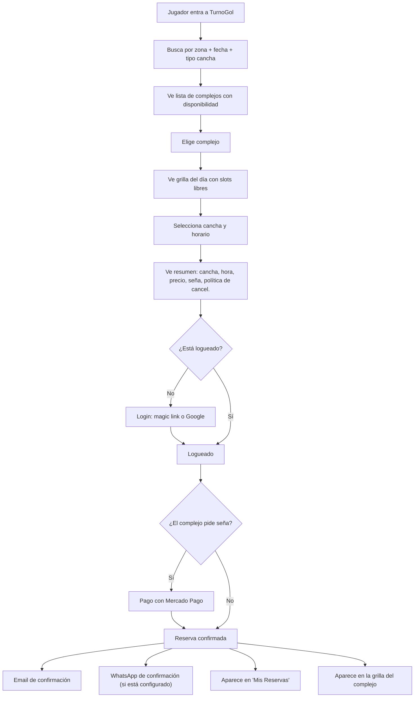
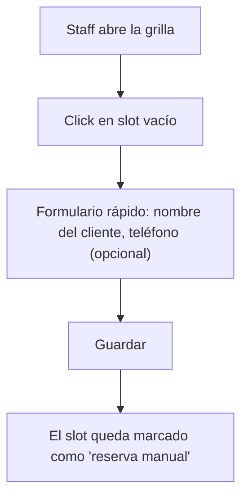
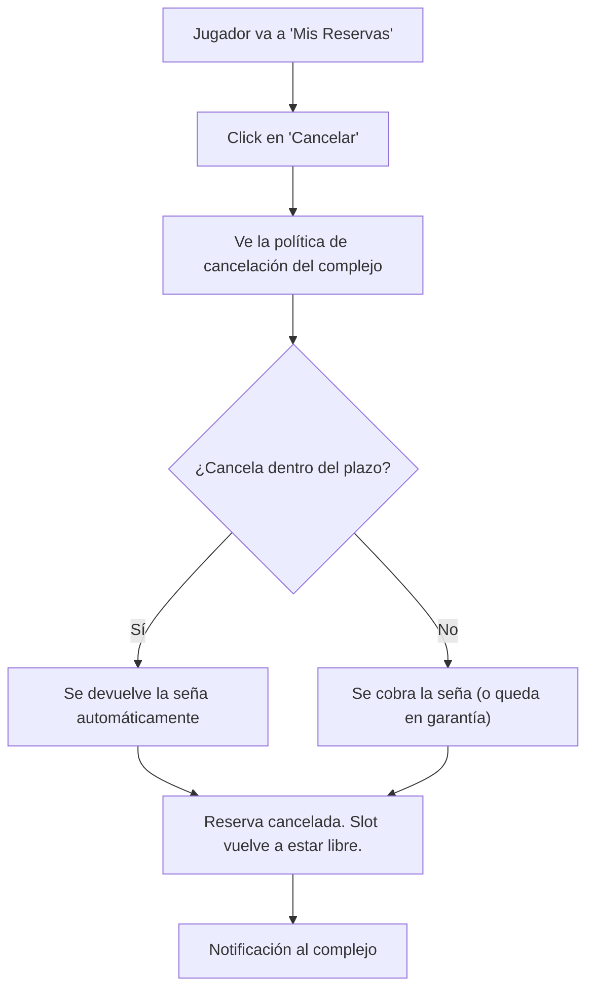
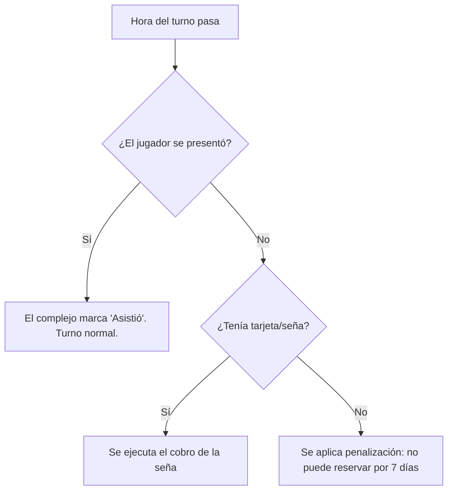

# ⚽ TurnoGol — Plan de Negocio

> **ATC, pero solo para fútbol. Simple. Enfocado. Superior.**

---

## Tabla de Contenidos

1. [La Tesis](#1-la-tesis)
2. [Qué copiamos de ATC (y qué no)](#2-qué-copiamos-de-atc-y-qué-no)
3. [El Producto](#3-el-producto)
4. [Entender al Cliente](#4-entender-al-cliente)
5. [Roles y Permisos](#5-roles-y-permisos)
6. [Flujos del Sistema](#6-flujos-del-sistema)
7. [Modelo de Monetización](#7-modelo-de-monetización)  
8. [Por qué ganamos](#8-por-qué-ganamos)
9. [Go-To-Market](#9-go-to-market)
10. [Roadmap](#10-roadmap)
11. [Riesgos](#11-riesgos)

---

## 1. La Tesis

**Simple Analytics le gana en facturación a Google Analytics.** No porque tenga más features, sino porque hace UNA cosa mejor que nadie, para un público específico que se siente ignorado por el gigante genérico.

ATC es el "Google Analytics" del deporte en Argentina. Hace todo: pádel, tenis, básquet, fútbol, hockey. Pero su alma, su ADN, su marca, su UX, sus comunicaciones, sus fotos, sus clientes estrella — **todo huele a pádel**.

El dueño de un complejo de fútbol 5 en Lanús que entra a ATC ve fotos de canchas de pádel con cristales, testimonios de clubes de pádel, y un sistema genérico que le pide que seleccione "el deporte". Se siente un ciudadano de segunda.

**TurnoGol es ATC, pero te sentís en tu casa si sos del fútbol.** Mismas funcionalidades core. Cero inventos. Pero cada pantalla, cada texto, cada email, cada onboarding está pensado por y para el mundo del fútbol.

---

## 2. Qué Copiamos de ATC (y qué no)

### ✅ Copiamos EXACTAMENTE

| De ATC | En TurnoGol |
|---|---|
| Software de gestión de turnos/reservas | ✅ Idéntico |
| Grilla de reservas interactiva (diaria/semanal) | ✅ Idéntico |
| Web propia autogenerada con slug | ✅ Idéntico |
| Reservas online 24/7 sin llamar | ✅ Idéntico |
| Integración Mercado Pago (señas, tarjeta en garantía) | ✅ Idéntico |
| Devolución automática de seña | ✅ Idéntico |
| Políticas de cancelación configurables | ✅ Idéntico |
| Control de caja diario + reporte de ventas/compras | ✅ Idéntico |
| Estadísticas y reportes de ocupación/ingresos | ✅ Idéntico |
| Turnos fijos (recurrente semanal) | ✅ Idéntico |
| Turnos abonados (saldo a favor) | ✅ Idéntico |
| Todos los tipos de turno (normal, fijo, abonado, profesor, escuela, torneo, cumpleaños) | ✅ Idéntico |
| Canchas transformables (madre-hija, bloqueo cruzado) | ✅ Idéntico |
| Duraciones configurables (60/90/120 min) | ✅ Idéntico |
| Reglas de reserva por cancha (intervalos, franjas, días) | ✅ Idéntico |
| Tabla de precios (duración × franja × día) | ✅ Idéntico |
| Multiusuario con roles y permisos | ✅ Idéntico |
| Multiplataforma (celular, PC, tablet) | ✅ Idéntico |
| Portal de búsqueda para jugadores | ✅ Idéntico |
| Login por magic link (sin contraseña) | ✅ Idéntico |
| Sección "Mis reservas" para el jugador | ✅ Idéntico |
| Sistema de penalizaciones por no-show (amarilla/roja/anual) | ✅ Idéntico |
| Soporte incluido, onboarding con capacitación | ✅ Idéntico |
| Trial gratuito (30 días) | ✅ Idéntico |
| Modelo SaaS mensual por cantidad de canchas + 33% dto. anual | ✅ Idéntico |

### ❌ NO hacemos (por ahora)

| Descartado | Por qué |
|---|---|
| Stock / bar / artículos / inventario | ATC lo tiene, pero muchos complejos no lo usan. Agrega complejidad. Se puede agregar en V2 si hay demanda. |
| App nativa iOS/Android | Web responsive + PWA es suficiente. Post-MVP si hay demanda. |
| "Falta 1" / Partidos abiertos | Feature social de ATC que no aplica a nuestro foco inicial, aunque el sistema es B2B2C. |
| Multi-deporte (pádel, tenis, etc.) | Decisión estratégica: solo fútbol. Es nuestro diferencial. |
| Perfiles de jugador con stats/rating | No es el core inicial. El negocio es la venta B2B (el complejo), apalancada por la adopción B2C (el jugador). |
| Comunidad / feed social / gamificación | No somos una red social. Somos un software de gestión. |
| Precios dinámicos con IA | Overengineering. El dueño quiere configurar sus precios, no que un algoritmo los cambie. |
| WhatsApp QR scraping | ATC lo usa para automatizaciones. Riesgo de ban. Vamos por API oficial de Meta (V1). |

### 🔥 Lo que hacemos MEJOR que ATC (sin inventar nada)

Acá está la magia. No es qué funcionalidades nuevas agregamos, sino **cómo hacemos las mismas funcionalidades**:

| Aspecto | ATC (genérico) | TurnoGol (fútbol) |
|---|---|---|
| **Configuración de canchas** | "Seleccione deporte: Pádel / Fútbol / Tenis / Básquet..." | Directo: "¿Cuántas canchas de F5 tenés? ¿Y de F7? ¿F8? ¿F9? ¿F11?" |
| **Tipos de cancha soportados** | Genéricos | F5, F6, F7, F8, F9, F10, F11 con presets inteligentes para cada uno |
| **Superficie** | Campo genérico | Césped sintético / Natural / Cemento / Caucho (las reales del fútbol) |
| **Onboarding** | Genérico para cualquier deporte | Paso a paso pensado para un dueño de complejo de fútbol: "¿Tu cancha tiene arcos reglamentarios? ¿Red perimetral? ¿Vestuarios?" |
| **Portal público** | Filtrar por "deporte" | Ya estás en fútbol. Filtrás por tipo (F5/F7/F11), zona, precio, techado, sintético |
| **Fotos y assets** | Fotos stock de pádel | Fotos stock de fútbol, iconografía futbolera, colores del fútbol |
| **Comunicación (emails, push)** | "Tu reserva en [Club]" | "Tu partido está confirmado ⚽ — [Club], Cancha 2 (F5 Sintético), Jueves 21hs" |
| **Landing page** | "Reservá tu cancha de [deporte]" | "Reservá tu cancha de fútbol" — sin dropdown, sin fricción |
| **Copywriting** | Corporativo/neutro | Habla de "partido", "turno", "fulbito", "el quincho", "el tercer tiempo" |
| **Búsqueda del jugador** | Busco cancha de pádel en... ah no, fútbol, perdón | "¿Dónde querés jugar?" → Mapa con todas las canchas de fútbol de tu zona |
| **SEO** | Compite por "reservar cancha" (genérico) | Domina "alquilar cancha de fútbol 5 en [zona]", "cancha fútbol 7 cerca", etc. |

---

## 3. El Producto

### 3.1 Plataformas

| Plataforma | Usuarios | Prioridad |
|---|---|---|
| **Web app (panel admin)** | Dueños, admins y staff de complejos | MVP |
| **Web pública (portal)** | Jugadores buscando canchas | MVP |
| **Web propia del complejo (slug)** | Jugadores que llegan directo al complejo (turnogol.com.ar/[slug]) | MVP |
| **PWA / Web responsive** | Jugadores | MVP (no app nativa) |

### 3.2 Módulos del Panel Admin (para el complejo)

#### a) Dashboard
- Ocupación de hoy (qué canchas están libres/ocupadas ahora)
- Ingresos del día / semana / mes
- Próximos turnos del día
- Reservas nuevas pendientes de... nada. Son automáticas. Pero se ven.
- Cancelaciones recientes

#### b) Grilla de Reservas
- Vista principal del sistema. El corazón de todo.
- Columnas: canchas
- Filas: horarios (intervalos según reglas de reserva de cada cancha: 60, 90, 120 min)
- Click en celda vacía → crear reserva manual
- Click en reserva existente → ver detalle, editar, cancelar, agregar consumo de bar
- Estados visuales con colores:
  - 🟢 Libre
  - 🔵 Reservado online (pagó seña)
  - 🟣 Turno fijo (abonado semanal)
  - 🟠 Reserva manual (sin pago online)
  - ⚫ Bloqueado (mantenimiento, evento privado)
- Puede verse en modo **diario** (más detallado) o **semanal** (vista panorámica)
- Funciona perfecto en celular (responsive) y en PC

#### c) Gestión de Canchas
- Agregar/editar/eliminar canchas
- Canchas transformables: madre-hija con bloqueo cruzado automático
- Campos por cancha:
  - Nombre (ej: "Cancha 1", "La grande")
  - Tipo: **F5 / F6 / F7 / F8 / F9 / F10 / F11**
  - Superficie: Sintético / Natural / Cemento / Caucho
  - Techada: Sí / No / Parcial
  - Iluminación: Sí / No
  - Fotos (hasta 5)
  - Estado: Activa / En mantenimiento
- Reglas de reserva por cancha: intervalos, duraciones permitidas (60/90/120), franjas horarias

#### d) Configuración de Precios
- Tabla de precios por cancha: columnas = duraciones (60/90/120 min), filas = franjas horarias
- Puntos de corte horarios configurables (ej: antes/después de 18hs)
- Precio genérico (aplica toda la semana) + personalización por día (S-D)
- Ejemplo: "Cancha 1 (F5) — L-V antes 18hs: $35.000/60min, L-V después 18hs: $55.000/60min, S-D: $65.000/60min"
- Todo configurable desde una tabla visual simple

#### e) Configuración de Seña y Cancelación
- Tipo de garantía de reserva:
  - **Seña fija:** monto en pesos (ej: $10.000)
  - **Porcentaje del turno:** (ej: 30%)
  - **Tarjeta en garantía:** no se cobra salvo incumplimiento
  - **Sin garantía:** reserva sin pago (cada complejo decide)
- Política de cancelación:
  - "Si cancela con más de X horas de anticipación → se devuelve la seña"
  - "Si cancela con menos de X horas → se cobra la seña"
  - "Si no se presenta (no-show) → se cobra la seña"
- Todo esto se le muestra al jugador ANTES de confirmar la reserva

#### f) Turnos Fijos y Abonados
- Turno fijo: recurrente semanal, se repite automáticamente
- Turno abonado: pago por adelantado con saldo a favor que se descuenta semana a semana
- Tipos de turno con colores: Normal, Fijo, Abonado, Profesor, Escuela, Torneo, Cumpleaños
- Se puede dar de baja, pausar (por vacaciones), o vencer (ej: "Fijo hasta diciembre")

#### g) Caja
- Registro de movimientos diarios
- Tipos de ingreso: Turnos, Bar, Eventos, Otros
- Tipos de egreso: Insumos, Servicios, Sueldos, Otros
- Cierre de caja diario: "Hoy entraron $500.000, salieron $80.000, neto $420.000"
- Filtrar por rango de fechas
- Exportar a Excel / PDF

#### h) ~~Stock y Bar~~ (DESCARTADO)
- Decisión tomada: no incluir gestión de stock/bar/artículos
- Muchos complejos no lo usan y agrega complejidad significativa
- Se puede agregar en V2 si hay demanda real

#### i) Estadísticas
- Ocupación por cancha (% de slots ocupados)
- Ocupación por día de la semana
- Ocupación por franja horaria → identifica "horarios muertos"
- Ingresos por período (semanal, mensual)
- Complejos con más de una cancha: comparativa entre canchas
- Clientes más frecuentes
- Tasa de cancelación y no-show
- Todo visual con gráficos simples y claros

#### j) Gestión de Staff y Permisos
- Agregar usuarios con diferentes roles (ver sección 5)
- Cada usuario accede con su propio email
- Se puede revocar acceso en cualquier momento

#### k) Web Propia del Complejo
- URL: `turnogol.com.ar/nombre-del-complejo`
- Se genera automáticamente con los datos del complejo
- Muestra:
  - Nombre, logo, fotos
  - Canchas disponibles con fotos
  - Precios
  - Ubicación en mapa (Google Maps embed)
  - Horarios de apertura
  - Servicios (vestuarios, estacionamiento, bar, parrilla, WiFi)
  - Botón de "Reservar" que abre la grilla con disponibilidad en tiempo real
- Compartible por WhatsApp (el complejo manda el link a sus clientes)
- Responsive (se ve bien en celular)

#### l) Configuración del Complejo
- Datos del complejo: nombre, dirección, teléfono, WhatsApp, email
- Logo y fotos
- Horarios de apertura y cierre (por día de la semana)
- Servicios disponibles: vestuarios, duchas, estacionamiento, bar/buffet, parrilla/quincho, WiFi, venta de pelotas
- Vincular cuenta de Mercado Pago
- Personalizar colores/tema de la web propia (básico: color primario + logo)

### 3.3 Portal Público (para jugadores)

#### a) Home
- Buscador principal: **"¿Dónde querés jugar?"**
- Detecta ubicación o permite elegir zona/barrio
- Filtros:
  - Tipo de cancha: F5, F7, F8, F9, F11, Todas
  - Fecha y hora
  - Superficie: Sintético, Natural, Todas
  - Techada: Sí, No, Todas
  - Precio máximo
- Resultados: lista de complejos con disponibilidad, ordenados por cercanía

#### b) Vista del Complejo
- Fotos, info del complejo, servicios, ubicación
- Canchas disponibles con precio de cada una
- Grilla de disponibilidad del día seleccionado → seleccionar slot → reservar

#### c) Flujo de Reserva
1. Seleccionar cancha y horario
2. Ver resumen: cancha, fecha, hora, precio, seña requerida, política de cancelación
3. Login / registro (magic link por email, o Google, o celular)
4. Pago (Mercado Pago)
5. Confirmación → se muestra en pantalla + se envía por email + WhatsApp (si está configurado)

#### d) Mis Reservas
- Lista de reservas activas y pasadas
- Puede cancelar una reserva activa (se le muestra la política del complejo antes de confirmar)
- Detalle de cada reserva: complejo, cancha, fecha, hora, monto pagado

#### e) Mapa de Canchas
- Mapa interactivo (Google Maps) con todos los complejos registrados en TurnoGol
- Click en un pin → ver info rápida del complejo + botón "Ver disponibilidad"
- Filtreable por tipo de cancha

### 3.4 Automatización WhatsApp

Mismo concepto que ATC. Un bot básico que:

1. **Responde consultas de disponibilidad** automáticamente ("¿Hay cancha para el jueves a las 21?")
2. **Envía link de reserva** directo al complejo en TurnoGol
3. **Envía recordatorios** de turno (configurable: 3hs antes, 24hs antes)
4. **Envía confirmación** de reserva por WhatsApp además de email
5. Si no puede responder → deriva al humano

No es IA conversacional. Es un bot con respuestas predefinidas + consulta en tiempo real a la base de datos de disponibilidad. Probado, simple, funcional.

---

## 4. Entender al Cliente

> [!IMPORTANT]
> Esta es la sección más importante de todo el documento. Si entendemos al cliente mejor que ATC, ganamos.

### 4.1 Cliente B2B: El Dueño del Complejo de Fútbol

#### Perfil

| Dato | Detalle |
|---|---|
| **Edad** | 35-60 años |
| **Perfil** | Emprendedor, muchas veces ex-jugador amateur. Puede ser un jubilado que invirtió, un comerciante que diversificó, o un tipo que armó la canchita con amigos y creció. |
| **Nivel tecnológico** | Bajo a medio. Usa WhatsApp todo el día, pero nunca usó un CRM en su vida. Puede que use Excel. Probablemente no. |
| **Dispositivo principal** | Celular (Android en el 80% de los casos). Tiene PC en la oficina pero no la usa para el complejo. |
| **Horario de trabajo** | De la tarde a la medianoche. Los turnos fuertes son de 18hs a 23hs. Trabaja los fines de semana. |
| **Cómo gestiona hoy** | Cuaderno + WhatsApp. Tiene 400 mensajes de WhatsApp por día preguntando "¿hay cancha?". Responde uno por uno. A veces se le pisan turnos. |
| **Equipo** | 1-3 personas: él mismo, un empleado en recepción, y quizás un familiar. No tiene "gerente de operaciones". |
| **Qué lo desvela** | Las cancelaciones de último momento. Pierde plata cada vez que alguien reserva y no viene. |
| **Ingreso mensual del complejo** | Variable. Un complejo con 3 canchas de F5 en GBA puede facturar $8-15M/mes bruto. |

#### Sus 5 dolores principales (en orden de intensidad)

1. **"Me cancelan a último momento y pierdo el turno"**
   - Es EL dolor número uno. Un turno cancelado a las 20hs para las 21hs es irrecuperable.
   - Hoy la solución es "pedir seña por transferencia" → engorroso, no todos lo hacen, se pierde el cliente en el proceso.
   - **Nuestra solución:** Mercado Pago integrado. Seña/tarjeta en garantía automática. Cero fricción.

2. **"Paso todo el día contestando WhatsApp"**
   - 400+ mensajes por día preguntando lo mismo: "¿Hay cancha el jueves a las 21?"
   - Mientras contesta, no puede atender el complejo.
   - **Nuestra solución:** Web con disponibilidad en tiempo real + bot WhatsApp que responde automáticamente + link directo a la reserva.

3. **"No sé cuánta plata hice este mes"**
   - Muchos manejan la caja con un cuaderno o directamente de memoria.
   - No saben qué cancha rinde más, qué horario está flojo, cuánto vendieron en el bar.
   - **Nuestra solución:** Caja digital + estadísticas claras y simples.

4. **"Los horarios de la mañana están vacíos"**
   - De 8hs a 17hs las canchas están vacías. Es plata tirada.
   - No saben cómo promocionar esos horarios.
   - **Nuestra solución:** Estadísticas que muestran los "horarios muertos" + la web propia le da visibilidad a esos slots baratos.

5. **"Yo no sé de tecnología, esto es muy complicado para mí"**
   - El miedo a lo digital es real. Si la plataforma parece "de programadores", no la usa.
   - **Nuestra solución:** UX extremadamente simple. Onboarding asistido: le configuramos todo. Soporte real por WhatsApp (no por ticket).

#### Cómo le hablamos

> [!TIP]
> **NO le hablamos de "software de gestión deportiva" ni de "digitalización".** Eso es jerga que no le dice nada.

Le hablamos de:
- "Que tus clientes reserven solos, sin que tengas que contestar más WhatsApp"
- "Cobrá la seña automática y olvidate de las cancelaciones"
- "Sabé cuánta plata hiciste cada día sin contar billetes"
- "Tu cancha aparece en Google cuando alguien busca 'cancha de fútbol 5 cerca'"

#### Objeciones que va a poner (y cómo las respondemos)

| Objeción | Respuesta |
|---|---|
| "No necesito un sistema, con el cuaderno me arreglo" | "¿Cuántos turnos perdiste este mes por cancelaciones? ¿Cuántos mensajes de WhatsApp contestaste hoy? Con TurnoGol recuperás esos turnos y esas horas." |
| "Es muy caro" | "Un solo turno que no te cancelen por mes ya te paga el sistema. Si tu turno de F5 sale $55.000 y el sistema sale $30.000/mes, con que salves un turno ya saliste hecho." |
| "Yo no sé de computación" | "Nosotros te configuramos todo. Vos solo tenés que mirar el celular y ver los turnos del día. Es más fácil que WhatsApp." |
| "Mis clientes no van a reservar online" | "Tus clientes ya compran en Mercado Libre, piden comida por Pedidos Ya, e Uber hasta para ir a la esquina. Pueden reservar una cancha desde el celular." |
| "¿Y si quiero seguir anotando algunos turnos a mano?" | "Podés. El sistema te deja cargar turnos manuales además de los que llegan online. Es lo mejor de los dos mundos." |
| "¿AFIP?" | "El sistema es una herramienta de gestión. Vos manejás tu facturación como siempre. No cambia nada." |

---

### 4.2 Cliente B2C: El Jugador de Fútbol Amateur

#### Perfil

| Dato | Detalle |
|---|---|
| **Edad** | 18-45 años |
| **Perfil** | Laburante. Juega 1-2 veces por semana con el grupo de siempre. El fútbol es su recreación principal. |
| **Nivel tecnológico** | Medio-alto. Tiene Instagram, WhatsApp, usa apps de delivery, Mercado Pago. |
| **Dispositivo** | Celular (Android 75%, iPhone 25%). |
| **Cómo reserva hoy** | WhatsApp al complejo. "Hola, ¿hay para el jueves a las 21?" → espera respuesta → "No, a las 21 no, pero a las 22 sí" → consulta al grupo → "Dale, listo, a las 22" → "OK anotado". Ida y vuelta de 15 mensajes. |
| **Cómo paga** | En el momento, en el complejo. Efectivo o transferencia/MP. Algunos complejos piden seña por transferencia. |
| **Su grupo** | Tiene un grupo de WhatsApp "FULBITO MIÉRCOLES" con 15-20 personas. De esos, juegan 10. Los otros 10 ponen excusas. |

#### Sus dolores

1. **"Llamé 3 canchas y ninguna tiene turno, o no me contestan"**
   - Quiere ver disponibilidad en tiempo real, como cuando compra un pasaje de avión.
   - **Nuestra solución:** Portal con todas las canchas de la zona, disponibilidad en vivo. Filtra, elige, reserva.

2. **"No sé qué canchas hay por mi zona"**
   - Conoce 2-3 complejos de toda la vida. Capaz hay uno nuevo a 5 cuadras que ni sabe que existe.
   - **Nuestra solución:** Mapa con todos los complejos de fútbol cerca. Fotos, precios, reseñas.

3. **"Reservó y no vino"**
   - Él sí vino. Pero el amigo que reservó no, y ahora toca pagar entre menos.
   - (Este dolor lo resolvemos del lado B2B con la seña, pero impacta al jugador positivamente: si el complejo cobra seña, el que reserva se compromete más.)

4. **"¿Cuánto sale? ¿Es sintético? ¿Tiene vestuarios?"**
   - Quiere saber TODO antes de ir, sin tener que preguntar por WhatsApp.
   - **Nuestra solución:** Web del complejo con toda la info: fotos, precios, servicios.

#### Cómo le hablamos

Directo, informal, futbolero:
- "Encontrá cancha al toque"
- "Reservá sin llamar a nadie"
- "Elegí la mejor cancha de tu zona"
- No le decimos "plataforma de gestión deportiva". Le decimos "acá hay cancha".

#### Lo que NO le pedimos

- NO le pedimos que se haga un perfil completo para reservar
- NO le pedimos que puntúe jugadores
- NO le pedimos que cree un equipo
- NO le pedimos nada que no sea: **buscar → elegir → reservar → jugar**
- Login simple: mail con magic link o Google. En 10 segundos está adentro.

---

## 5. Roles y Permisos

Simple. Tres roles del lado B2B, uno del lado B2C.

### B2B (Panel del complejo)

| Rol | Quién es | Qué puede hacer | Qué NO puede hacer |
|---|---|---|---|
| **Dueño** | El propietario del complejo. Se registra y crea la cuenta. | TODO: configurar canchas, precios, horarios, MP, caja, stock, estadísticas, agregar/eliminar staff, ver reportes financieros, gestionar suscripción/plan | Nada restringido |
| **Administrador** | El encargado de confianza. El que "maneja" el complejo día a día. | Lo mismo que Dueño EXCEPTO: gestionar suscripción/plan/facturación, y eliminar la cuenta del complejo | Cambiar plan, cancelar suscripción, eliminar cuenta |
| **Recepcionista** | El pibe que está en el mostrador. | Ver grilla de reservas, crear/cancelar reservas manuales, cargar consumos del bar en una reserva, registrar cobros en caja | NO ve estadísticas financieras, NO configura precios/canchas/horarios, NO gestiona staff |

### B2C (Portal/App)

| Rol | Quién es | Qué puede hacer |
|---|---|---|
| **Jugador** | Cualquier persona registrada | Buscar canchas, ver disponibilidad, reservar turno, pagar seña, ver "Mis Reservas", cancelar reserva |

### Registro de cada rol

**Dueño** (registro inicial del complejo):
```
Email → Verificación → Datos del complejo (nombre, dirección, teléfono, 
cantidad y tipo de canchas) → Vincular Mercado Pago → Subir fotos → 
Configurar horarios y precios → Listo, publicado.
```

**Administrador / Recepcionista** (invitado por el Dueño):
```
Dueño va a "Gestión de staff" → "Agregar usuario" → Ingresa email + 
selecciona rol → El invitado recibe un email → Se registra con ese email → 
Ya tiene acceso con los permisos del rol asignado.
```

**Jugador:**
```
Ingresa email → Recibe magic link → Click → Logueado. 
(Alternativa: login con Google)
No necesita completar perfil. Solo mail.
```

---

## 6. Flujos del Sistema

### 6.1 Reserva Online (el flujo más importante)



### 6.2 Reserva Manual (el complejo anota un turno que le llegó por teléfono)



### 6.3 Cancelación por el Jugador



### 6.4 No-Show



### 6.5 Flujo de WhatsApp Automático

```
JUGADOR escribe: "Hola, hay cancha para el sábado?"

BOT responde: 
"¡Hola! ⚽ Te muestro la disponibilidad del sábado:

🟢 Cancha 1 (F5 Sintético) 
   • 10:00 - $40.000
   • 14:00 - $40.000  
   • 20:00 - $55.000
   • 21:00 - $55.000

🟢 Cancha 2 (F7 Sintético)
   • 11:00 - $90.000
   • 15:00 - $90.000

Reservá acá 👉 turnogol.com.ar/mi-complejo

¿Necesitás otra cosa? Escribí 'hablar' para contactar al complejo."
```

---

## 7. Modelo de Monetización

### 7.1 Estructura de planes

Copiamos el modelo de ATC exacto: **abono mensual fijo según cantidad de canchas.** Sin comisiones por reserva. Simple y predecible para el cliente.

| Plan | Canchas | Precio Mensual (ARS) | Precio Anual (33% dto.) |
|---|---|---|---|
| **Cancha** | 1 a 3 | Precio en ARS (ajustable trimestralmente) | 33% off |
| **Complejo** | 4+ canchas | Precio en ARS (ajustable trimestralmente) | 33% off |

> [!TIP]
> **Los nombres de los planes son futboleros, no corporativos.** "Cancha" suena a F5 chico, "Complejo" suena a lugar con varias canchas. El dueño se identifica inmediatamente.

### 7.2 Qué incluye CADA plan (todo incluido)

- ✅ Grilla de reservas
- ✅ Web propia del complejo
- ✅ Reservas online 24/7
- ✅ Integración Mercado Pago (seña + tarjeta en garantía + devolución automática)
- ✅ Caja y reportes financieros
- ✅ Estadísticas y reportes
- ✅ Turnos fijos
- ✅ Bot WhatsApp
- ✅ Usuarios ilimitados (dueño + admins + staff)
- ✅ Soporte por WhatsApp 24/7
- ✅ Actualizaciones automáticas
- ✅ Capacitación y onboarding gratuito
- ✅ Presencia en el portal/buscador de TurnoGol

**No hay funcionalidades "desbloqueables" por plan.** La única diferencia es la cantidad de canchas. Esto simplifica la venta y elimina la objeción de "me están cobrando de más por algo que no uso".

### 7.3 Trial

- **30 días gratis**, completo, sin limitaciones.
- Sin tarjeta de crédito para empezar (baja fricción al máximo).
- Al terminar el trial: "Tu prueba gratuita terminó. Para seguir usando TurnoGol, elegí tu plan." Si no paga, el complejo deja de aparecer en el portal pero no pierde sus datos.

### 7.4 Cobro

- Pago mensual vía MercadoPago Suscripciones
- Medios: Mercado Pago, tarjeta crédito/débito, transferencia bancaria
- Pago anual anticipado = 33% de descuento (como ATC)
- Facturación en ARS, con ajuste trimestral por inflación

### 7.5 Economics del complejo (por qué le conviene)

```
Complejo con 3 canchas de F5 en GBA:
- Turno nocturno: $55.000
- Turnos por noche (por cancha): ~4
- Turnos semanales totales (3 canchas × 4 turnos × 6 días): ~72 turnos/semana

Si el 10% cancela (7 turnos/semana × $55.000): pierde $385.000/semana = $1.540.000/mes

TurnoGol cuesta: ~$35 USD/mes ≈ $42.000/mes (a TC ~$1.200)

Con que TurnoGol le SALVE 1 SOLO TURNO por mes de una cancelación, 
ya se pagó solo Y le sobra plata.
Realmente le va a salvar MUCHOS más. El ROI es obsceno.
```

---

## 8. Por Qué Ganamos

### 8.1 No somos mejores por features. Somos mejores por FOCO.

ATC es genérico. Cuando un dueño de complejo de fútbol entra a ATC:
- Ve fotos de canchas de pádel
- Lee testimonios de clubes de pádel
- Tiene que seleccionar "fútbol" de un dropdown
- El onboarding le pregunta cosas que no aplican
- El soporte atiende a dueños de canchas de tenis, squash, hockey...
- Las mejoras del producto se reparten entre 8 deportes

Cuando entra a TurnoGol:
- **Todo es fútbol.** Las fotos, el lenguaje, los ejemplos, los testimonios.
- El onboarding le pregunta "¿cuántas de F5 tenés? ¿Y de F7?" — se siente entendido.
- El soporte entiende su negocio porque es lo ÚNICO que hacemos.
- Cada mejora del producto va directo a SU problema.

### 8.2 El moat (barrera de entrada)

| Barrera | Detalle |
|---|---|
| **Especialización** | ATC no puede volverse "solo fútbol" sin perder todo su negocio de pádel. Están atrapados en lo genérico. |
| **SEO vertical** | Vamos a dominar "alquilar cancha fútbol 5 [zona]" en Google. ATC compite por "reservar cancha" genérico. |
| **Boca a boca** | Los dueños de complejos de fútbol se conocen entre sí. Si uno lo usa y le funciona, le cuenta al vecino. |
| **Red de complejos** | Cuantos más complejos, más jugadores encuentran TurnoGol en Google → más tráfico para cada complejo → más razón para quedarse. |

### 8.3 Lo que Simple Analytics nos enseña

Simple Analytics funciona porque:
1. **No intenta hacer todo lo que Google Analytics hace.** Hace menos, pero mejor.
2. **Habla el idioma de su usuario** (dueños de web que odian la complejidad de GA).
3. **El producto ES el marketing.** Es tan simple que se recomienda solo.
4. **Cobra un precio justo** por un producto focalizado, y la gente paga feliz.

TurnoGol es lo mismo:
1. No intentamos hacer todo lo que ATC hace. Hacemos lo mismo, pero SOLO para fútbol.
2. Hablamos el idioma del dueño de complejo de fútbol (no del "club deportivo multidisciplinario").
3. Si el producto resuelve las cancelaciones y el WhatsApp infinito, se recomienda solo.
4. Cobramos un precio justo que se paga con UN turno salvado.

---

## 9. Go-To-Market

### Fase 1: "La Pretemporada" (Meses 1-4)

**Meta:** 30-50 complejos activos en CABA + GBA

| Acción | Detalle |
|---|---|
| **Venta puerta a puerta** | 1-2 personas visitando complejos de fútbol con una tablet. Demo en vivo de 10 minutos. "Te lo dejo 30 días gratis, te lo configuro yo, si no te gusta no pagás nada." |
| **Onboarding white-glove** | Nosotros les configuramos todo: canchas, precios, horarios, fotos. Le sacamos fotos al complejo si hace falta. Cero esfuerzo para el dueño. |
| **WhatsApp del complejo como canal** | Le pedimos al complejo que empiece a mandar su link de TurnoGol a los clientes que le escriben. "Reservá acá: turnogol.com.ar/mi-complejo". Así los jugadores descubren la plataforma orgánicamente. |
| **SEO desde día 1** | Cada web de complejo está optimizada para "cancha de fútbol 5 en [barrio]". Tráfico orgánico gratuito que le trae clientes nuevos al complejo. |

### Fase 2: "El Clausura" (Meses 5-12)

**Meta:** 100-200 complejos en CABA + GBA + Córdoba + Rosario

| Acción | Detalle |
|---|---|
| **Referidos** | "Recomendá TurnoGol a otro complejo y los dos ganan 1 mes gratis" |
| **Pauta digital** | Google Ads: "sistema para canchas de fútbol", "gestión de turnos fútbol". Facebook/Instagram: publicaciones mostrando la grilla, el bot, los reportes. Apuntado a dueños de complejos. |
| **Contenido** | Blog/Instagram con tips para dueños de complejos: "5 formas de reducir cancelaciones", "Cuánto dinero perdés por no cobrar seña", etc. Contenido que vende sin vender. |
| **Expansión geográfica gradual** | Córdoba y Rosario (televentas + onboarding remoto, ya no puerta a puerta) |

### Fase 3: "Nacional" (Año 2)

**Meta:** 400+ complejos a nivel nacional

| Acción | Detalle |
|---|---|
| **Self-service** | El complejo puede registrarse y configurarse solo desde la web. Reducir dependencia del onboarding manual. |
| **Presencia en todas las ciudades grandes** | La Plata, Mar del Plata, Mendoza, Tucumán, Santa Fe, Neuquén, Salta |
| **El portal se vuelve la referencia** | "¿Dónde jugamos hoy?" → la gente abre TurnoGol como abre Google Maps para buscar un restaurant. |

---

## 10. Roadmap

### MVP — Meses 1-3

Lo mínimo para que un complejo le diga "chau cuaderno":

- [ ] Auth: registro/login de complejos (email+password) y jugadores (magic link + Google)
- [ ] Panel admin: CRUD de canchas (F5-F11) con canchas transformables
- [ ] Panel admin: reglas de reserva por cancha (intervalos, duraciones, franjas)
- [ ] Panel admin: tabla de precios (duración × franja × día)
- [ ] Panel admin: grilla de reservas diaria/semanal (crear/editar/cancelar manual, drag & drop)
- [ ] Panel admin: todos los tipos de turno (único, fijo, abonado, profesor, escuela, torneo, cumpleaños)
- [ ] Panel admin: cobros parciales, múltiples medios de pago, gestión de deudas
- [ ] Panel admin: caja (reporte de caja + retiros/ingresos manuales)
- [ ] Panel admin: usuarios y roles (Dueño + Encargado)
- [ ] Web propia del complejo con slug (info + disponibilidad + reservar)
- [ ] Portal público: buscador de canchas por zona + tipo + fecha + mapa
- [ ] Flujo de reserva online completo (buscar → elegir → pagar → confirmar)
- [ ] Integración Mercado Pago (seña por cancha, tarjeta en garantía, devolución automática)
- [ ] Políticas de cancelación configurables
- [ ] Penalizaciones cross-complejo (amarilla/roja/anual)
- [ ] "Mis Reservas" para el jugador + cancelación online
- [ ] Emails transaccionales (confirmación, cancelación, recordatorio)
- [ ] WhatsApp MVP: links wa.me con mensajes pre-armados
- [ ] Landing page TurnoGol (SEO optimizada)

### V1 — Meses 4-6

Ajustes post-lanzamiento + completar funcionalidades core:

- [ ] Estadísticas y dashboard (ocupación, ingresos, cancelaciones)
- [ ] WhatsApp V1: API oficial de Meta (confirmación, recordatorio, vendedor automático)
- [ ] Exportación de reportes a Excel/PDF
- [ ] Lista negra local por complejo
- [ ] Mejoras UX basadas en feedback real de los primeros complejos

### V2 — Meses 7-12

App móvil + escala:

- [ ] Stock / bar / artículos (si hay demanda real)
- [ ] Sistema de reseñas de complejos
- [ ] Mejoras en estadísticas (gráficos avanzados, comparativas)
- [ ] Onboarding self-service (registro sin asistencia humana)
- [ ] Mejoras continuas en SEO y portal público
- [ ] Panel de facturación y gestión de suscripción para complejos

---

## 11. Riesgos

| Riesgo | Probabilidad | Impacto | Qué hacemos |
|---|---|---|---|
| **"Con WhatsApp me arreglo"** | Alta | Alto | Demostrar ROI inmediato. "1 turno salvado = el sistema se pagó solo". Onboarding cero esfuerzo. |
| **ATC baja precios o mejora su vertical de fútbol** | Media | Medio | Moverse rápido. ATC tiene que mejorar para TODOS los deportes. Nosotros solo para fútbol. Siempre vamos a ser más rápidos iterando. |
| **Inflación / crisis económica** | Alta | Medio | Precios accesibles. El ROI del sistema supera el costo por 10x mínimo. En crisis, necesitan OPTIMIZAR más, no menos. |
| **Dificultad de escalar la venta puerta a puerta** | Media | Medio | Es solo para la Fase 1. Después pasar a televentas, pauta digital y self-service. |
| **Competidores locales (Don Potrero, Clubo, etc.)** | Media | Bajo | Ninguno tiene la combinación de foco 100% fútbol + portal para jugadores + producto pulido. Son parciales. |
| **Adopción lenta de jugadores** | Media | Medio | Los jugadores no son el foco inicial. Los complejos son el canal: cuando el complejo comparte su link de TurnoGol, los jugadores llegan solos. |

---

> **TurnoGol no es una idea nueva. Es una idea existente, ejecutada mejor, para un público específico que nadie atiende como se merece.**
> 
> Igual que Simple Analytics no inventó la analítica web. Solo la hizo simple, para la gente correcta.

---

*Versión 3.0 — 16 de abril de 2026 (actualizado con decisiones v3.0)*
