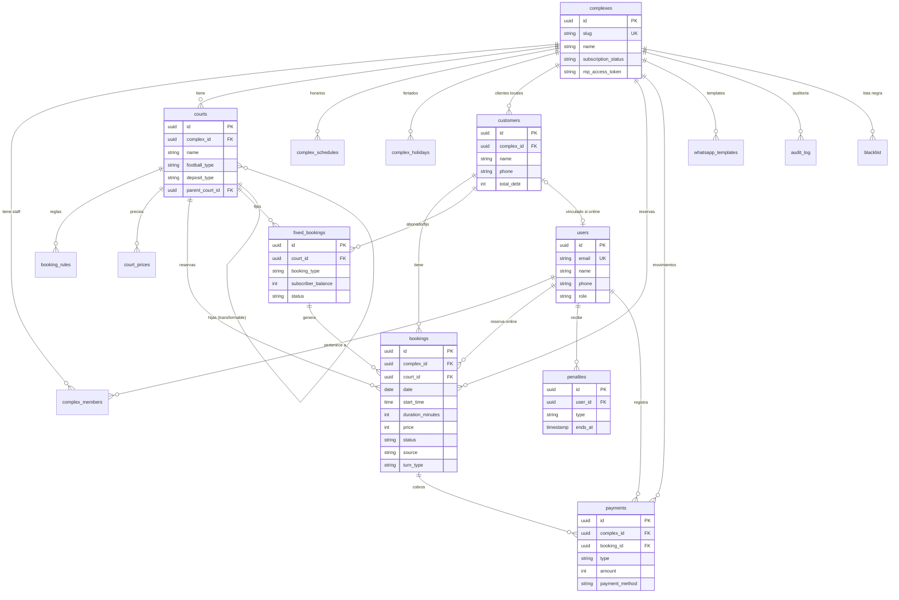
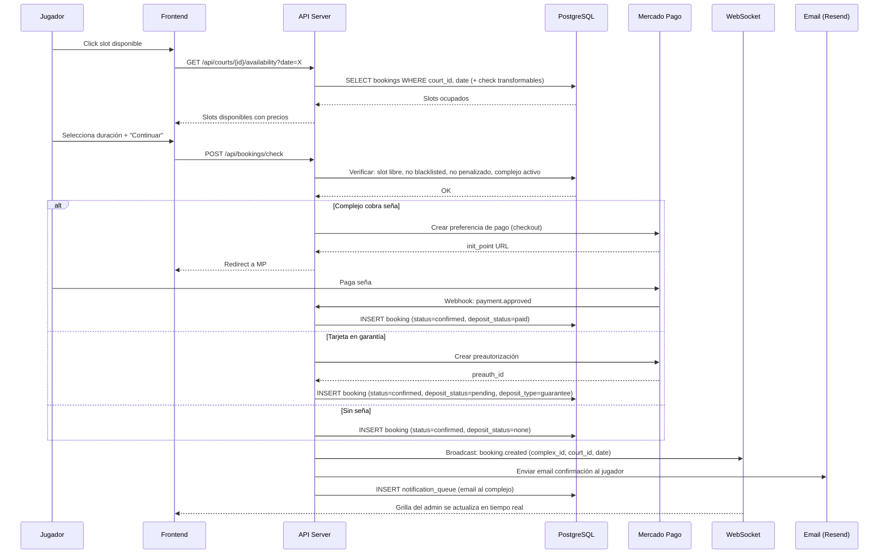
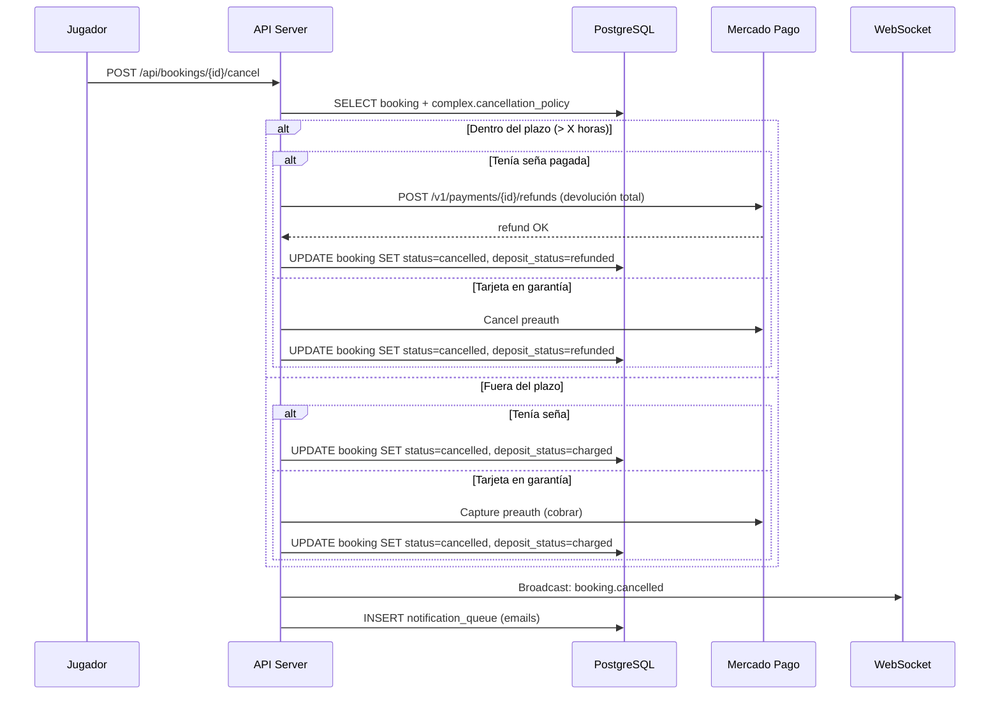
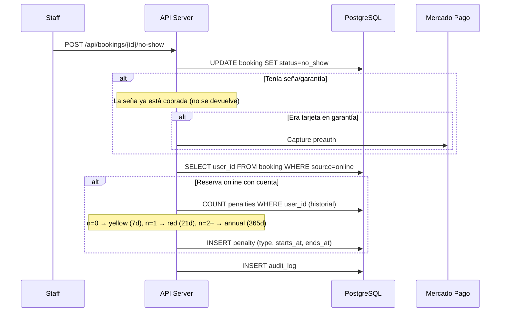
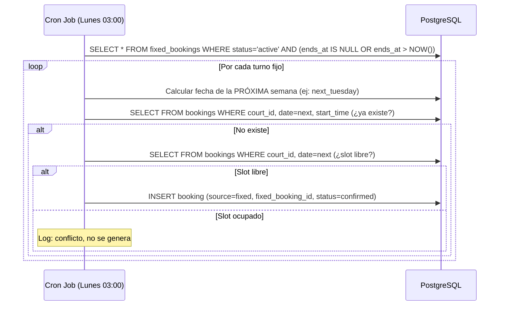

# ⚽ TurnoGol — Plan de Sistema v1.0

> Arquitectura técnica completa. Esquema de base de datos, relaciones, flujos de datos, integraciones y decisiones de infraestructura.
> Basado en las HU v3.0 y el Plan de Negocio v3.0.

---

## Tabla de Contenidos

1. [Stack Tecnológico](#1-stack-tecnológico)
2. [Arquitectura General](#2-arquitectura-general)
3. [Multi-Tenancy](#3-multi-tenancy)
4. [Esquema de Base de Datos](#4-esquema-de-base-de-datos)
5. [Diagrama ER](#5-diagrama-er)
6. [Flujos de Datos Críticos](#6-flujos-de-datos-críticos)
7. [Estructura de API](#7-estructura-de-api)
8. [Tiempo Real (WebSockets)](#8-tiempo-real-websockets)
9. [Integración Mercado Pago](#9-integración-mercado-pago)
10. [Autenticación y Autorización](#10-autenticación-y-autorización)
11. [Cron Jobs y Tareas Programadas](#11-cron-jobs-y-tareas-programadas)
12. [Storage y Media](#12-storage-y-media)
13. [Emails Transaccionales](#13-emails-transaccionales)
14. [Índices y Performance](#14-índices-y-performance)

---

## 1. Stack Tecnológico

| Capa | Tecnología | Justificación |
|---|---|---|
| **Frontend Admin** | Next.js 14+ (App Router) | SSR para SEO de slugs, RSC para performance, ecosystem maduro |
| **Frontend Público** | Mismo Next.js (rutas públicas) | Una sola app, rutas `/[slug]` y `/buscar` |
| **Backend / API** | Next.js API Routes + Server Actions | Colocalizado, sin infra extra, TypeScript end-to-end |
| **Base de Datos** | PostgreSQL (via Supabase o Neon) | Relacional, JSONB para configs flexibles, RLS para multi-tenancy |
| **ORM** | Prisma | Type-safe, migraciones, introspección |
| **Auth** | NextAuth.js v5 (Auth.js) | Magic link, Google OAuth, credentials, session JWT |
| **Pagos** | Mercado Pago SDK (Node.js) | OAuth, Checkout Pro, preapproval, refunds |
| **Real-time** | Supabase Realtime o Pusher | Grilla en tiempo real para múltiples usuarios |
| **Storage** | Supabase Storage o Cloudinary | Fotos de canchas y complejos |
| **Email** | Resend | Transaccional, templates, tracks |
| **Maps** | Google Maps Platform | Geocoding, embed, Places autocomplete |
| **Deploy** | Vercel | Edge, previews, zero-config Next.js |
| **Cron** | Vercel Cron o QStash (Upstash) | Generación de turnos fijos, recordatorios |
| **Caché** | Upstash Redis | Rate limiting, sesiones, caché de grilla |

---

## 2. Arquitectura General

```
┌─────────────────────────────────────────────────────────┐
│                      VERCEL (Edge)                       │
│  ┌──────────────┐  ┌──────────────┐  ┌───────────────┐  │
│  │  Panel Admin  │  │  Web Pública │  │  Portal/Buscar│  │
│  │  /admin/*     │  │  /[slug]/*   │  │  /buscar      │  │
│  └──────┬───────┘  └──────┬───────┘  └───────┬───────┘  │
│         │                 │                   │          │
│  ┌──────┴─────────────────┴───────────────────┴───────┐  │
│  │              Next.js API / Server Actions           │  │
│  │              (middleware: auth + tenancy)           │  │
│  └──────────────────────┬─────────────────────────────┘  │
│                         │                                │
│  ┌──────────┐  ┌────────┴────────┐  ┌────────────────┐  │
│  │  Redis   │  │   PostgreSQL    │  │  Supabase      │  │
│  │ (Upstash)│  │   (Supabase)    │  │  Storage       │  │
│  └──────────┘  └────────┬────────┘  └────────────────┘  │
│                         │                                │
│  ┌──────────┐  ┌────────┴────────┐  ┌────────────────┐  │
│  │  Resend  │  │  Mercado Pago   │  │  Google Maps   │  │
│  │ (emails) │  │  (pagos)        │  │  (geo)         │  │
│  └──────────┘  └─────────────────┘  └────────────────┘  │
│                                                          │
│  ┌──────────────────────────────────────────────────┐    │
│  │  Supabase Realtime (WebSocket para grilla)       │    │
│  └──────────────────────────────────────────────────┘    │
└─────────────────────────────────────────────────────────┘
```

---

## 3. Multi-Tenancy

**Estrategia: Shared Database, Schema-based Isolation (Row-Level)**

- Todas las entidades de complejo tienen `complex_id` como FK
- Prisma middleware inyecta `complex_id` automáticamente en queries
- Auth middleware resuelve `complex_id` desde la sesión del admin
- RLS de PostgreSQL como segunda capa de protección
- Los datos de jugadores (accounts, penalties) son **cross-tenant** (globales)

---

## 4. Esquema de Base de Datos

### 4.1 — `users` (Usuarios del sistema — both admin & player)

| Campo | Tipo | Notas |
|---|---|---|
| `id` | UUID PK | |
| `email` | VARCHAR(255) UNIQUE NOT NULL | |
| `name` | VARCHAR(255) | |
| `phone` | VARCHAR(20) | |
| `password_hash` | VARCHAR(255) NULL | Solo para admin. NULL para jugadores (magic link/OAuth) |
| `avatar_url` | TEXT NULL | |
| `role` | ENUM('player','admin') | Tipo global de usuario |
| `email_verified_at` | TIMESTAMP NULL | |
| `created_at` | TIMESTAMP | |
| `updated_at` | TIMESTAMP | |

---

### 4.2 — `complexes` (Complejos de fútbol)

| Campo | Tipo | Notas |
|---|---|---|
| `id` | UUID PK | |
| `name` | VARCHAR(255) NOT NULL | |
| `slug` | VARCHAR(100) UNIQUE NOT NULL | Para URL: turnogol.app/[slug] |
| `address` | TEXT NOT NULL | |
| `city` | VARCHAR(100) | |
| `province` | VARCHAR(100) | |
| `latitude` | DECIMAL(10,8) | Google Maps |
| `longitude` | DECIMAL(11,8) | |
| `phone` | VARCHAR(20) | |
| `whatsapp` | VARCHAR(20) | |
| `email` | VARCHAR(255) | |
| `logo_url` | TEXT NULL | |
| `photos` | JSONB | Array de URLs: `["url1","url2"]` |
| `services` | JSONB | `{"vestuarios":true,"duchas":true,...}` |
| `primary_color` | VARCHAR(7) NULL | Hex color para web pública |
| `cancellation_policy` | ENUM('lose','refund_before_x') DEFAULT 'lose' | |
| `cancellation_hours` | INT DEFAULT 24 | Horas de anticipación para devolver seña |
| `online_booking_days` | INT DEFAULT 7 | Anticipación máxima para reservas online |
| `mp_access_token` | TEXT NULL | Encriptado. Token OAuth de MP |
| `mp_refresh_token` | TEXT NULL | Encriptado |
| `mp_token_expires_at` | TIMESTAMP NULL | |
| `mp_user_id` | VARCHAR(50) NULL | ID de la cuenta MP del complejo |
| `onboarding_step` | INT DEFAULT 0 | Progreso del onboarding (0-8) |
| `onboarding_completed` | BOOLEAN DEFAULT FALSE | |
| `subscription_status` | ENUM('trial','active','grace','blocked','cancelled') DEFAULT 'trial' | |
| `trial_ends_at` | TIMESTAMP | Fecha fin del trial |
| `subscription_plan` | ENUM('cancha','complejo') NULL | |
| `subscription_billing` | ENUM('monthly','annual') NULL | |
| `subscription_mp_id` | VARCHAR(100) NULL | ID de suscripción en MP |
| `blocked_at` | TIMESTAMP NULL | |
| `created_at` | TIMESTAMP | |
| `updated_at` | TIMESTAMP | |

---

### 4.3 — `complex_schedules` (Horarios de apertura)

| Campo | Tipo | Notas |
|---|---|---|
| `id` | UUID PK | |
| `complex_id` | UUID FK → complexes | |
| `day_of_week` | INT (0-6) | 0=Lun, 6=Dom |
| `is_open` | BOOLEAN DEFAULT TRUE | |
| `open_time` | TIME | ej: '08:00' |
| `close_time` | TIME | ej: '01:00' (cruce de medianoche) |
| `online_open_time` | TIME NULL | Subconjunto para reservas online |
| `online_close_time` | TIME NULL | |

**Constraint:** UNIQUE(complex_id, day_of_week)

---

### 4.4 — `complex_holidays` (Feriados/cerrados)

| Campo | Tipo | Notas |
|---|---|---|
| `id` | UUID PK | |
| `complex_id` | UUID FK | |
| `date` | DATE NOT NULL | |
| `type` | ENUM('closed','holiday') | |
| `special_open_time` | TIME NULL | Solo si holiday |
| `special_close_time` | TIME NULL | |
| `note` | TEXT NULL | |

---

### 4.5 — `complex_members` (Staff del complejo)

| Campo | Tipo | Notas |
|---|---|---|
| `id` | UUID PK | |
| `complex_id` | UUID FK | |
| `user_id` | UUID FK → users | |
| `role` | ENUM('owner','manager') | Dueño / Encargado |
| `pin_code` | VARCHAR(6) | Código para operaciones destructivas |
| `is_active` | BOOLEAN DEFAULT TRUE | |
| `created_at` | TIMESTAMP | |

**Constraint:** UNIQUE(complex_id, user_id)

---

### 4.6 — `courts` (Canchas)

| Campo | Tipo | Notas |
|---|---|---|
| `id` | UUID PK | |
| `complex_id` | UUID FK | |
| `name` | VARCHAR(100) NOT NULL | "Cancha 1", "La Grande" |
| `football_type` | ENUM('F5','F6','F7','F8','F9','F10','F11') | |
| `surface` | ENUM('synthetic','natural','concrete','rubber') | |
| `roofed` | ENUM('yes','no','partial') | |
| `lighting` | BOOLEAN DEFAULT TRUE | |
| `photos` | JSONB | Array de URLs |
| `status` | ENUM('active','maintenance') DEFAULT 'active' | |
| `display_order` | INT DEFAULT 0 | Orden en la grilla |
| `deposit_type` | ENUM('none','fixed','percentage','guarantee') DEFAULT 'none' | Tipo de seña |
| `deposit_value` | INT NULL | Monto fijo en centavos o porcentaje (10-100) |
| `parent_court_id` | UUID FK → courts NULL | Si es cancha hija → referencia a la madre |
| `is_transformable_parent` | BOOLEAN DEFAULT FALSE | Si es cancha madre |
| `created_at` | TIMESTAMP | |
| `updated_at` | TIMESTAMP | |

**Constraint:** Si `parent_court_id` IS NOT NULL, el `parent_court_id` NO puede tener su propio `parent_court_id` (profundidad máx 1 nivel — validación en app)

---

### 4.7 — `booking_rules` (Reglas de reserva por cancha)

| Campo | Tipo | Notas |
|---|---|---|
| `id` | UUID PK | |
| `court_id` | UUID FK → courts | |
| `from_time` | TIME NOT NULL | '08:00' |
| `to_time` | TIME NOT NULL | '23:00' |
| `days` | JSONB NOT NULL | `[0,1,2,3,4]` (lun-vie) |
| `interval_minutes` | INT NOT NULL | 60, 90, 120 |
| `allowed_durations` | JSONB NOT NULL | `[60, 90]` array de minutos |
| `is_blocked` | BOOLEAN DEFAULT FALSE | True = "No duración" (bloqueo) |
| `priority` | INT DEFAULT 0 | Mayor = más prioridad (última gana) |
| `created_at` | TIMESTAMP | |

---

### 4.8 — `court_prices` (Precios por cancha)

| Campo | Tipo | Notas |
|---|---|---|
| `id` | UUID PK | |
| `court_id` | UUID FK → courts | |
| `duration_minutes` | INT NOT NULL | 60, 90, 120 |
| `time_slot_from` | TIME NOT NULL | Inicio de la franja (ej: '00:00') |
| `time_slot_to` | TIME NOT NULL | Fin de la franja (ej: '18:00') |
| `day_of_week` | INT NULL | NULL = genérico (aplica a todos los días). 0-6 = día específico |
| `price` | INT NOT NULL | En centavos (ej: 5500000 = $55.000) |
| `created_at` | TIMESTAMP | |

**Lógica de resolución de precio:**
1. Buscar precio con `day_of_week` = día actual + matching franja + matching duración
2. Si no existe → buscar precio con `day_of_week` = NULL (genérico) + matching franja + matching duración
3. Si no existe → error "Precio no configurado"

---

### 4.9 — `customers` (Clientes/jugadores del complejo — local, no cross-tenant)

| Campo | Tipo | Notas |
|---|---|---|
| `id` | UUID PK | |
| `complex_id` | UUID FK | |
| `user_id` | UUID FK → users NULL | Vinculado si reservó online. NULL si es solo manual. |
| `name` | VARCHAR(255) NOT NULL | |
| `phone` | VARCHAR(20) | Principal para buscar |
| `email` | VARCHAR(255) NULL | |
| `is_blacklisted` | BOOLEAN DEFAULT FALSE | Lista negra local |
| `blacklist_reason` | TEXT NULL | |
| `total_debt` | INT DEFAULT 0 | En centavos. Deuda acumulada. |
| `notes` | TEXT NULL | |
| `created_at` | TIMESTAMP | |
| `updated_at` | TIMESTAMP | |

**Constraint:** UNIQUE(complex_id, phone) — un cliente por teléfono por complejo

---

### 4.10 — `fixed_bookings` (Turnos fijos / abonados — el "bloque" recurrente)

| Campo | Tipo | Notas |
|---|---|---|
| `id` | UUID PK | |
| `complex_id` | UUID FK | |
| `court_id` | UUID FK → courts | |
| `customer_id` | UUID FK → customers | |
| `day_of_week` | INT (0-6) | Día de la semana que se repite |
| `start_time` | TIME NOT NULL | |
| `duration_minutes` | INT NOT NULL | |
| `booking_type` | ENUM('fixed','subscriber') | Fijo o abonado |
| `turn_type` | ENUM('normal','professor','school','tournament','birthday') DEFAULT 'normal' | |
| `status` | ENUM('active','paused','cancelled') DEFAULT 'active' | |
| `ends_at` | DATE NULL | NULL = indefinido |
| `subscriber_balance` | INT DEFAULT 0 | Saldo a favor en centavos (solo abonados) |
| `price_snapshot` | INT NOT NULL | Precio al momento de crear, en centavos |
| `notes` | TEXT NULL | |
| `created_at` | TIMESTAMP | |
| `updated_at` | TIMESTAMP | |

---

### 4.11 — `bookings` (Reservas individuales — el core)

| Campo | Tipo | Notas |
|---|---|---|
| `id` | UUID PK | |
| `complex_id` | UUID FK | |
| `court_id` | UUID FK → courts | |
| `customer_id` | UUID FK → customers NULL | NULL si es bloqueo |
| `fixed_booking_id` | UUID FK → fixed_bookings NULL | Si fue generada por un turno fijo |
| `user_id` | UUID FK → users NULL | Si fue reserva online (jugador logueado) |
| `date` | DATE NOT NULL | |
| `start_time` | TIME NOT NULL | |
| `end_time` | TIME NOT NULL | Calculado: start_time + duration |
| `duration_minutes` | INT NOT NULL | |
| `price` | INT NOT NULL | En centavos. Fijado al crear. |
| `status` | ENUM('confirmed','completed','cancelled','no_show','blocked') | |
| `source` | ENUM('manual','online','fixed','system') | Origen de la reserva |
| `turn_type` | ENUM('normal','professor','school','tournament','birthday','subscriber') DEFAULT 'normal' | |
| `deposit_amount` | INT DEFAULT 0 | Monto de seña en centavos |
| `deposit_status` | ENUM('none','pending','paid','refunded','charged') DEFAULT 'none' | |
| `deposit_mp_payment_id` | VARCHAR(100) NULL | ID del pago/preauth en MP |
| `deposit_type` | ENUM('deposit','guarantee') NULL | Seña real o tarjeta en garantía |
| `organizer_name` | VARCHAR(255) NULL | Para cumpleaños/eventos |
| `guest_count` | INT NULL | Para cumpleaños/eventos |
| `notes` | TEXT NULL | |
| `cancelled_at` | TIMESTAMP NULL | |
| `cancelled_by` | UUID FK → users NULL | Quién canceló |
| `completed_at` | TIMESTAMP NULL | |
| `completed_by` | UUID FK → users NULL | |
| `created_by` | UUID FK → users NULL | Admin que creó (NULL si online) |
| `created_at` | TIMESTAMP | |
| `updated_at` | TIMESTAMP | |

**Índices críticos:**
- `idx_bookings_grid`: (complex_id, court_id, date, start_time) — consulta de grilla
- `idx_bookings_player`: (user_id, status, date) — "Mis Reservas"
- `idx_bookings_date`: (complex_id, date, status) — dashboard/stats

---

### 4.12 — `payments` (Cobros registrados)

| Campo | Tipo | Notas |
|---|---|---|
| `id` | UUID PK | |
| `complex_id` | UUID FK | |
| `booking_id` | UUID FK → bookings NULL | NULL si es retiro/ingreso manual |
| `type` | ENUM('income','expense') | Ingreso o egreso |
| `category` | ENUM('booking','deposit','manual','refund','withdrawal') | |
| `amount` | INT NOT NULL | En centavos. Positivo siempre. |
| `payment_method` | ENUM('cash','mercadopago','transfer','credit_card','debit_card','check') | |
| `description` | TEXT NULL | |
| `mp_payment_id` | VARCHAR(100) NULL | ID de pago en MP |
| `recorded_by` | UUID FK → users | Admin que registró |
| `recorded_at` | TIMESTAMP | Cuándo se registró el movimiento |
| `booking_date` | DATE NULL | Fecha del turno asociado (para reportes) |
| `court_id` | UUID FK → courts NULL | Cancha asociada (para reportes) |
| `customer_id` | UUID FK → customers NULL | |
| `created_at` | TIMESTAMP | |

**Índices:**
- `idx_payments_caja`: (complex_id, recorded_at) — reporte de caja
- `idx_payments_booking`: (booking_id) — cobros de un turno

---

### 4.13 — `penalties` (Penalizaciones cross-complejo)

| Campo | Tipo | Notas |
|---|---|---|
| `id` | UUID PK | |
| `user_id` | UUID FK → users | Jugador penalizado |
| `complex_id` | UUID FK | Complejo que reportó |
| `booking_id` | UUID FK → bookings | Reserva del no-show |
| `type` | ENUM('yellow','red','annual') | |
| `reason` | TEXT | |
| `starts_at` | TIMESTAMP | |
| `ends_at` | TIMESTAMP | Calculado: +7d, +21d, +365d |
| `infraction_number` | INT | 1, 2, 3 |
| `created_at` | TIMESTAMP | |

**Query de check:** `SELECT * FROM penalties WHERE user_id = ? AND ends_at > NOW() LIMIT 1`

---

### 4.14 — `blacklist` (Lista negra local por complejo)

| Campo | Tipo | Notas |
|---|---|---|
| `id` | UUID PK | |
| `complex_id` | UUID FK | |
| `phone` | VARCHAR(20) NOT NULL | |
| `reason` | TEXT NULL | |
| `blocked_by` | UUID FK → users | |
| `created_at` | TIMESTAMP | |

**Constraint:** UNIQUE(complex_id, phone)

---

### 4.15 — `whatsapp_templates` (Templates de mensajes WhatsApp)

| Campo | Tipo | Notas |
|---|---|---|
| `id` | UUID PK | |
| `complex_id` | UUID FK | |
| `type` | ENUM('confirmation','reminder','cancellation') | |
| `template` | TEXT NOT NULL | Con variables: `{nombre}`, `{fecha}`, etc. |
| `is_active` | BOOLEAN DEFAULT TRUE | |
| `created_at` | TIMESTAMP | |

---

### 4.16 — `audit_log` (Log de auditoría)

| Campo | Tipo | Notas |
|---|---|---|
| `id` | UUID PK | |
| `complex_id` | UUID FK | |
| `user_id` | UUID FK → users | Quién lo hizo |
| `action` | VARCHAR(50) | 'booking.create', 'booking.cancel', 'price.update', etc. |
| `entity_type` | VARCHAR(50) | 'booking', 'court', 'payment' |
| `entity_id` | UUID | ID de la entidad afectada |
| `details` | JSONB | Datos antes/después o metadata adicional |
| `pin_verified` | BOOLEAN DEFAULT FALSE | Si se usó código PIN |
| `created_at` | TIMESTAMP | |

---

### 4.17 — `notification_queue` (Cola de notificaciones)

| Campo | Tipo | Notas |
|---|---|---|
| `id` | UUID PK | |
| `type` | ENUM('email_confirmation','email_cancellation','email_reminder','whatsapp_confirmation') | |
| `recipient_email` | VARCHAR(255) NULL | |
| `recipient_phone` | VARCHAR(20) NULL | |
| `payload` | JSONB | Datos para el template |
| `status` | ENUM('pending','sent','failed') DEFAULT 'pending' | |
| `scheduled_for` | TIMESTAMP | Cuándo enviar |
| `sent_at` | TIMESTAMP NULL | |
| `error` | TEXT NULL | |
| `booking_id` | UUID FK → bookings NULL | |
| `complex_id` | UUID FK | |
| `created_at` | TIMESTAMP | |

---

## 5. Diagrama ER



---

## 6. Flujos de Datos Críticos

### 6.1 — Reserva Online (Jugador)



### 6.2 — Cancelación por Jugador (con devolución)



### 6.3 — No-Show (Admin reporta)



### 6.4 — Generación de Turnos Fijos (Cron Semanal)



### 6.5 — Bloqueo Cruzado de Canchas Transformables

```
TRIGGER: Al crear/mover/cancelar una reserva

SI la cancha reservada es MADRE (is_transformable_parent = true):
  → Buscar todas las hijas (WHERE parent_court_id = court_id)
  → Para cada hija: verificar que el slot esté libre
  → Si alguna hija ocupada → RECHAZAR la reserva
  → Si todas libres → la reserva se crea, las hijas se bloquean VISUALMENTE (no se crean bookings)

SI la cancha reservada es HIJA (parent_court_id IS NOT NULL):
  → Buscar la madre
  → Verificar que la madre esté libre en ese slot
  → Si madre ocupada → RECHAZAR
  → Si madre libre → la reserva se crea, la madre se bloquea VISUALMENTE

PARA LA GRILLA:
  → Al renderizar slots, se ejecuta query adicional:
    "¿Alguna cancha relacionada (madre/hija) tiene reserva en este slot?"
  → Si sí → slot aparece como "bloqueado por transformable" (candado)
```

### 6.6 — Resolución de Precio

```
INPUT: court_id, date, start_time, duration_minutes
OUTPUT: price (centavos)

1. day_of_week = date.getDay() // 0=lun, 6=dom
2. Buscar en court_prices:
   WHERE court_id = ?
   AND duration_minutes = ?
   AND start_time >= time_slot_from
   AND start_time < time_slot_to
   AND (day_of_week = ? OR day_of_week IS NULL)
   ORDER BY day_of_week DESC NULLS LAST  // día específico prioriza sobre genérico
   LIMIT 1
3. Si no hay resultado → "Precio no configurado para esta combinación"
```

---

## 7. Estructura de API

### Rutas Públicas (sin auth o auth jugador)

```
GET    /api/search?lat=X&lng=Y&type=F5&date=2026-04-20&time=21:00
GET    /api/complexes/[slug]
GET    /api/complexes/[slug]/availability?date=X
POST   /api/bookings                          (crear reserva online)
POST   /api/bookings/[id]/cancel              (cancelar como jugador)
GET    /api/me/bookings                       (mis reservas)
POST   /api/auth/magic-link                   (enviar magic link)
POST   /api/auth/verify                       (verificar magic link)
GET    /api/auth/google                       (OAuth Google)
```

### Rutas Admin (auth admin + complex_id)

```
-- Grilla
GET    /api/admin/bookings?date=2026-04-20    (grilla del día)
POST   /api/admin/bookings                    (crear manual)
PATCH  /api/admin/bookings/[id]               (mover)
POST   /api/admin/bookings/[id]/cancel        (cancelar)
POST   /api/admin/bookings/[id]/complete      (finalizar)
POST   /api/admin/bookings/[id]/no-show       (reportar)
POST   /api/admin/bookings/[id]/block         (bloquear slot)

-- Cobros
POST   /api/admin/bookings/[id]/payments      (agregar cobro)
DELETE /api/admin/payments/[id]               (retirar cobro)

-- Canchas
GET    /api/admin/courts
POST   /api/admin/courts
PATCH  /api/admin/courts/[id]
DELETE /api/admin/courts/[id]
PATCH  /api/admin/courts/reorder              (drag & drop)

-- Reglas y precios
GET    /api/admin/courts/[id]/rules
POST   /api/admin/courts/[id]/rules
GET    /api/admin/courts/[id]/prices
POST   /api/admin/courts/[id]/prices

-- Turnos fijos
GET    /api/admin/fixed-bookings
POST   /api/admin/fixed-bookings
PATCH  /api/admin/fixed-bookings/[id]         (pausar, cancelar)

-- Clientes
GET    /api/admin/customers?search=X
POST   /api/admin/customers/[id]/blacklist

-- Caja
GET    /api/admin/reports/cash?from=X&to=Y
POST   /api/admin/payments/manual             (retiro/ingreso)

-- Configuración
GET    /api/admin/complex
PATCH  /api/admin/complex
POST   /api/admin/complex/mercadopago/connect
DELETE /api/admin/complex/mercadopago/disconnect

-- Staff
GET    /api/admin/members
POST   /api/admin/members
DELETE /api/admin/members/[id]

-- Stats
GET    /api/admin/stats/dashboard
GET    /api/admin/stats/occupancy?from=X&to=Y
GET    /api/admin/stats/revenue?from=X&to=Y
```

---

## 8. Tiempo Real (WebSockets)

**Canal por complejo:** `complex:{complex_id}`

**Eventos emitidos:**

| Evento | Payload | Trigger |
|---|---|---|
| `booking.created` | `{booking_id, court_id, date, start_time, duration, type, customer_name}` | Al crear cualquier reserva |
| `booking.cancelled` | `{booking_id, court_id, date, start_time}` | Al cancelar |
| `booking.moved` | `{booking_id, from, to}` | Al mover drag & drop |
| `booking.completed` | `{booking_id}` | Al finalizar |
| `payment.added` | `{booking_id, amount, method}` | Al registrar cobro |

**Suscripción:** Todos los admins del complejo se suscriben al canal. El frontend actualiza la grilla localmente sin refetch completo.

---

## 9. Integración Mercado Pago

### Flujo OAuth (vincular cuenta del complejo)

```
1. Admin click "Conectar MP" → redirect a:
   https://auth.mercadopago.com/authorization?
     client_id=APP_ID&
     response_type=code&
     redirect_uri=turnogol.app/api/mp/callback&
     state={complex_id_encriptado}

2. MP redirige a callback con ?code=AUTH_CODE&state=X

3. Backend:
   POST https://api.mercadopago.com/oauth/token
   {grant_type: "authorization_code", code: AUTH_CODE, ...}
   → Recibe access_token, refresh_token, user_id
   → Guarda encriptado en complexes

4. Token refresh: cron cada 4 horas verifica expiración
```

### Cobro de Seña

```
POST /v1/payments
{
  transaction_amount: seña,
  token: card_token,
  payer: { email },
  metadata: { booking_id, complex_id }
}
→ Webhook: payment.approved → confirmar booking
```

### Preautorización (Tarjeta en Garantía)

```
POST /v1/payments
{
  transaction_amount: seña,
  capture: false,           // ← CLAVE: preauth, no cobra
  token: card_token,
  payer: { email }
}
→ Para cobrar (no-show): PUT /v1/payments/{id} { capture: true }
→ Para liberar (jugó):   POST /v1/payments/{id}/refunds
```

### Devolución

```
POST /v1/payments/{payment_id}/refunds
{ amount: monto_a_devolver }
```

---

## 10. Autenticación y Autorización

### Jugadores
- **Magic Link:** Genera token JWT temporal, envía por email, verifica al click
- **Google OAuth:** NextAuth.js provider
- Sesión JWT con `{ user_id, role: 'player' }`

### Admins
- **Email + Contraseña:** bcrypt hash, login tradicional
- Sesión JWT con `{ user_id, role: 'admin', complex_id, member_role: 'owner'|'manager' }`

### Middleware de Autorización

```typescript
// Middleware simplificado
function withAuth(handler, { roles, requirePin }) {
  return async (req) => {
    const session = await getSession(req)
    if (!session) return 401
    
    if (roles && !roles.includes(session.member_role)) return 403
    
    if (requirePin) {
      const pin = req.headers['x-pin-code']
      const member = await db.complexMembers.findUnique({ user_id: session.user_id })
      if (member.pin_code !== hashPin(pin)) return 403
    }
    
    // Inyectar complex_id en el query context
    req.complexId = session.complex_id
    return handler(req)
  }
}
```

---

## 11. Cron Jobs y Tareas Programadas

| Job | Frecuencia | Descripción |
|---|---|---|
| `generate-fixed-bookings` | Lunes 03:00 AM | Genera reservas de la semana siguiente para turnos fijos activos |
| `send-reminders` | Cada 30 min | Envía recordatorios de turno (email) X horas antes |
| `check-trial-expiry` | Diario 00:00 | Marca trials vencidos, envía emails día 25, bloquea post gracia |
| `refresh-mp-tokens` | Cada 4 horas | Refresh de tokens OAuth de MP próximos a expirar |
| `cleanup-expired-preauths` | Diario 06:00 | Libera preautorizaciones de tarjeta en garantía de turnos ya jugados |
| `send-notifications` | Cada 1 min | Procesa la cola `notification_queue` |
| `purge-blocked-accounts` | Semanal | Marca para eliminación complejos bloqueados >60 días |

---

## 12. Storage y Media

```
/complexes/{complex_id}/logo.webp
/complexes/{complex_id}/photos/1.webp
/complexes/{complex_id}/photos/2.webp
/courts/{court_id}/1.webp
/courts/{court_id}/2.webp
```

- Resize automático al subir: original + thumbnail (200x200) + medium (800x600)
- Formato: WebP (compresión superior)
- CDN: Supabase Storage con caché agresivo

---

## 13. Emails Transaccionales

| Template | Trigger | Destinatario | Variables |
|---|---|---|---|
| `booking-confirmation` | Reserva online confirmada | Jugador | complejo, cancha, fecha, hora, precio, seña, policy |
| `booking-cancellation` | Reserva cancelada | Jugador | datos de reserva, info devolución |
| `booking-reminder` | X horas antes del turno | Jugador | complejo, cancha, fecha, hora, dirección |
| `new-online-booking` | Reserva online nueva | Admin complejo | jugador, cancha, fecha, hora, seña |
| `trial-reminder` | 5 días antes de fin trial | Dueño | días restantes, link a pagar |
| `trial-expired` | Trial vencido | Dueño | link a planes |
| `welcome` | Registro exitoso | Dueño | nombre, link onboarding |

---

## 14. Índices y Performance

### Índices Principales

```sql
-- Grilla (la query más ejecutada del sistema)
CREATE INDEX idx_bookings_grid ON bookings (complex_id, date, court_id, start_time)
  WHERE status != 'cancelled';

-- Mis Reservas del jugador
CREATE INDEX idx_bookings_player ON bookings (user_id, date DESC)
  WHERE user_id IS NOT NULL;

-- Búsqueda de clientes por teléfono
CREATE INDEX idx_customers_phone ON customers (complex_id, phone);

-- Caja por fecha
CREATE INDEX idx_payments_date ON payments (complex_id, recorded_at);

-- Penalizaciones activas
CREATE INDEX idx_penalties_active ON penalties (user_id, ends_at)
  WHERE ends_at > NOW();

-- Slug del complejo (para routing)
CREATE UNIQUE INDEX idx_complex_slug ON complexes (slug);

-- Precios lookup
CREATE INDEX idx_prices_lookup ON court_prices (court_id, duration_minutes, time_slot_from, day_of_week);

-- Turnos fijos activos
CREATE INDEX idx_fixed_active ON fixed_bookings (status, day_of_week)
  WHERE status = 'active';
```

### Estrategia de Caché (Redis)

| Key | TTL | Uso |
|---|---|---|
| `grid:{complex_id}:{date}` | 30s | Grilla del día (invalidar en write) |
| `availability:{court_id}:{date}` | 60s | Disponibilidad pública |
| `complex:{slug}` | 5min | Datos del complejo para web pública |
| `prices:{court_id}` | 10min | Precios de la cancha |
| `penalty:{user_id}` | 5min | Check de penalización activa |

---

*Versión 1.0 — 16 de abril de 2026*
*Arquitectura técnica de TurnoGol basada en HU v3.0*
